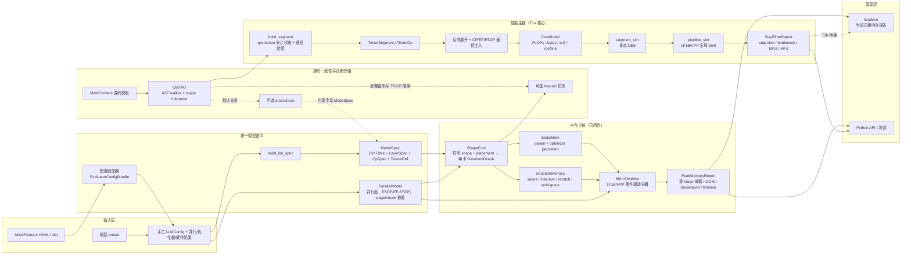
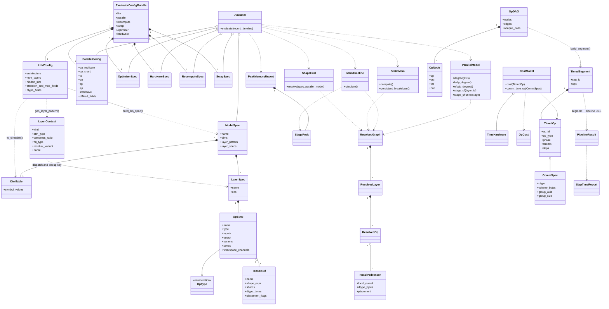
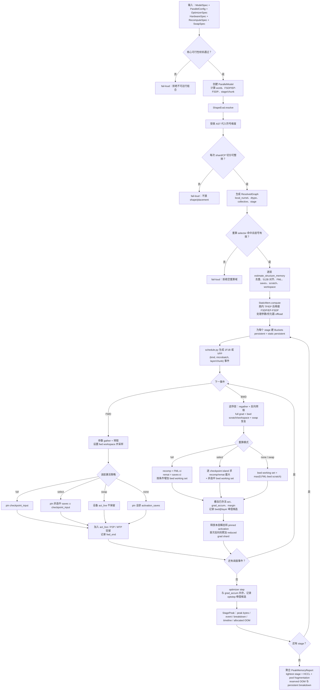
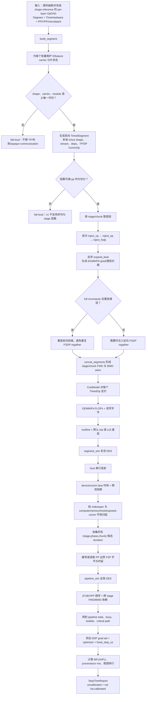

# PyNative Cost Evaluator 内存与性能仿真器方案设计

> 文档类型：当前实现（As-Is）方案设计
>
> 分析对象：`pynative-cost-evaluator`
>
> 源码基线：分支 `feat/unified-llm-modelspec`，提交 `0e51e74beedb2928697e1ed0066867184da8817f`
>
> 基线日期：2026-07-30
>
> 定位约定：正文中的 `path:line` 均相对于仓库根目录；源码与测试优先于历史 spec/plan。
>
> 工作树边界：文档收尾期间存在并发、未提交的 `cost_eval/layers/head.py` 与 `scratchpad/` 实验改动；本设计以稳定 `HEAD` 为准，不把未提交实验视为已完成能力。

## 1. 结论摘要

本库的核心定位是一个与策略搜索器解耦的、纯离线的并行策略代价评估内核：输入模型结构、5D 并行、重算、换入换出、优化器和硬件参数，输出每个 pipeline stage 的峰值显存、OOM 判定与构成，以及实验性的单步时间、瓶颈、MFU/HFU。搜索器未来可把评估器包在外层反复调用，但不属于当前仓库的实现范围。`README.md:3-7`

当前实现不是一条完全统一的“内存+性能”流水线，而是共享部分中间语义、成熟度不同的两条主链：

1. **内存主链已经闭合**：`LLMConfig → ModelSpec → ResolvedGraph → StaticMem + MemTimeline → PeakMemoryReport`，由 `Evaluator.evaluate()` 统一编排，并已接入 Explorer。`cost_eval/report.py:244-270`、`cost_eval/report.py:281-371`、`serve_explorer.py:976-985`
2. **性能主链完成了 T1a 仿真核心**：`OpDAG → TimedSegment → OpCost → 段内 DES → pipeline DES → StepTimeReport`；但它仍是独立 API，尚未接入统一 `Evaluator` 或 Explorer，理论硬件常数未完成真机标定，`OpTimeLibrary` 也尚未实现。`README.md:23-34`、`cost_eval/timesim/report.py:102-108`、`cost_eval/timesim/op_cost.py:1-6`

方案最重要的三个设计取舍是：

- **声明式模型 IR**：内存主链不执行训练代码，而是把模型拆成带符号 shape、切分标注和内存契约的 `ModelSpec/LayerSpec/OpSpec/TensorRef`。`cost_eval/model_spec.py:140-236`
- **先局部化、后仿真**：`ShapeEval` 先把符号张量解析成每卡张量，再由静态内存和事件时间线消费，避免每个计算模块重复解释并行语义。`cost_eval/shape_eval.py:218-315`
- **峰值来自事件共存而非静态相加**：内存按 FWD/BWD/optimizer 事件维护存活桶；性能按 host、device、各通信流和 pipeline 依赖做离散事件仿真。`cost_eval/mem_timeline.py:453-481`、`cost_eval/timesim/segment_sim.py:1-19`、`cost_eval/timesim/pipeline_sim.py:1-28`

## 2. 实现范围与成熟度

| 子系统 | 当前状态 | 对外入口 | 设计边界 |
|---|---|---|---|
| YAML/字典适配 | 已实现，存在显式边界 | `load_mindformers_yaml()`、`from_mindformers_dict()` | 产出六类配置对象；未知或未建模真值按 schema fail-loud；`swap.enable=true` 尚不能映射，需手工构造 `SwapSpec`。`cost_eval/configs/from_mindformers.py:1-18`、`cost_eval/configs/from_mindformers.py:166-176`、`cost_eval/configs/from_mindformers.py:1153-1159` |
| 统一 LLM 建模 | 已实现 | `build_llm_spec(LLMConfig)` | 由 layer pattern 和注册表构造 `ModelSpec`；不支持的结构语义拒绝执行。`cost_eval/build_llm.py:300-410` |
| 内存评估门面 | 已实现并接线 | `Evaluator.evaluate()` | 返回逐 stage 的 allocated 峰值、reserved 估计、OOM 和时间线。`cost_eval/report.py:183-241`、`cost_eval/report.py:270-371` |
| Explorer | 已实现内存面板 | `python serve_explorer.py` | 页面走 `Evaluator`，展示 op-DAG、逐 stage 时间线和分桶。`README.md:9-16`、`serve_explorer.py:976-1030` |
| live-set 交叉仿真 | 已实现，非默认主路径 | `simulate_liveness()` | 复用调度及非激活公式，以 live-set 替换四类激活桶，用于 A/B 诊断。`cost_eval/liveness/simulate.py:1-25` |
| 源码抽取图适配 | 已实现但受限 | graph source `extracted` | 抽取不完整默认拒绝给峰值；目前 `tp>1` 或 `cp>1` 直接 fail-loud。`cost_eval/opdag/to_resolved.py:1428-1479` |
| 性能 T1a 核心 | 已实现 | `build_segment()`、`evaluate_step_time()` | 理论 roofline、通信模型、段内/全局 DES、MFU/HFU 已有；当前生产调用主要存在于测试。`cost_eval/timesim/producer.py:144-155`、`cost_eval/timesim/report.py:102-226` |
| 性能 T1b/T2 | 未完成 | — | Explorer 时间面板、经验算子库和真机标定待做。`README.md:23-34` |
| 自动策略搜索 | 不在当前范围 | — | 当前库只提供 evaluator，不包含搜索 optimizer。`README.md:5-7` |

因此，对当前版本最准确的产品表述是：

> **一个已形成闭环的内存仿真器，加上一套可独立调用、尚未产品化和标定的性能仿真核心。**

## 3. 总体软件逻辑图

图中有三种不同的“图/IR”，不可混为一谈：

- `ModelSpec` 是内存主链的**声明式模型事实源**，由本库按模型族组装。`cost_eval/model_spec.py:223-236`、`cost_eval/build_llm.py:334-410`
- `ResolvedGraph` 是 `ModelSpec` 代入并行策略后的**每卡字节图**，供内存公式消费。`cost_eval/shape_eval.py:186-218`
- `OpDAG/TimedSegment` 是源码抽取与性能仿真的**算子依赖/时序 IR**。`cost_eval/opdag/schema.py:1-34`、`cost_eval/timesim/ir.py:1-63`

## 4. 核心类关系图

关系图中的模型类定义来自 `cost_eval/model_spec.py:32-236`，结构化层身份来自 `cost_eval/layer_context.py:19-55`，配置类来自 `cost_eval/llm_config.py:19-130`、`cost_eval/specs.py:10-301` 与 `cost_eval/configs/from_mindformers.py:166-176`，内存编排来自 `cost_eval/report.py:244-371`，时间 IR 和报告来自 `cost_eval/timesim/ir.py:18-63` 与 `cost_eval/timesim/report.py:44-59`。

领域模型没有复杂继承树，主要依靠 frozen dataclass、组合和 builder/registry 完成扩展；`LayerContext` 是可哈希的逐层结构身份，逻辑分派读取结构化字段，字符串 `name` 只作为兼容 `ModelSpec` 的输出标签。`cost_eval/layer_context.py:1-12`、`cost_eval/layer_context.py:19-55`

## 5. 模块职责

| 模块 | 输入 | 输出 | 核心职责 |
|---|---|---|---|
| `configs/from_mindformers.py` | YAML/dict | `EvaluatorConfigBundle` | 解析模型、并行、重算、swap、优化器、硬件六类配置；做 schema 守卫。`cost_eval/configs/from_mindformers.py:1-18`、`cost_eval/configs/from_mindformers.py:166-176` |
| `llm_config.py`、`presets.py` | 模型超参或预置名称 | `LLMConfig` | 统一表达模型族、注意力、FFN/MoE、MTP/mHC、dtype 与标定开关。`cost_eval/llm_config.py:19-130`、`cost_eval/presets.py:1-9` |
| `build_llm.py`、`layers/*` | `LLMConfig` | `ModelSpec` | 验证结构，生成 layer pattern，按 attention/FFN 注册表组装逐层 op 契约。`cost_eval/build_llm.py:211-265`、`cost_eval/build_llm.py:300-410` |
| `parallel_model.py` | `ParallelConfig`、层数、world size | placement 查询 | 计算并行度、dense/expert FSDP 域、stage 放置和 VPP chunk。`cost_eval/parallel_model.py:7-77`、`cost_eval/parallel_model.py:79-160` |
| `shape_eval.py` | `ModelSpec`、`ParallelModel` | `ResolvedGraph` | 安全求值符号 shape，施加 TP/EP/CP 切分，检测 placement 转换和 collective。`cost_eval/shape_eval.py:18-39`、`cost_eval/shape_eval.py:61-179`、`cost_eval/shape_eval.py:218-315` |
| `structure_mem.py` | 一组 `ResolvedOp` | `StructureMemory` | 对权重/saves 去重，计算持久量、激活、max-live、反向 scratch/workspace 与重算区域预算。`cost_eval/structure_mem.py:23-80`、`cost_eval/structure_mem.py:248-372` |
| `static_mem.py` | `ResolvedGraph`、优化器、并行模型 | 每 stage persistent | 在图内 TP/EP 切分后继续施加 dense-FSDP/EP-FSDP，并拆分参数与优化器卸载。`cost_eval/static_mem.py:1-20`、`cost_eval/static_mem.py:26-95` |
| `schedule.py` | PP/VPP、microbatch | FWD/BWD 事件序 | 共享的 1F1B/VPP 调度代数，内存和时间包都消费它。`cost_eval/schedule.py:1-5`、`cost_eval/schedule.py:21-181` |
| `mem_timeline.py` | 图、预算、调度、重算/swap | `StagePeak` | 按事件更新 15 个状态桶，记录峰值、峰值事件和可选全时间线。`cost_eval/mem_timeline.py:24-48`、`cost_eval/mem_timeline.py:453-481` |
| `report.py` | 全部内存侧配置 | `PeakMemoryReport` | 核心可行性校验、M3→M6 编排、allocated/reserved 双口径 OOM 和报告组装。`cost_eval/report.py:22-241`、`cost_eval/report.py:244-371` |
| `opdag/*` | MindFormers 源码快照 | `OpDAG`/`ExtractedGraph` | AST 抽取、符号 shape、通信探针、覆盖率和与手写图的可选一致性检查。`cost_eval/opdag/schema.py:1-91`、`cost_eval/opdag/to_resolved.py:333-469` |
| `liveness/*` | hand-spec 或 extracted graph | live-set 结果 | 独立重放激活生命周期，作为 bucket 仿真的只读交叉校验。`cost_eval/liveness/simulate.py:1-25`、`cost_eval/liveness/sources.py:48-144` |
| `timesim/producer.py` | `OpDAG`、维度、并行度 | `TimedSegment` | 每张量携带 SP/feature 分片状态，生成本地 shape、依赖和 TP/SP 通信。`cost_eval/timesim/producer.py:2-59`、`cost_eval/timesim/producer.py:123-155` |
| `timesim/frame_comm.py`、`bwd_rules.py` | 前向段 | 完整 FWD/BWD 段 | 注入 CP/EP/FSDP 通信，按对偶规则反向展开，并处理重算重放。`cost_eval/timesim/frame_comm.py:1-34`、`cost_eval/timesim/bwd_rules.py:43-126` |
| `timesim/op_cost.py` | `TimedOp`、`TimeHardware` | `OpCost` | FLOPs/读写字节、roofline、α-β 通信定价和 provenance。`cost_eval/timesim/op_cost.py:1-19`、`cost_eval/timesim/op_cost.py:60-128` |
| `timesim/segment_sim.py`、`pipeline_sim.py` | 已定价段与调度 | 段/pipeline 时延 | host 发射、device/通信多流 DES，再做跨 stage P2P 依赖和 bubble/关键路径。`cost_eval/timesim/segment_sim.py:1-132`、`cost_eval/timesim/pipeline_sim.py:1-148` |
| `timesim/report.py` | per-layer 前向段 | `StepTimeReport` | 组装 pass、执行两级 DES、添加步尾、计算 MFU/HFU 与瓶颈排行。`cost_eval/timesim/report.py:1-24`、`cost_eval/timesim/report.py:102-226` |

## 6. 输入模型与中间表示

### 6.1 配置入口

`EvaluatorConfigBundle` 聚合 `llm / parallel / recompute / swap / optimizer / hardware` 六个对象，使 YAML 路径和手工构造路径最终进入同一内核。适配器保持核心包为纯 Python，并对 YAML 依赖使用惰性导入。`cost_eval/configs/from_mindformers.py:1-18`、`cost_eval/configs/from_mindformers.py:166-176`

`ParallelConfig` 不只是并行度集合，还携带 sequence parallel、CP method、FSDP reshard、参数/梯度/优化器卸载、microbatch、VPP、显式 stage 配额和预取深度等运行语义；构造时验证正整数、布尔值及派生卸载关系。`cost_eval/specs.py:10-136`

配置适配器与核心对象的能力不是完全等价的：直接 Python API 可以构造并使用 `SwapSpec`，但 YAML 的 `swap.enable=true` 目前会因 `layer_swap/op_swap` 映射未实现而 fail-loud。`cost_eval/specs.py:294-301`、`cost_eval/configs/from_mindformers.py:1153-1159`

### 6.2 ModelSpec 构造

`build_llm_spec()` 的构造顺序是：

1. `_validate_structure()` 先检查维度、自洽性和实现支持度；未知归一化、pre-norm 组合、RoPE/QK norm 或缺失 DSA 维度等不被静默近似。`cost_eval/build_llm.py:211-265`、`cost_eval/build_llm.py:383-393`
2. `gen_layer_pattern()` 生成 `[embedding] + decoder layers + [mtp]×N + [lm_head]`。`cost_eval/build_llm.py:300-326`
3. 每个 `LayerContext` 根据 attention/FFN 注册表构造 op list，并按需包裹 mHC。`cost_eval/build_llm.py:334-380`
4. `LLMConfig.to_dimtable()` 物化符号维度，最终返回 `ModelSpec(name, dims, layer_pattern, layer_specs)`。`cost_eval/build_llm.py:383-410`

### 6.3 per-op 内存契约

`OpSpec` 将算子的内存行为拆为：

- `params`：参数张量；
- `saves`：前向后需保留给反向的张量；
- `workspace` / `fwd_workspace`：前向瞬态；
- `bwd_scratch`、`bwd_workspace`：反向瞬态；
- `inputs/output`：供 forward max-live 和 placement 传播使用；
- `attrs`：算子族的补充公式参数。`cost_eval/model_spec.py:184-220`

`TensorRef` 同时携带符号 shape、显式 shard 轴、权重/专家/partial 标志、dtype、CP 行为、重算 pin 与 detach 语义。`cost_eval/model_spec.py:140-181`

这种契约让“模型结构事实”和“并行/调度算法”分离，但它仍需要维护声明式清单。当前源码提供可选 `validate_opdag` 交叉检查来发现手写图与真实源码的漂移；该检查默认关闭，因此 README 中“零漂移”更适合作为设计目标，而不是无需守护即可自动成立的性质。`README.md:61-66`、`cost_eval/report.py:262-280`

## 7. 内存仿真详细设计

### 7.1 主调用链

`Evaluator.evaluate()` 是内存侧唯一完整门面，顺序固定为：

1. 可选执行源码 OpDAG 一致性检查；
2. 计算 world size 并创建 `ParallelModel`；
3. `ShapeEval.resolve()` 生成 `ResolvedGraph`；
4. 校验重算层和 selector 确实命中图；
5. 生成精度/外推/OOM 安全提示；
6. 读取分配块对齐粒度；
7. `StaticMem.compute()` 和 `persistent_breakdown()`；
8. 计算生产默认通常为 0 的 `framework_reserve`；
9. `MemTimeline.simulate()` 逐 stage 重放事件；
10. 选择 tightest stage，增加 HCCL reserved 估计并返回报告。`cost_eval/report.py:270-371`

### 7.2 符号 shape 与并行局部化

符号表达式只允许已知符号与 `+、-、*、//`，使用受限 AST 求值，不执行任意 Python。`cost_eval/shape_eval.py:18-39`

对每个张量：

1. 代入 `DimTable` 得到全局维度；
2. 对 `TensorRef.shards` 指定的轴做整除切分，不能整除立即报错；
3. 对激活的第一个 `S` 轴施加一次 CP 切分；colossal CP 的特定 KV full-S 缓冲除外；
4. 计算 `local_numel × dtype_bytes`，保留专家、首维、detach、pin 等字段。`cost_eval/shape_eval.py:61-120`

可写成：

$$
N_{\text{local}}(t)
=
\prod_i
\frac{d_i(\text{DimTable})}
{\prod_{a\in \text{shards}(i)} degree(a)}
$$

其中每次除法都要求整除；CP 是独立的激活序列轴规则，不与参数 TP/EP 切分混写。

相邻 placement 的变化被映射为 `all_reduce / reduce_scatter / all_gather / all_to_all`，作为图中的 reshard 事实。`cost_eval/shape_eval.py:127-179`

### 7.3 分配对齐与 FSDP 本地参数量

每张量分配字节先按硬件块大小对齐：

$$
\operatorname{Align}(x,b)
=
\left\lceil \frac{x}{b} \right\rceil b
$$

默认 `b=512` 字节；它是平台属性而非拟合常数。`cost_eval/specs.py:228-245`、`cost_eval/structure_mem.py:83-91`

图内参数已经在 `ShapeEval` 中做 TP 或 EP 切分；`StaticMem` 再施加：

- dense 权重：`dense_fsdp_degree()`；
- expert 权重：`efsdp_degree() = dp_shard·cp·tp/ep`；
- FSDP 首维能整除才切；dense 首维不能整除时整参复制，独立 expert wrap 不能整除时 fail-loud。`cost_eval/static_mem.py:4-20`、`cost_eval/structure_mem.py:94-127`

这避免了专家权重中把 TP 重复除两次，也保留了 grouped-FSDP 子域和 `ep==1` 退化到 dense FSDP 的运行时语义。`cost_eval/parallel_model.py:42-77`、`cost_eval/static_mem.py:69-94`

### 7.4 持久内存

对 stage 内按名称去重的参数集合 $W_s$：

$$
P_s
=
\sum_{w\in W_s}
\operatorname{Align}
\left(
N_{\text{fsdp-local}}(w)\cdot b_{\text{persist}}(w),\ b
\right)
$$

其中：

- AdamW：bf16 参数为 14 B/元素，fp32 参数为 12 B/元素；
- Muon：二维矩阵 momentum-only，bf16 为 10 B/元素、fp32 为 8 B/元素；非矩阵仍走 AdamW；
- `offload_params` 只去掉 compute-dtype 参数副本；
- `offload_optimizer` 只去掉 master/m/v；
- 梯度不计入 persistent，而在时间线中按 `grad_buf + grad_accum` 建模。`cost_eval/specs.py:172-225`、`cost_eval/static_mem.py:26-95`

`persistent_breakdown()` 用同一切分、去重和对齐口径，把结果拆成参数副本、master、momentum、二阶动量及对齐残差，保证分解和总量逐字节守恒。`cost_eval/static_mem.py:97-172`

### 7.5 单层结构内存

`estimate_structure_memory()` 对一个 layer/结构计算以下预算：

- 参数/梯度 full bytes 和 reduced shard bytes；
- 去重后的 `activation_saves`；
- 前向 `workspace` 与反向 `bwd_workspace` 最大值；
- `checkpoint_input`；
- `forward_max_live`；
- `bwd_scratch`；
- persistent。`cost_eval/structure_mem.py:23-80`、`cost_eval/structure_mem.py:248-372`

前向 max-live 不是所有中间张量相加，而是依据非权重激活的第一次/最后一次使用区间求：

$$
FML
=
\max_k
\left(
\sum_{t:\ first(t)\le k\le last(t)}
\operatorname{Align}(|t|,b)
+
workspace_k
\right)
$$

实现根据输入/输出名称推导 first/last use，并把当前 op workspace 加入峰值。`cost_eval/structure_mem.py:168-201`

反向 scratch 默认使用逆序相邻窗口的最大值，保守模式才取全量和，以兼顾常见算子生命周期与 OOM 上界需求。`cost_eval/structure_mem.py:204-245`、`cost_eval/specs.py:241-245`

### 7.6 重算与 swap

三种激活保留策略为：

| 策略 | FWD 结束后 `act_live` | BWD 额外工作集 |
|---|---|---|
| 无重算 | 全部 `activation_saves` | `max(0, FML - bwd_scratch)` |
| full | 仅 `checkpoint_input` | `recomp_scratch=max(0,FML-ci)`；`remat_saves=max(0,activation_saves-ci)`；部分 PP 场景另计反向 working set |
| select | 非选中 saves 与层入口边界的并集 | 对连续 checkpoint island 分别计算，取 island 峰值；另计非选中段 working set |
| swap | FWD 后设备侧保存 0 | BWD 时恢复当前层 saves，并按 `swap_depth` 预取后续反向层 |

full 路径公式见 `cost_eval/mem_timeline.py:686-720`；无重算公式见 `cost_eval/mem_timeline.py:734-742`；swap 对称恢复和预取见 `cost_eval/mem_timeline.py:678-685`。

选择性重算先把选中 op 切为多个最大连续 island。各 island 在反向中依次重算、完成后释放，因此 `recomp_scratch` 和 `remat_saves` 都取 island 最大值而非求和：

$$
R_{\text{select}}
=
\max_{I}
\left[
FML(I)-PinnedBoundary(I)
\right]_+
$$

$$
S_{\text{remat,select}}
=
\max_{I}
\left[
ActivationSaves(I)-PinnedBoundary(I)
\right]_+
$$

同时：

$$
A_{\text{pinned}}
=
Saves(\text{non-selected}) \cup \{checkpoint\ input\}
$$

这些定义保证“全选”等价 full、“全不选”等价无重算。`cost_eval/structure_mem.py:379-456`、`cost_eval/structure_mem.py:487-568`

### 7.7 调度与状态桶

无 VPP 时使用 1F1B warmup/steady/cooldown，warmup 数为 `min(pp-1-stage, m)`；VPP 时在 `(microbatch, chunk)` 粒度生成虚拟顺序。`cost_eval/schedule.py:21-44`、`cost_eval/schedule.py:53-181`

每个 stage 独立维护以下 15 个状态桶：

`persistent`、`act_live`、`gather_buf`、`grad_buf`、`recomp_scratch`、`bwd_scratch`、`bwd_working_set`、`swap_buf`、`workspace`、`optstep`、`kept_frag`、`grad_accum`、`p2p_buf`、`remat_saves`、`mtp_resident`。`cost_eval/mem_timeline.py:24-48`

任一采样事件的 allocated 总量为：

$$
M_s(e)
=
\sum_{q\in Buckets} q_s(e)
+
framework\_reserve
$$

$$
Peak_s=\max_e M_s(e)
$$

`rec()` 在每个事件保存分桶快照，并以严格大于更新峰值、峰值事件、microbatch 和可选 timeline。`cost_eval/mem_timeline.py:453-481`

关键共存关系如下：

- FWD：本层参数 all-gather、预取窗口、forward workspace 与已有 `act_live` 共存；结束后按重算/swap 策略 pin 激活。`cost_eval/mem_timeline.py:544-625`
- BWD：参数重新 gather、反向预取、full grad、反向 scratch/workspace、重算或普通 working set、swap 恢复与已有激活/累计梯度共存。`cost_eval/mem_timeline.py:627-767`
- 每层第一次反向结束后，reduced grad shard 进入 `grad_accum`，后续 microbatch 原地累加，不重复增量。`cost_eval/mem_timeline.py:776-796`
- optimizer step 在全部反向后执行，激活已经释放，但与 `grad_accum` 共存；AdamW 瞬态为最大本地分片权重的 `K_OPT=4` 个 fp32 临时量。`cost_eval/mem_timeline.py:798-849`

### 7.8 allocated、reserved 与 OOM

报告同时保留两种口径：

1. `allocated_peak`：事件桶的峰值，是张量分配和主要 OOM 判断的核心；
2. `reserved_peak_estimate`：

$$
Reserved_s
\approx
AllocatedPeak_s
+
HCCLReserved
+
PoolFragmentation(AllocatedPeak_s)
$$

`HCCLReserved = 200 MiB × size>1 的去重通信域数`，只进入 reserved；pool fragmentation 当前按 `1.8% × allocated_peak` 估计，来自单点标定，因此不是严格上界。`cost_eval/framework.py:31-98`、`cost_eval/framework.py:101-106`、`cost_eval/report.py:204-241`

`framework_reserve` 的生产默认值为 0；FSDP 预取、FlashAttention workspace、MoE staging 和 512B 对齐已分别进入结构/事件公式。该字段只作为显式审计/回归旋钮。`cost_eval/framework.py:17-27`、`cost_eval/framework.py:100-106`

### 7.9 内存仿真计算流程图

## 8. 性能仿真详细设计

### 8.1 性能 IR 入口

性能侧的直接输入不是 `ModelSpec` 或 `ExtractedGraph`，而是已经由 `extract_cell` 和符号 shape inference 处理过的 shaped `OpDAG`。每个 `OpNode` 记录源码位置、输入/输出符号张量和算子类型，DAG 同时记录依赖边、opaque calls、参数和诊断信息。`cost_eval/opdag/schema.py:1-91`、`cost_eval/timesim/producer.py:2-6`

源码到 shaped `OpDAG` 的生成链为：

1. `module_resolver` 静态解析 spec factory，绑定参数并裁剪可判定分支，不 import 或执行目标训练模块；不可判定条件进入拒绝路径。`cost_eval/opdag/module_resolver.py:1-18`、`cost_eval/opdag/module_resolver.py:419-466`
2. `init_dims` 与 `init_binder` 恢复构造期维度、参数、primitive、线性层和子 Cell 绑定。`cost_eval/opdag/init_dims.py:1-12`、`cost_eval/opdag/init_dims.py:553-612`、`cost_eval/opdag/init_binder.py:10-69`
3. `extract_cell` 汇总 MRO/构造绑定并驱动 construct walker，严格模式要求诊断为空。`cost_eval/opdag/extractor.py:866-907`、`cost_eval/opdag/extractor.py:1045-1187`
4. walker 按源码顺序生成 SSA 节点和数据边，只展开静态可确定的循环/条件，并保留 detach/no-grad 信息。`cost_eval/opdag/construct_walker.py:661-873`、`cost_eval/opdag/construct_walker.py:3092-3311`
5. `infer_shapes` 沿名称和数据边传播符号 shape；不能求解的节点进入带源码位置的报告，不填猜测值。`cost_eval/opdag/shape_infer.py:1075-1117`、`cost_eval/opdag/shape_infer.py:1129-1317`

shaped `OpDAG` 随后分叉为两个彼此解耦的后端：`to_resolved` 生成 `ExtractedGraph` 供 liveness/memory 诊断，而 timesim 的 `build_segment()` 直接消费 shaped `OpDAG`。timesim 不消费 `ResolvedOp/ResolvedTensor`，两个包的双向 import 隔离由回归测试守护。`cost_eval/opdag/to_resolved.py:1428-1466`、`cost_eval/timesim/producer.py:144-155`、`tests/test_timesim_decoupling.py:69-101`

`build_segment()` 将其转换为 `TimedSegment`。分片状态挂在**每个生产者张量**上，而不是用全局 `sp_active/feature_sharded` 布尔值，因此能够表达 MLA 多分支在汇合点前具有不同驻留状态。`cost_eval/timesim/producer.py:2-47`

主要转换规则是：

- 含 `S` 的段入口张量可携带 sequence-parallel 状态；
- ColumnParallelLinear 消费 SP 输入前注入 all-gather，并在输出 feature carrier 上标记 TP 分片；
- RowParallelLinear 消费 feature shard，随后按 SP 配置注入 reduce-scatter 或 all-reduce；
- SequenceParallelLinear 权重不切、输入输出保持 S 切分且无通信；
- 多输入汇合出现 S 状态不一致时，对驻留侧注入 layout-redistribution all-gather；
- 未知 TP MatMul、分片 carrier 歧义、疑似被 walker 吞掉的通信都 fail-loud。`cost_eval/timesim/producer.py:18-59`、`cost_eval/timesim/producer.py:123-155`

当前 `comm_probe` 不直接驱动运行时注入；producer 仍硬编码 TP/SP 模块语义，测试只用 probe 的源码结果交叉验证这些假设。`cost_eval/timesim/producer.py:49-59`

### 8.2 框架通信与反向展开

`evaluate_step_time()` 接收每层前向 `TimedSegment`，按 `CP → EP → FSDP` 的顺序注入框架通信，再反转层序生成 BWD pass。`cost_eval/timesim/report.py:4-11`、`cost_eval/timesim/report.py:126-150`

通信注入职责为：

- FSDP：前向段头 all-gather，必要时反向 regather；
- EP：围绕 `GroupedMatMul` 注入 token all-to-all；
- CP：colossal 模式生成 FlashAttention block/ring P2P，ulysses 模式生成前后 all-to-all；
- BWD：GEMM 展开为 dX/dW，FlashAttention 展开为 grad op，通信使用对偶规则。`cost_eval/timesim/frame_comm.py:45-187`、`cost_eval/timesim/bwd_rules.py:43-126`

性能反向当前只完整支持无重算和 full 重算；select 重算、部分非 SP TP 通信精确位置等属于后续版本边界。`cost_eval/timesim/bwd_rules.py:91-126`

### 8.3 算子成本模型

`CostModel` 的 T1 档只使用理论模型，所有 `OpCost.provenance` 均为 `theory`；传入算子经验库会显式抛出 `NotImplementedError`，防止报告被误认为已经标定。`cost_eval/timesim/op_cost.py:1-6`、`cost_eval/timesim/op_cost.py:60-64`

GEMM FLOPs：

$$
FLOPs_{\text{GEMM}}
=
2\cdot numel(A)\cdot N_{\text{out}}
$$

该公式复用于 forward、dX 和 dW。`cost_eval/timesim/ir.py:74-87`

FlashAttention FLOPs，输入约定为 `(S,B,N,D)`：

$$
FLOPs_{\text{FA}}
=
2BN S_qS_{kv}(D_q+D_v)\cdot c
$$

其中 causal 时 $c=0.5$，FA backward 取前向的 2.5 倍；输入不是 4D 时拒绝猜 layout。`cost_eval/timesim/op_cost.py:48-57`、`cost_eval/timesim/op_cost.py:106-113`

读写字节：

$$
Bytes_{rw}
=
\sum InputsBytes + OutputBytes
$$

`View/host_only` 的设备成本为 0，只保留 host 发射开销。`cost_eval/timesim/op_cost.py:67-71`、`cost_eval/timesim/op_cost.py:102-104`

计算/带宽 roofline：

$$
t_{dev}
=
\max
\left(
\frac{FLOPs}{Peak(dtype)\cdot\eta_{op}},
\frac{Bytes_{rw}}{HBM\_BW\cdot\eta_{bw}}
\right)
$$

无 FLOPs 的算子只走带宽项；以 arithmetic intensity 与 ridge point 判定 compute-bound 或 memory-bound。`cost_eval/timesim/op_cost.py:91-123`

通信使用 α-β 模型：

$$
t_{comm}
=
\alpha_{axis}
+
\frac{MovedBytes(collective,n)}{BW_{axis}}
$$

其中：

- AG：`volume × (n-1)`；
- RS/A2A：`volume × (n-1)/n`；
- AR：`2 × volume × (n-1)/n`；
- P2P：`volume`。`cost_eval/timesim/op_cost.py:73-89`

`DEFAULT_910B` 的峰值、带宽和 η 是未标定占位值，`calibrated=False`。`cost_eval/timesim/machine.py:1-9`、`cost_eval/timesim/machine.py:54-64`

### 8.4 段内多流 DES

每个 `TimedOp` 有 phase、stream 和跨流 dependency。段内仿真维护：

- host 串行发射时钟；
- device stream 时钟；
- 每个通信轴的 stream 时钟；
- 已完成 op 的时间；
- 跨流 dependency ready time。`cost_eval/timesim/ir.py:1-63`、`cost_eval/timesim/segment_sim.py:41-74`

对 op $i$：

$$
start_i
=
\max
\left(
host\_issue\_end_i,\ lane\_clock(stream_i),\ deps\_ready_i
\right)
$$

$$
end_i
=
start_i + duration_i
$$

段时长是所有 lane 的 makespan。之后通过时间区间扫描，把时长守恒拆为 compute、memory-bound、host gap 和各轴 exposed communication；重叠通信不会重复进入 exposed 部分。`cost_eval/timesim/segment_sim.py:1-19`、`cost_eval/timesim/segment_sim.py:41-132`

### 8.5 pipeline DES 与步尾

每个 `(stage, phase, chunk)` 先仿真一次稳态段时长，pipeline 中不同 microbatch 复用该时长。全局 DES 再施加：

- 同 stage 的 1F1B/VPP 顺序；
- 上游 FWD 完成加 P2P 后下游才能开始；
- 下游 BWD 完成加 P2P 后上游才能反向；
- VPP chunk 顺序和必要的 group-size 约束。`cost_eval/timesim/pipeline_sim.py:1-28`、`cost_eval/timesim/pipeline_sim.py:56-148`

pipeline 结果包含总时间、每 stage busy/bubble、bubble fraction 和关键路径。`cost_eval/timesim/pipeline_sim.py:36-53`、`cost_eval/timesim/pipeline_sim.py:132-148`

步尾再添加：

1. `dp_replicate>1` 的 DDP gradient all-reduce tail，当前保守地视为 barrier 后全暴露；
2. optimizer 粗粒度带宽时间；
3. `fixed_step_us`，用于补偿尚未进入 layer segment 的 embedding/lm_head/loss；
4. pipeline P2P，若未显式给字节则从 stage0 边界激活推导，推导失败即报错。`cost_eval/timesim/report.py:12-24`、`cost_eval/timesim/report.py:161-186`

最终：

$$
t_{step}
=
t_{pipeline}
+
t_{grad\_tail}
+
t_{optimizer}
+
t_{fixed}
$$

$$
MFU
=
\frac{m\cdot FLOPs_{\text{effective}}}
{t_{step}\cdot Peak(dtype)\cdot pp}
$$

$$
HFU
=
\frac{m\cdot(FLOPs_{\text{effective}}+FLOPs_{\text{recompute}})}
{t_{step}\cdot Peak(dtype)\cdot pp}
$$

实现按 `(t_dev+t_comm)` 对 provenance 加权，并输出 compute、membound、host、bubble、各通信轴、grad tail 的瓶颈排行。`cost_eval/timesim/report.py:188-226`

### 8.6 性能仿真计算流程图

## 9. 核心不变量与 fail-loud 策略

### 9.1 内存侧

- 非法结构维度、不支持的模型特性、并行不可整除和重算 selector 零命中都直接报错，不以 floor、0 或经验值继续。`cost_eval/build_llm.py:211-265`、`cost_eval/shape_eval.py:83-89`、`cost_eval/report.py:107-180`
- 参数、saves 在一个结构内按名称去重；逐张量对齐只有一个实现点，静态总量和分解共享同一口径。`cost_eval/structure_mem.py:273-319`、`cost_eval/static_mem.py:97-172`
- `grad_buf` 是当前层 reduce-scatter 前的 full transient，`grad_accum` 是已规约的 step-scoped shard，两者不能混作 persistent。`cost_eval/mem_timeline.py:27-40`、`cost_eval/mem_timeline.py:787-796`
- `allocated_oom` 与 `reserved_oom` 分开判断；reserved 只是 HCCL 和 pool 的近似估计，不作为严格保证。`cost_eval/report.py:204-241`

### 9.2 性能侧

- 未知 TP MatMul、shape carrier 歧义、FlashAttention 非 4D、未知 collective、PP 边界字节无法推导都 fail-loud。`cost_eval/timesim/producer.py:152-175`、`cost_eval/timesim/op_cost.py:48-52`、`cost_eval/timesim/op_cost.py:73-89`、`cost_eval/timesim/report.py:161-170`
- 依赖只显式记录跨流边；同一 stream 的 FIFO 由 lane clock 保证。`cost_eval/timesim/producer.py:46-47`、`cost_eval/timesim/segment_sim.py:41-74`
- 段内三态归因守恒：compute、memory-bound、host gap、exposed communication 的区间并集应与 makespan 一致。`cost_eval/timesim/segment_sim.py:1-19`、`cost_eval/timesim/segment_sim.py:76-132`
- 理论档不能伪装成标定档：`OpTimeLibrary` 未实现即抛错，最终报告暴露 `uncalibrated`。`cost_eval/timesim/op_cost.py:60-64`、`cost_eval/timesim/report.py:220-226`

### 9.3 源码抽取旁路

`extracted` graph 不对缺失算子零填充。覆盖率不完整时，默认抛出 `IncompleteExtraction`；只有显式 `allow_partial=True` 或环境开关才返回下界诊断。当前适配器没有 TP/CP placement 标注，因此 `tp>1` 或 `cp>1` 也直接拒绝。`cost_eval/opdag/to_resolved.py:1428-1479`

这个取舍保证“不完整图的峰值”不会被误当作估计值，但也意味着源码抽取路径目前不能替代内存主链的 `ModelSpec → ShapeEval`。

## 10. 输出契约

### 10.1 `PeakMemoryReport`

核心输出包括：

- `per_stage: list[StagePeak]`；
- `tightest_stage`；
- allocated OOM 与 reserved OOM；
- HCCL reserved 字节及通信域清单；
- 持久态组成分解。`cost_eval/report.py:183-241`

每个 `StagePeak` 包含 stage、峰值字节、峰值分桶、峰值事件、OOM、可选全 timeline 和峰值 microbatch。`cost_eval/mem_timeline.py:72-96`

### 10.2 `StepTimeReport`

核心输出包括：

- `t_step_us / t_pipeline_us / t_opt_us / t_grad_sync_tail_us / fixed_step_us`；
- 每 stage busy、bubble、host gap、exposed communication；
- bubble fraction 与闭式参考值；
- critical path；
- MFU/HFU；
- provenance mix；
- bottleneck ranking；
- `uncalibrated`。`cost_eval/timesim/report.py:44-59`

## 11. 当前精度边界与设计债

### 11.1 内存模型

1. **full recompute 仍有双向误差**：当前已显式补入重算工作集与 `remat_saves`，但 `FML` 与 saved 集存在部分重叠，且 PP 极端配置可能过估；另一些全重算锚点仍可能欠估，因此代码主动发出安全提示。`cost_eval/report.py:286-305`、`cost_eval/mem_timeline.py:703-720`
2. **少量标定 margin 仍存在**：`kept_frag`、`nr_moe_frag_factor`、CE 共存份数等只在特定 gate 下生效，应被视为已标识的经验补偿，而非通用物理公式。`cost_eval/mem_timeline.py:743-762`
3. **reserved 不是严格上界**：HCCL 每域 200 MiB 和 allocator 1.8% 来自配置默认或有限锚点，实际随消息量、内存池序列和模型变化。`cost_eval/framework.py:91-98`、`cost_eval/framework.py:101-106`
4. **外推风险**：层数超过已验证缩层尺度时，核心入口只告警不改变数值，使用者仍需保留 OOM 安全余量。`cost_eval/report.py:307-314`
5. **文字债**：`Buckets` 类 docstring 仍写“7 桶”，但实际字段和 `total()` 已有 15 桶，应修正文档以免审阅者误判。`cost_eval/mem_timeline.py:24-48`
6. **通信生命周期仍有缺口**：内存主链没有消费 `ShapeEval` 生成的 collective 元数据；CP ring/Ulysses 在飞双缓冲和 backward PP gradient P2P 尚未完整进入 bucket 时间线。`cost_eval/shape_eval.py:281-285`、`cost_eval/mem_timeline.py:427-436`
7. **live-set 旁路不能直接替换主链**：当前 liveness BWD 节点不能覆盖主链的独立 `bwd_workspace`，FWD 也没有 expert 两阶段 gather，适合诊断而非权威交付。`cost_eval/liveness/graph.py:84-92`、`cost_eval/liveness/simulate.py:415-430`
8. **新测得的 head/loss 反向 workspace 尚处在闭环过程中**：稳定基线已收录测量报告，显示 `lm_head` 反向单 kernel workspace 可达约 1 GiB，但该 workspace 与 loss high-water 的 live-set 在时间上不共存，简单采用“最大 live + 最大 workspace”会成为上界；报告的“建模”节仍待落地。故本设计将其列为在研精化项，不把并发工作树中的实现当作稳定能力。`docs/head_loss_bwd_workspace_2026-07-30.md:29-36`、`docs/head_loss_bwd_workspace_2026-07-30.md:326-351`

### 11.2 性能模型

1. **未统一接线**：`evaluate_step_time()` 当前没有被 `Evaluator` 或 Explorer 调用，时间结果与内存结果尚未形成单一评估报告；README 也把 Explorer 时间面板列为 T1b。`README.md:23-34`、`cost_eval/report.py:244-371`
2. **首尾计算缺口**：默认输入只是 transformer per-layer 段，`fixed_step_us=0` 时会警告 embedding/lm_head/loss 未定价，尤其大词表 lm_head 可能是 step 最大 GEMM。`cost_eval/timesim/report.py:102-116`
3. **硬件未标定**：默认 910B 参数是理论占位，报告必须保留 `uncalibrated=True`；经验库命中/插值尚未实现。`cost_eval/timesim/machine.py:54-64`、`cost_eval/timesim/op_cost.py:1-6`
4. **v1 拆分限制**：层数必须被 PP 均匀整除，非均匀 `layers_per_stage` 留给 v1.5；VPP 还要求特定 group size 和 microbatch 整除条件。`cost_eval/timesim/report.py:102-111`、`cost_eval/timesim/pipeline_sim.py:70-84`
5. **重算和通信边界**：time path 的 select recompute 未完整支持；非 SP TP 的部分通信位置仍是近似；`comm_probe` 目前只是测试交叉校验而非 producer 的运行时事实源。`cost_eval/timesim/bwd_rules.py:91-126`、`cost_eval/timesim/producer.py:49-59`
6. **源图覆盖限制**：源码抽取图的完整度和 TP/CP 能力尚不足以无条件作为时间/内存统一事实源。`cost_eval/opdag/to_resolved.py:1428-1479`
7. **Ulysses 跨流依赖疑似漏接**：源码审阅可见 pre/post all-to-all 的 `deps` 均为空，原 FlashAttention 也没有追加对 pre 的依赖；而段内 DES 只通过显式 `deps` 建立 device/communication 跨流先后关系，不把列表顺序当作跨流依赖。现有测试只校验节点顺序和载荷。因此这是一个**由源码推断、尚需新增时序测试确认的风险**：当前结果可能让 pre、FA、post 错误重叠，从而低估 Ulysses 时延。`cost_eval/timesim/frame_comm.py:144-161`、`cost_eval/timesim/segment_sim.py:41-74`、`tests/test_timesim_frame_comm.py:185-198`

### 11.3 配置与接线边界

1. `pipeline_parallel_overlap_p2p` 和 `pipeline_parallel_overlap_b_f` 在 YAML 适配器中被识别为“放行并告警的近似项”，但 `_build_parallel()` 构造 `ParallelConfig` 时没有透传这两个字段；因此 YAML 路径当前不会启用下游对应行为。`cost_eval/configs/from_mindformers.py:656-663`、`cost_eval/configs/from_mindformers.py:908-921`
2. `_build_optimizer()` 会读取 `optimizer.ns_workspace_mult`，但 `_OPTIMIZER_KEYS` 白名单未包含该键，而 schema 校验先执行；由执行顺序推断，YAML 显式配置目前会在读取前被拒绝，只能使用默认值。`cost_eval/configs/from_mindformers.py:1017-1028`、`cost_eval/configs/from_mindformers.py:1083-1101`、`cost_eval/configs/from_mindformers.py:1124-1129`
3. `layers_per_stage + interleave` 的显式组合只做 stage 内近似 chunk 划分，并发出建模告警，不等同于所有真实 VPP 放置。`cost_eval/parallel_model.py:124-160`

## 12. 建议的后续演进顺序

以下是基于当前依赖关系的建议，不代表已经实现：

1. **先统一门面和报告 schema**：让 `Evaluator` 可选执行 memory/time 两条链，返回统一的 `EvaluationReport`，同时保持当前 `PeakMemoryReport` API 向后兼容。
2. **补齐端到端 segment 来源**：把现有 GPTModel 级 embedding/head/loss 段真正接入 `evaluate_step_time()`，消除默认 `fixed_step_us=0` 的最大结构缺口。
3. **完成 T1b Explorer 时间面板**：呈现 step time、stage bubble、critical path、stream overlap 和瓶颈排行，并在界面显著显示 calibration provenance。
4. **完成 T2 `OpTimeLibrary`**：建立按 op、shape、dtype、并行/通信参数查询的 hit/interpolation/model/theory 四级退化，并把硬件配置、运行时版本和标定日期纳入版本键。
5. **推进源码图成为可选统一事实源**：先补完整覆盖率，再补 TP/CP placement；只有完整图才允许进入正式峰值/时间报告。
6. **收紧跨链一致性测试**：对同一通信事件同时检查 `ShapeEval` collective、memory gather/swap bucket 和 `TimedOp CommSpec` 的轴、体积与生命周期。
7. **清理文档漂移**：更新 “7 桶”旧注释，并把旧 spec 中已被当前代码替代的经验常数、重算解释和阶段状态标为历史口径。

## 13. 代码阅读路径

如果需要快速理解或二次开发，建议按以下顺序阅读：

1. `README.md:1-34`：目标和当前阶段；
2. `cost_eval/model_spec.py:140-236`：声明式模型及 per-op 契约；
3. `cost_eval/build_llm.py:300-410`：LLMConfig 如何落成 ModelSpec；
4. `cost_eval/report.py:244-371`：内存全链编排；
5. `cost_eval/shape_eval.py:218-315`：并行局部化；
6. `cost_eval/structure_mem.py:248-372`、`cost_eval/structure_mem.py:487-568`：层级内存和 select 重算；
7. `cost_eval/mem_timeline.py:509-850`：调度事件和峰值；
8. `cost_eval/opdag/schema.py:1-91`、`cost_eval/timesim/producer.py:2-59`：性能侧源图与时序 IR；
9. `cost_eval/timesim/op_cost.py:48-128`：算子成本；
10. `cost_eval/timesim/segment_sim.py:41-132`、`cost_eval/timesim/pipeline_sim.py:85-148`：两级 DES；
11. `cost_eval/timesim/report.py:102-226`：step 汇总及已知缺口。

## 14. 方案评价

当前方案的强项是：模型结构、并行局部化、内存预算、事件调度和报告之间有清晰分层；内存峰值不依赖简单静态倍数，而是显式表达 FSDP 预取、重算再物化、swap、累计梯度、optimizer step 和 PP/VPP 共存；性能侧也已经具备能让 overlap 与 bubble 自然涌现的两级 DES。

当前最主要的系统性缺口不是“有没有性能公式”，而是**统一事实源、完整接线和标定闭环尚未完成**：内存主链依赖声明式 `ModelSpec`，性能主链依赖源码 `OpDAG`；两者尚未由同一门面执行，也没有共享同一份已完整覆盖并支持 TP/CP 的源码图。下一阶段应优先闭合这条产品链路，再扩大经验参数和自动搜索能力。

## 15. 本次文档核验

- 全量回归：`python -m pytest -q`，结果 `2010 passed, 268 warnings`；warning 主要是代码主动暴露的重算精度、OOM 安全和性能首尾段未定价提示。
- 图表校验：Mermaid CLI 实际解析并渲染 4 张图，全部成功。
- 源码定位校验：机械检查 241 处 `path:line`，覆盖 40 个源码、测试及实测文档文件，无缺失文件或越界行号。
- 本任务变更范围：只新增本方案设计文档，不修改评估器源码、配置或测试；并发出现的其它工作树改动保持原样。
