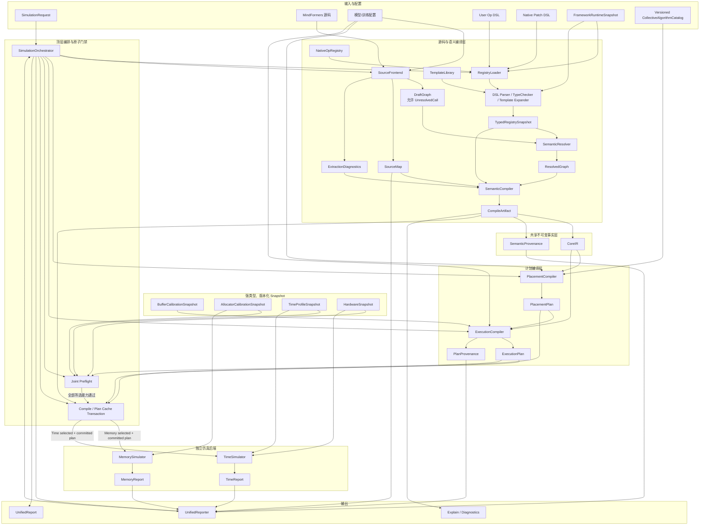
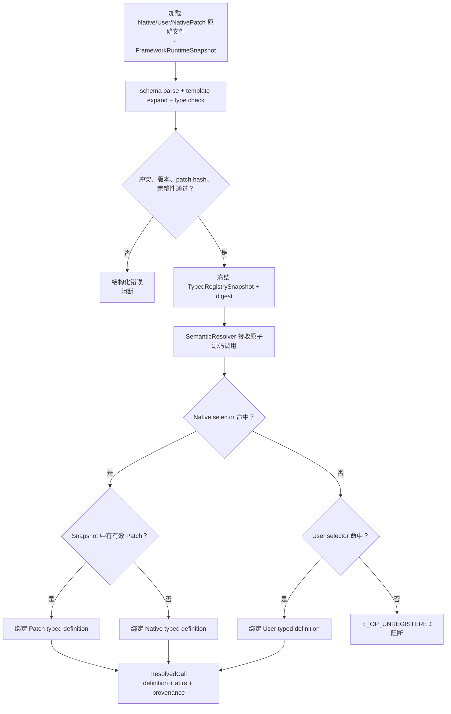
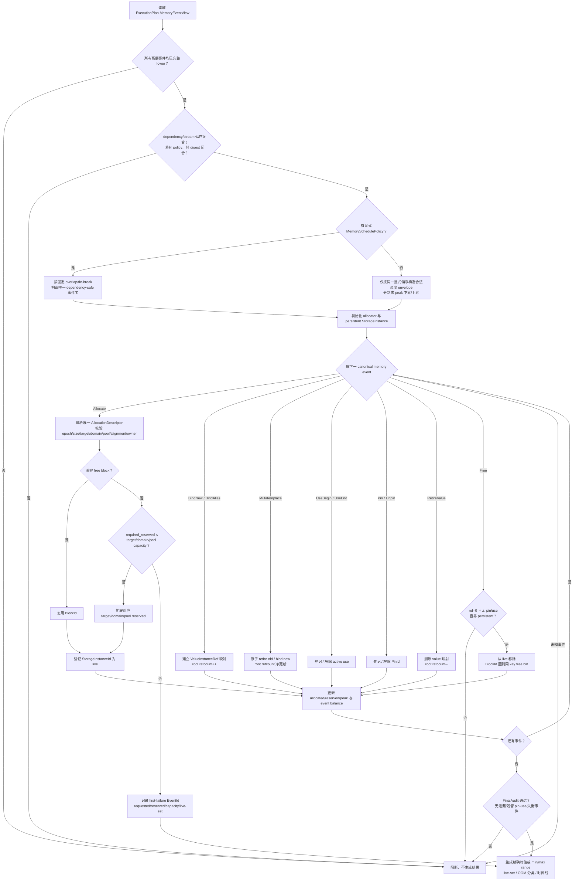
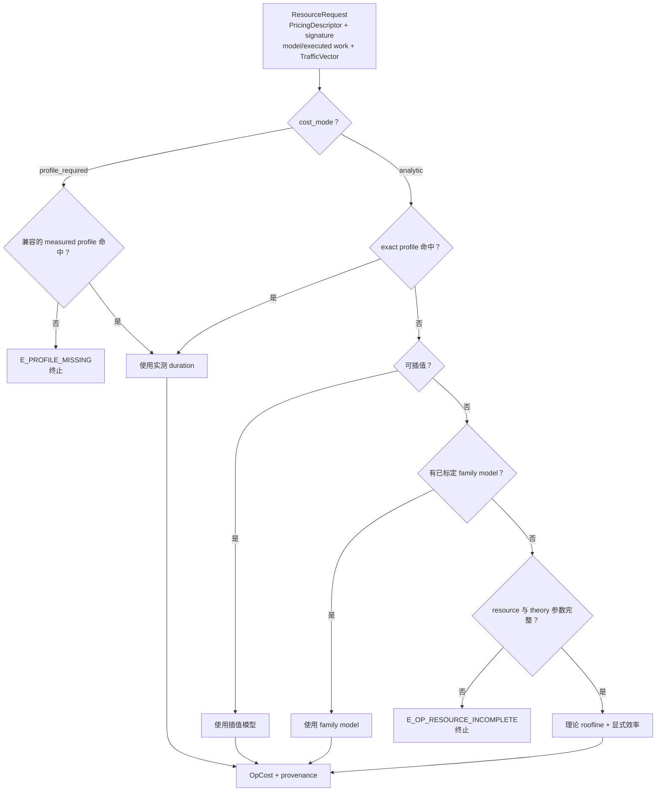
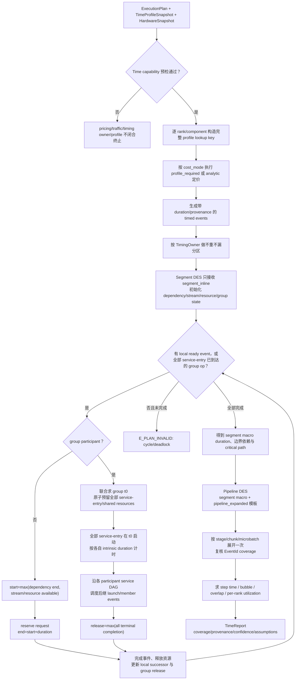
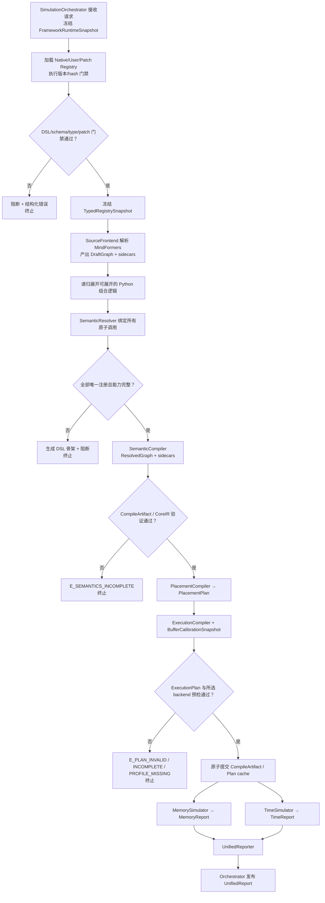

# PyNative Cost Evaluator 新方案总体设计与模块设计

> 文档类型：目标方案（To-Be）总体设计与模块设计
>
> 设计对象：`pynative-cost-evaluator`
>
> 现状核对基线：分支 `feat/unified-llm-modelspec`，提交 `6b72d8db1b6ab22890f77ae4817ec74af4fb61c2`
>
> 设计日期：2026-07-30
>
> 方案版本：1.0
>
> 状态：方案已确认，尚未实现
>
> 定位约定：正文中的 `path:line` 均相对于仓库根目录。带源码定位的内容描述当前实现事实；未带定位且使用“目标、应、建议”的内容属于本方案设计。
>
> 文档权威：本文件依据本轮已确认的设计决策形成，是完整、独立的 To-Be 规范；
> 它完整取代 `specs/2026-07-30-unified-code-grounded-ir-design.md` 的目标架构规范，
> 后者仅可作为历史背景。当前实现事实始终以所列基线源码为准；任何说明文档与源码冲突时，
> 以源码为准。

## 1. 结论摘要

新方案的主线是：

> **以 MindFormers 源码为模型事实入口，以固定语法的 Op 语义 DSL 补齐源码无法证明的算子契约，编译成不可变 CoreIR，再由独立的 PlacementPlan 和 ExecutionPlan 驱动内存、时间两个只读仿真后端。**

术语上，本文把统一 `ModelIR` 定义为原子的 `CompileArtifact`：其中 `CoreIR` 是后端共享的
逻辑模型核心，SourceMap、SemanticProvenance 和诊断是可裁剪 sidecar。后文使用 CoreIR 时，
特指这个不含源码文本、placement 和执行状态的核心层。

这条主线同时解决四个问题：

1. **模型演进速度**：Python 层可展开代码直接从 MindFormers 源码重新抽取，源码变化后重新编译即可更新 Op DAG，不再要求首先手改整张模型图。
2. **未知 Op 的安全性**：未注册或语义不完整的 Op 在 CoreIR 生成前阻断，提示用户通过配置文件注册；不再默认 shape 不变、无 saved tensor、零 workspace 或零成本。
3. **内存精度**：内存后端消费显式的 `Allocate / Alias / Pin / Free` 事件，以 placement
   后的 `StorageInstanceId` 为物理身份模拟申请、保留和释放过程，而不是只依赖层级分桶即时相加。
4. **架构解耦**：Time 和 Memory 只共享上游事实，不互相 import、不修改 CoreIR；Placement 与执行语义各自有独立计划层。

目标流水线为：

```text
MindFormers 源码 / 手写补充
              │
              ▼
       Source Frontend
              │
              ▼
 SemanticResolver + 固定 DSL
 Native / User / NativePatch
              │
              ▼
            CoreIR
 TensorId / StorageId / OpId
 ShapeExpr / DType / alias / saves
              │
              ▼
        PlacementPlan
 mesh / local shape / shard / replica
 stage / collective / reshard / StoragePlacementId
              │
              ▼
        ExecutionPlan
 event / dependency / stream / lifetime
 allocation / release / StorageInstanceId / resource request
         ┌────┴────┐
         ▼         ▼
 MemorySimulator  TimeSimulator
 allocator/live   cost/contention/pipeline
         └────┬────┘
              ▼
        UnifiedReport
 result / coverage / provenance / confidence
```

## 2. 设计背景与现状差距

### 2.1 当前已经具备的可复用基础

当前仓库并非从零开始：

- `ModelSpec / OpSpec / TensorRef` 已表达 shape、参数、saved tensor、workspace 和反向 scratch 等内存契约。`cost_eval/model_spec.py:142-238`
- `OpDAG` 已表达算子节点、依赖边、源码抽取诊断、detach 和参数等信息。`cost_eval/opdag/schema.py:8-46`
- `TimedOp` 已包含 phase、local shape、stream、dependency 和通信规格，可作为 ExecutionPlan 时间侧视图的重要参考。`cost_eval/timesim/ir.py:18-63`
- liveness 旁路已证明“按张量存活集和重算图变换”可以独立于现有桶模型运行。`cost_eval/liveness/simulate.py:1-25`
- 当前测试明确禁止 Time 和 Memory 相互 import，只允许共享上游模块；这个边界应继续保留。`tests/test_timesim_decoupling.py:69-101`

因此，新方案不是重写所有计算公式，而是把现有能力迁移到统一、可验证的上游契约中。

### 2.2 当前语义分散

当前 Op 语义被分散维护：

| 语义 | 当前位置 | 当前问题 |
|---|---|---|
| 源码名称到 Op 类型 | `opdag/primitives.py` | 只负责名称与粗粒度类型映射 |
| 反向保存张量 | `opdag/bprop_rules.py` | 与 shape、alias、time cost 分离 |
| shape 推断 | `opdag/shape_infer.py` | 大量按 Op 类型的分支 |
| 时间成本 | `timesim/op_cost.py` | 只对部分算子有 FLOPs 公式 |
| 内存契约 | `model_spec.py`、`layers/*` | 主要由模型 builder 手写 |

`PRIMITIVES` 明确要求未知 primitive fail-loud，避免错误分类导致 saved 集错误。`cost_eval/opdag/primitives.py:14-21`
`derive_saves()` 对未知 Op 类型以及未声明 saved 集的融合 Op 同样 fail-loud。`cost_eval/opdag/bprop_rules.py:75-96`

这些纪律是正确的，但新增一个完整 Op 仍可能需要修改多处 Python 代码，缺少统一的用户扩展入口。

### 2.3 未知 Op 的处理不一致

当前未知调用可能出现三种不同结果：

- primitive alias 未注册时直接抛错；`cost_eval/opdag/primitives.py:334-347`
- 一般无法识别的调用可能只进入 `opaque_calls`，不形成 DAG 节点；`cost_eval/opdag/schema.py:29-44`
- shape 推断对未列举的 Op 会透传首输入 shape 并记录诊断。`cost_eval/opdag/shape_infer.py:1492-1507`

“未知 Op 透传首输入 shape”不是真正保守：它只对 shape-preserving Op 成立，对 reduction、concat、topk、动态索引和多输出 Op 都可能传播错误结果。目标方案必须取消这一兜底。

### 2.4 dtype 与时间资源模型仍偏粗

当前 `TimedOp` 只有一个字符串 `dtype`，`tensor_bytes()` 主要区分 fp32 和其他 2 字节类型。`cost_eval/timesim/ir.py:37-71`
比较类输出的 bool dtype 需要 shape inference 额外订正。`cost_eval/opdag/shape_infer.py:1267-1281`

当前 FLOPs 只对 MatMul/GroupedMatMul 计算，其他 Op 在 `op_flops()` 中返回 0；时间模型再把未命中 GEMM/FA 的 Op 作为带宽类处理。`cost_eval/timesim/ir.py:74-87`、`cost_eval/timesim/op_cost.py:91-123`

目标方案需要统一的 DType 类型系统和声明式资源模型。

### 2.5 当前内存身份与生命周期仍会丢失语义

当前 `OpSpec/ResolvedOp` 只有单个 `output`，`saves` 是扁平列表，workspace/scratch
主要是可缺省标量。`cost_eval/model_spec.py:187-205`、`cost_eval/shape_eval.py:186-203`
现有 liveness 契约明确拒绝多输出，并对缺少的 workspace/scratch 通过
`getattr(..., 0)` 放行。`cost_eval/liveness/contract.py:401-415`

活性图按 tensor name 首见定型，inplace 通过同名 producer 表示；
运行时 live key 也是 `(microbatch, layer, name)`。`cost_eval/liveness/graph.py:157-185`、
`cost_eval/liveness/simulate.py:137-163`、`cost_eval/liveness/simulate.py:590-599`
因此当前模型无法普遍区分：

- 同名的新逻辑版本与真正的物理复用；
- 异名 alias/view 与两次独立分配；
- saved input/output 的 Pin 与实际新建的 saved internal；
- 多个 workspace 的顺序复用与真实共存；
- 多输出和零输出 side-effect Op。

已有 adapter 也明确记录 Detach alias 因目标结构无法表达而发生过计；
零输出节点会被标为 `no-output` 并跳过。`cost_eval/opdag/to_resolved.py:42-43`、
`cost_eval/opdag/to_resolved.py:1305-1330`

所以新方案不能只把现有“桶”换个模块名，必须在 IR/Plan 层恢复逻辑值、物理 Storage、
保存义务和相位 buffer 四类独立事实。

## 3. 目标、非目标与核心不变量

### 3.1 目标

1. 从 MindFormers 源码动态构建并更新 Op DAG。
2. 用一套固定语法、可静态校验的 DSL 描述 native 和用户 Op 语义。
3. 将 shape、dtype、storage、alias、autograd、placement 和 resource 语义编译成统一契约。
4. 通过 `TensorId / StorageId / StoragePlacementId / StorageInstanceId / OpId`
   消除名称去重、放置副本和别名歧义。
5. 生成不被后端修改的 CoreIR、PlacementPlan 和 ExecutionPlan。
6. 用显式申请释放事件提高内存峰值仿真的准确性和可解释性。
7. 复用现有 Time DES、Memory 公式、schedule 和 calibration 资产。
8. 对未知、不完整、冲突和失效 patch 统一 fail-loud。

### 3.2 非目标

1. DSL 不执行任意 Python，也不允许用户扩展解释器函数或语法。
2. CoreIR 不承载源码文件、行号、调用原文等诊断信息。
3. 基础 Op 语义库不保存某型号设备上的实测耗时；buffer 身份与生命周期属于语义，
   设备相关的实测 duration、buffer 大小锚点和 allocator 参数属于 Calibration/Profile。
4. Memory 和 Time 不共享后端内部状态，也不互相调用。
5. 第一阶段不追求一次性删除全部 legacy 路径。
6. 不把自动并行策略搜索器纳入仿真器核心。

### 3.3 核心不变量

1. 一个原子源码调用在一次编译中只能解析到一条有效 Op 语义。
2. 未注册或所选仿真目标所需能力不完整时，不生成可执行计划。
3. 可执行 CoreIR 中不存在 `UnknownOp` 或 `OpaqueOp`。
4. 缺失字段与显式空值严格区分。
5. `StorageId` 是 CoreIR 的逻辑存储/alias 等价类，StoragePlacementId 是 rank/stage
   上的放置模板，ExecutionPlan 的 `StorageInstanceId` 才是物理内存计数身份。
6. PlacementPlan 和 ExecutionPlan 只派生 CoreIR，不反向修改 CoreIR。
7. MemorySimulator 和 TimeSimulator 只消费 Plan 及各自只读、强类型、版本化的 backend
   snapshot，不读取源码、YAML 或 Registry。
8. native、user、patch、template、compiler 和 calibration/profile 的版本与 hash
   分别进入 CompileArtifact、Plan 或 BackendReport provenance，并参与对应缓存键。
9. `TensorId` 是一次赋值后的逻辑值身份；同名新版本必须获得新 ID，不能用名称推断物理复用。
10. 每个输出必须显式选择且只选择一种存储规则：`new`、`alias(ref)` 或 `inplace(ref)`。
11. 每个执行计划要么完整通过预检，要么不产生任何可供后端执行的部分计划。
12. CLI/API 必须通过 SimulationOrchestrator；FrameworkRuntimeSnapshot、联合预检和缓存事务
    不能由调用方选择性绕过。

## 4. 总体软件架构



### 4.1 分层责任

| 层 | 只负责 | 不负责 |
|---|---|---|
| Orchestration | 唯一入口、全量编译、联合预检、缓存事务、结果原子性 | 修改任一层语义或绕过失败 |
| Environment | 冻结 framework/runtime/schema/compiler 版本事实 | 在编译中读取可变全局状态 |
| SourceFrontend | 解析源码、内联可展开函数、识别原子调用和数据依赖 | 猜测未知 Op 语义 |
| Semantic | 注册表解析、DSL 校验、shape/dtype/storage/autograd/resource 编译 | 仿真 allocator 或设备执行 |
| CoreIR | 保存逻辑 Op、Tensor、Storage 和不可变语义事实 | local shard、microbatch 时序 |
| Placement | mesh、stage、shard、replica、local shape、collective | allocator、耗时定价 |
| Execution | phase、dependency、stream、lifetime、resource request、alloc/free | 修改逻辑模型 |
| Memory | liveness、allocator、allocated/reserved、OOM | 推导 shape、autograd、placement |
| Time | cost、contention、stream/pipeline DES | 推导 storage/alias 或修改 IR |
| Reporting | 汇总结果、范围、coverage、provenance、confidence | 隐藏未覆盖或理论退化 |

## 5. 核心类关系图

```mermaid
classDiagram
    class SourceFrontend
    class DraftGraph
    class UnresolvedCall
    class SourceMap
    class ExtractionDiagnostics
    class RegistryLoader
    class FrameworkRuntimeSnapshot
    class TypedRegistrySnapshot
    class SemanticResolver
    class DslCompiler
    class ResolvedGraph
    class SemanticCompiler
    class CompileArtifact

    class CoreIR
    class OpInstance {
        +OpId id
        +SemanticId semantic_id
        +TensorId[] inputs
        +TensorId[] outputs
        +Attributes attrs
        +OpDTypeContract dtype_contract
        +BufferContractId[] buffers
    }
    class OpDTypeContract {
        +DTypeExpr compute_dtype
        +DTypeExpr accum_dtype
    }
    class TensorValue {
        +TensorId id
        +ShapeExpr shape
        +DType storage_dtype
        +StorageId storage_id
        +LayoutExpr layout
    }
    class ParameterBinding {
        +ParameterId id
        +TensorId initial_value
        +StorageId storage_id
        +ParameterRole role
    }
    class ValueRef {
        +ValueKind tensor_parameter_or_phase
        +TensorId_or_ParameterId_or_PhaseValueId id
    }
    class Storage {
        +StorageId id
        +BytesExpr size
        +StorageKind kind
        +PlacementConstraint placement
        +AlignmentConstraint alignment
        +Persistence persistence
    }
    class StoragePlacement {
        +StoragePlacementId id
        +StorageId logical_id
        +Placement placement
        +AlignmentConstraint alignment
    }
    class BufferContract {
        +BufferContractId id
        +OpId owner
        +Phase phase
        +BufferSizeSpec size
        +PlacementConstraint placement
        +MemoryDomain domain
        +AllocatorPool pool
        +AlignmentConstraint alignment
        +EventAnchor begin
        +EventAnchor end
        +OverlapGroup? overlap
        +ProvenanceRef provenance
    }
    class BufferPlacement {
        +BufferPlacementId id
        +BufferContractId contract
        +Placement placement
        +BytesExpr local_size
        +MemoryDomain domain
        +AllocatorPool pool
        +AlignmentConstraint alignment
    }
    class StorageInstance {
        +StorageInstanceId id
        +AllocationPlacementRef placement
        +AllocationEpoch epoch
        +Persistence persistence
        +AllocationDescriptorId allocation
    }
    class StorageRelation {
        +StorageRule new_alias_inplace_incoming
        +ValueRef base
        +OffsetExpr offset
        +ShapeExpr extent
        +StrideExpr stride
    }
    class SavedTensorRef {
        +TensorId tensor_id
        +ReleaseJoin release_join
    }
    class SavedInternalValue {
        +TensorId tensor_id
        +StorageId storage_id
        +ShapeExpr shape
        +DType storage_dtype
        +PlacementExpr placement
        +EventAnchor producer
        +ReleaseJoin release_join
    }
    class GradientValueSpec {
        +PhaseValueId id
        +ValueRef primal
        +ShapeExpr shape
        +DTypeExpr storage_dtype
        +StorageId storage_id
        +PhaseStorageRule storage_rule
    }
    class GradientAccumulationSpec {
        +PhaseValueId[] contributions
        +PhaseValueId output
        +PhaseStorageRule output_storage
        +DTypeExpr compute_dtype
        +DTypeExpr accum_dtype
        +ResourceId resource_id
    }
    class AutogradContract {
        +SavedTensorRef[] saved_inputs
        +SavedTensorRef[] saved_outputs
        +SavedInternalValue[] saved_internal
        +GradientValueSpec[] gradients
    }
    class FLOPsValue {
        +FLOPsKind expr_or_unavailable
        +IntExpr expr
        +Reason unavailable_reason
    }
    class ResourceComponent {
        +ResourceId id
        +Phase phase
        +CostMode cost_mode
        +ValueRef[] reads
        +ValueRef[] writes
        +DTypeExpr compute_dtype
        +DTypeExpr accum_dtype
        +FLOPsValue flops
        +SpecialOpsExpr special_ops
        +ReductionOpsExpr reduction_ops
        +BytesExpr bytes_read
        +BytesExpr bytes_written
        +CostFamily cost_family
        +AccountingOwner owner
        +StreamClass? stream
        +ResourceId[]? depends_on
    }
    class SemanticProvenance

    class PlacementCompiler
    class CollectiveAlgorithmCatalog
    class PlacementPlan
    class ValuePlacement {
        +ValuePlacementId id
        +ValueRef value
        +Shape local_shape
        +LayoutSignature layout
        +AlignmentSignature alignment
        +WorkReplicationRoleMap replication_roles
    }
    class CollectivePlan {
        +CollectiveId id
        +Digest full_accounting_digest
    }
    class CollectiveAlgorithmPlan {
        +CollectiveAlgorithmId id
        +SchemaVersion version
        +AlgorithmStep[] steps
        +BytesExpr[] per_rank_network_moved_bytes
        +MemoryTrafficExpr[] per_rank_hbm_traffic
        +TrafficOwnershipSpec traffic_ownership
        +ReductionStepWork[] reduction_step_work
        +Digest physical_service_digest
    }
    class TrafficOwnershipSpec {
        +TrafficTermId[] terms
        +ResourceOwnerRule[] owner_rules
        +Digest digest
    }
    class ReductionStepWork {
        +AlgorithmStepId step
        +RankId owner
        +IntExpr executed_flops
        +ReductionOpsExpr executed_reduction_ops
    }
    class ReductionArithmeticSpec {
        +ResourceId id
        +WorkScope model_or_system
        +ReductionOpKind op_kind
        +ReductionRankWork[] per_rank_work
        +Digest physical_executed_work_digest
        +Digest accounting_digest
        +DTypeExpr compute_dtype
        +DTypeExpr accum_dtype
        +DurationAccounting included_or_separate
    }
    class ReductionRankWork {
        +RankId rank
        +AlgorithmStepId[] owned_steps
        +IntExpr model_flops_credit
        +IntExpr executed_flops
        +ReductionOpsExpr model_reduction_ops_credit
        +ReductionOpsExpr executed_reduction_ops
    }
    class ExecutionCompiler
    class ExecutionPolicyCatalog {
        +SchemaVersion version
        +Digest digest
    }
    class ExecutionPlan
    class ResolvedPolicySet {
        +SchemaVersion catalog_version
        +PolicyDefinition[] definitions
        +Digest catalog_digest
        +Digest resolved_digest
    }
    class ExecEvent {
        +EventId id
        +EventKind kind
        +TimingOwner timing_owner
        +ExecutionTargetId target
        +GroupOperationInstanceId? group_instance
        +StreamClass stream
        +EventId[] dependencies
    }
    class MemoryEventView {
        +CanonicalMemoryEvent[] events
        +MemoryDependencyEdge[] dependency_edges
        +MemoryStreamOrder[] stream_orders
        +MemorySchedulePolicy? schedule_policy
        +AllocationDescriptor[] allocation_descriptors
        +ExecutionTarget[] targets
        +Digest digest
    }
    class MemorySchedulePolicy {
        +MemorySchedulePolicyKind kind
        +OverlapRule[] overlap_rules
        +TieBreakRule tie_break
        +Digest digest
    }
    class AllocationDescriptor {
        +AllocationDescriptorId id
        +StorageInstanceId storage_instance
        +Bytes resolved_size_bytes
        +ExecutionTargetId target
        +MemoryDomain memory_domain
        +AllocatorPool pool
        +Alignment resolved_alignment
        +Persistence persistence
        +AllocationOwner owner
        +ProvenanceRef provenance
    }
    class BufferSpec
    class ScheduleGradientAccumulationPlan {
        +ScheduleAccumulationId id
        +ParameterId parameter
        +ExecutionTargetId target
        +OptimizerStepEpoch window
        +Int accumulation_steps
        +ValueInstanceRef[] microbatch_gradients
        +StorageInstanceId accumulator
        +DType storage_dtype
        +DType compute_dtype
        +DType accum_dtype
        +AccumulationCollectiveOrder collective_order
        +EventId[] update_events
        +EventId final_ready
        +Digest work_digest
    }
    class ResourceRequest {
        +ResourceId id
        +ExecutionTargetId target
        +PlacedValueRef[] reads
        +PlacedValueRef[] writes
        +WorkVector model_work
        +WorkVector executed_work
        +ModelWorkClassId? model_work_class
        +AccountingAttribution? model_attribution
        +PricingDescriptor pricing
        +TrafficVector traffic
    }
    class ExecutionTarget {
        +ExecutionTargetId id
        +RankId rank
        +DeviceId device
        +StageId stage
        +ResourceDomain domain
        +HardwareTargetRef hardware
    }
    class WorkVector {
        +FLOPsValue flops
        +SpecialOpsExpr special_ops
        +ReductionOpsExpr reduction_ops
    }
    class ModelWorkClass {
        +ModelWorkClassId id
        +ModelWorkClassKind kind
        +MetricScope model_forward_backward
        +ExecutionTargetId[] capacity_domain
        +ResourceSignature metric_signature
        +Digest metric_digest
    }
    class PricingDescriptor {
        +PricingKind kind
        +CostMode cost_mode
        +DTypeOrNone compute_dtype
        +DTypeOrNone accum_dtype
        +CostFamily cost_family
        +ResourcePolicyRef resource_policy
        +ResourceSignatureBase signature_base
        +PricingPayload payload
    }
    class ResourceSignatureBase {
        +CanonicalTuple fields
        +Digest digest
    }
    class CollectivePricingSpec {
        +CollectiveAlgorithmId algorithm_id
        +SchemaVersion algorithm_version
        +AlgorithmStep[] steps
        +DurationAccounting accounting
        +CollectiveCostPolicyRef cost_policy
        +LaunchBindingId launch
        +GroupOperationInstanceId group_instance
        +Digest physical_service_digest
    }
    class DevicePricingSpec {
        +KernelVariantId kernel_variant
        +KernelAttrSignature attributes
        +LaunchBindingId launch
    }
    class LaunchBinding {
        +LaunchBindingId id
        +EventId host_launch_event
        +EventId launched_event
        +LaunchAccounting accounting
        +ProfileScope device_only
        +Digest digest
    }
    class TransferPricingSpec {
        +MemoryDomain source
        +MemoryDomain destination
        +TransportClass transport
        +IntExpr setup_count
        +SetupAccounting setup_accounting
        +TransferPolicyRef cost_policy
    }
    class HostPricingSpec {
        +HostOpKind op_kind
        +IntExpr launch_count
        +HostWorkVector work
        +HostPolicyRef cost_policy
    }
    class SyncPricingSpec {
        +SyncKind kind
        +GroupOperationInstanceId group_instance
        +SyncPolicyRef cost_policy
        +Bool dependency_only
    }
    class GroupOperationInstance {
        +GroupOperationInstanceId id
        +GroupOperationKind kind
        +GroupEpoch epoch
        +ProcessGroupId group_id
        +RankId[] participants
        +TopologySignature topology
        +EventId[] service_entry_events
        +EventId[] release_events
        +ParticipantEventDAG[] participant_dags
        +Digest algorithm_steps_digest
        +Digest full_accounting_digest
        +GroupOperationSignature signature
        +Digest digest
    }
    class GroupOperationSignature {
        +GroupOperationKind kind
        +HardwareClass[] participant_classes
        +TopologySignature topology
        +Digest algorithm_work_traffic_digest
        +ProfileDurationScope duration_scope
        +Digest digest
    }
    class ParticipantEventDAG {
        +RankId rank
        +EventId[] pre_arrival_events
        +EventId service_entry_event
        +EventId[] service_member_events
        +EventId[] terminal_events
        +EventEdge[] service_edges
        +Digest physical_service_digest
        +Digest accounting_digest
    }
    class TrafficVector {
        +MemoryTraffic[] memory_traffic
        +TransportTraffic[] transport_traffic
        +Digest physical_traffic_digest
        +Digest accounting_digest
    }
    class ValueInstanceRef
    class BufferCalibrationSnapshot
    class AllocatorCalibrationSnapshot
    class TimeProfileSnapshot
    class HardwareSnapshot

    class MemorySimulator
    class TimeSimulator
    class MemoryReport
    class TimeReport
    class UnifiedReporter
    class UnifiedReport
    class SimulationOrchestrator
    class JointPreflight
    class CacheTransaction

    SourceFrontend --> DraftGraph
    SourceFrontend --> SourceMap
    SourceFrontend --> ExtractionDiagnostics
    DraftGraph o-- UnresolvedCall
    FrameworkRuntimeSnapshot --> RegistryLoader
    RegistryLoader --> DslCompiler
    FrameworkRuntimeSnapshot --> DslCompiler
    DslCompiler --> TypedRegistrySnapshot
    DraftGraph --> SemanticResolver
    TypedRegistrySnapshot --> SemanticResolver
    SemanticResolver --> ResolvedGraph
    ResolvedGraph --> SemanticCompiler
    SourceMap --> SemanticCompiler
    ExtractionDiagnostics --> SemanticCompiler
    TypedRegistrySnapshot --> SemanticCompiler
    SemanticCompiler --> CompileArtifact
    CompileArtifact o-- CoreIR
    CompileArtifact o-- SourceMap
    CompileArtifact o-- SemanticProvenance
    CoreIR o-- OpInstance
    CoreIR o-- TensorValue
    CoreIR o-- ParameterBinding
    CoreIR o-- Storage
    CoreIR o-- BufferContract
    OpInstance o-- BufferContract
    TensorValue o-- StorageRelation
    GradientValueSpec --> ValueRef
    GradientValueSpec o-- StorageRelation
    ResourceComponent --> ValueRef
    OpInstance o-- OpDTypeContract
    OpInstance o-- AutogradContract
    AutogradContract o-- SavedTensorRef
    AutogradContract o-- SavedInternalValue
    AutogradContract o-- GradientValueSpec
    CoreIR o-- GradientAccumulationSpec
    GradientAccumulationSpec --> ValueRef
    GradientAccumulationSpec o-- ResourceComponent
    GradientValueSpec --> Storage
    OpInstance o-- ResourceComponent
    ResourceComponent o-- FLOPsValue
    TensorValue --> Storage
    ParameterBinding --> TensorValue
    ParameterBinding --> Storage

    CoreIR --> PlacementCompiler
    CollectiveAlgorithmCatalog --> PlacementCompiler
    PlacementCompiler --> PlacementPlan
    PlacementPlan o-- ValuePlacement
    ValuePlacement --> ValueRef
    PlacementPlan o-- StoragePlacement
    PlacementPlan o-- BufferPlacement
    BufferPlacement --> BufferContract
    PlacementPlan o-- CollectivePlan
    CollectivePlan o-- CollectiveAlgorithmPlan
    CollectiveAlgorithmPlan o-- TrafficOwnershipSpec
    CollectiveAlgorithmPlan o-- ReductionStepWork
    CollectivePlan o-- ReductionArithmeticSpec
    ReductionArithmeticSpec o-- ReductionRankWork
    CoreIR --> ExecutionCompiler
    PlacementPlan --> ExecutionCompiler
    ExecutionPolicyCatalog --> ExecutionCompiler
    BufferCalibrationSnapshot --> ExecutionCompiler
    ExecutionCompiler --> ExecutionPlan
    ExecutionPlan o-- ResolvedPolicySet
    ExecutionPlan o-- LaunchBinding
    ExecutionPlan o-- GroupOperationInstance
    GroupOperationInstance o-- GroupOperationSignature
    GroupOperationInstance o-- ParticipantEventDAG
    ExecutionPlan o-- ExecEvent
    ExecutionPlan o-- ExecutionTarget
    ExecEvent --> ExecutionTarget
    ExecEvent --> GroupOperationInstance
    ExecutionPlan o-- MemoryEventView
    MemoryEventView o-- AllocationDescriptor
    MemoryEventView o-- ExecutionTarget
    MemoryEventView o-- "0..1" MemorySchedulePolicy
    ExecutionPlan o-- BufferSpec
    ExecutionPlan o-- ScheduleGradientAccumulationPlan
    ExecutionPlan o-- ResourceRequest
    ResourceRequest --> ExecutionTarget
    ResourceRequest o-- WorkVector
    ResourceRequest --> "0..1" ModelWorkClass
    ExecutionPlan o-- ModelWorkClass
    ResourceRequest o-- PricingDescriptor
    ResourceRequest o-- TrafficVector
    PricingDescriptor o-- ResourceSignatureBase
    PricingDescriptor o-- DevicePricingSpec
    PricingDescriptor o-- CollectivePricingSpec
    PricingDescriptor o-- TransferPricingSpec
    PricingDescriptor o-- HostPricingSpec
    PricingDescriptor o-- SyncPricingSpec
    CollectivePricingSpec --> GroupOperationInstance
    SyncPricingSpec --> GroupOperationInstance
    PricingDescriptor --> ResolvedPolicySet
    ExecutionPlan o-- ValueInstanceRef
    ValueInstanceRef --> ValuePlacement
    ExecutionPlan o-- StorageInstance
    StorageInstance --> AllocationDescriptor

    CompileArtifact --> CacheTransaction
    PlacementPlan --> CacheTransaction
    ExecutionPlan --> JointPreflight
    ExecutionPlan --> CacheTransaction
    AllocatorCalibrationSnapshot --> JointPreflight
    TimeProfileSnapshot --> JointPreflight
    HardwareSnapshot --> JointPreflight
    AllocatorCalibrationSnapshot --> MemorySimulator
    TimeProfileSnapshot --> TimeSimulator
    HardwareSnapshot --> TimeSimulator
    MemorySimulator --> MemoryReport
    TimeSimulator --> TimeReport
    MemoryReport --> UnifiedReporter
    TimeReport --> UnifiedReporter
    SemanticProvenance --> UnifiedReporter
    UnifiedReporter --> UnifiedReport
    SimulationOrchestrator --> SourceFrontend
    SimulationOrchestrator --> RegistryLoader
    SimulationOrchestrator --> PlacementCompiler
    SimulationOrchestrator --> ExecutionCompiler
    SimulationOrchestrator --> JointPreflight
    SimulationOrchestrator --> CacheTransaction
    JointPreflight --> CacheTransaction
    CacheTransaction --> MemorySimulator
    CacheTransaction --> TimeSimulator
    SimulationOrchestrator --> UnifiedReporter
```

## 6. 目标模块划分

```text
cost_eval/
├─ orchestration/
│  ├─ pipeline.py              # SimulationOrchestrator 唯一公共入口
│  ├─ request.py               # SimulationRequest / selected backends
│  ├─ preflight.py             # 跨层、跨后端原子预检
│  └─ cache_txn.py             # compile/plan cache 的原子提交
├─ environment/
│  └─ framework_runtime.py     # FrameworkRuntimeSnapshot
├─ frontend/
│  ├─ source_frontend.py       # MindFormers Python 解析与可展开调用内联
│  ├─ draft_graph.py           # DraftGraph / UnresolvedCall
│  ├─ source_map.py            # 可裁剪诊断旁路
│  └─ diagnostics.py           # 抽取失败与 scaffold 上下文
├─ semantics/
│  ├─ schema.py                 # Op 语义描述 schema
│  ├─ errors.py                 # 统一错误码
│  ├─ template_library.py       # 固定模板
│  ├─ compiler.py               # ResolvedGraph + sidecars → CompileArtifact
│  ├─ artifact.py               # CoreIR + sidecars 的原子编译产物
│  ├─ provenance.py             # registry/template/config 来源
│  ├─ resolver.py               # DraftGraph + typed snapshot → ResolvedGraph
│  ├─ resolved_graph.py         # 绑定后的调用图
│  ├─ registry/
│  │  ├─ native.py             # 内置只读注册域
│  │  ├─ user.py               # 用户新增 Op 注册域
│  │  ├─ patch.py              # native 完整替换 patch
│  │  ├─ loader.py             # 三域加载、冲突与版本门禁
│  │  ├─ context.py            # RegistryBuildContext
│  │  └─ snapshot.py           # TypedRegistrySnapshot + digest
│  └─ dsl/
│     ├─ ast.py                # 受控表达式 AST
│     ├─ parser.py             # 解析，不使用 eval
│     ├─ types.py              # Shape/Bytes/DType/Bool 类型系统
│     ├─ validator.py          # schema、引用、能力完整性
│     └─ compiler.py           # DSL → OpSemanticDefinition
├─ core_ir/
│  ├─ ids.py                   # OpId/TensorId/ParameterId/PhaseValueId/ValueRef/StorageId/SemanticId
│  ├─ shape.py                 # ShapeExpr
│  ├─ dtype.py                 # DType 与 promotion/sizeof
│  ├─ layout.py                # LayoutExpr / stride / offset
│  ├─ graph.py                 # CoreIR/OpInstance/TensorValue
│  ├─ buffers.py               # immutable BufferContract from DSL
│  ├─ parameters.py            # ParameterBinding / tied parameter identity
│  ├─ storage.py               # Storage/alias/in-place
│  ├─ autograd.py              # saves/gradient values/fan-in accumulation/reachability
│  └─ verify.py                # CoreIR 不变量
├─ calibration/
│  ├─ contracts.py             # 四类 snapshot 的只读 protocol
│  ├─ buffer_snapshot.py       # ExecutionCompiler 可消费
│  ├─ allocator_snapshot.py    # MemorySimulator 可消费
│  ├─ time_snapshot.py         # Time profile + Hardware snapshot
│  └─ digests.py               # plan/report cache digest
├─ placement/
│  ├─ mesh.py
│  ├─ storage_placement.py     # StoragePlacementId / placed replica template
│  ├─ buffer_placement.py      # BufferPlacementId / local buffer requirements
│  ├─ plan.py
│  ├─ compiler.py
│  ├─ shard_rules.py
│  ├─ collectives.py            # collective + ReductionArithmeticSpec
│  └─ collective_algorithms.py  # versioned catalog / algorithm work plan
├─ execution/
│  ├─ plan.py
│  ├─ events.py
│  ├─ memory_events.py         # canonical MemoryEventView
│  ├─ memory_schedule.py       # memory partial order + optional schedule policy
│  ├─ instance_ids.py          # ValueInstanceRef / StorageInstanceId / allocation epoch
│  ├─ allocation_specs.py      # all StorageInstance AllocationDescriptor
│  ├─ targets.py               # rank/device/stage/resource-domain/HardwareTargetRef
│  ├─ resource_requests.py     # model/executed work + placed I/O
│  ├─ model_work_classes.py    # owner-independent MFU attribution
│  ├─ pricing.py               # 自包含 PricingDescriptor / ResourceSignatureBase
│  ├─ traffic.py               # HBM/host/transport traffic 与唯一计费 owner
│  ├─ policy_catalog.py        # versioned catalog + immutable ResolvedPolicySet
│  ├─ launch_lowering.py       # Host launch event + LaunchBinding
│  ├─ group_operations.py      # collective/barrier operation-level rendezvous
│  ├─ compiler.py
│  ├─ autograd_lowering.py
│  ├─ schedule_grad_accum.py   # cross-microbatch/optimizer-step accumulation
│  ├─ recompute_lowering.py
│  └─ schedule_lowering.py
├─ memorysim/
│  ├─ simulator.py
│  ├─ allocator.py
│  ├─ liveness.py
│  ├─ calibration.py
│  └─ report.py
├─ timesim/
│  ├─ simulator.py
│  ├─ op_cost.py
│  ├─ resources.py
│  ├─ segment_sim.py
│  ├─ pipeline_sim.py
│  └─ calibration.py
├─ reporting/
│  ├─ unified.py
│  ├─ coverage.py
│  ├─ provenance.py
│  └─ explain.py
└─ adapters/
   ├─ legacy_model_spec.py
   ├─ legacy_opdag.py
   ├─ legacy_memory.py
   └─ legacy_time.py
```

模块约束：

- `orchestration` 是唯一公共编排入口；CLI/API 不得绕过它直接组合 compiler 和 backend。
- `semantics/core_ir/placement/execution` 是后端中立层。
- `memorysim` 和 `timesim` 禁止互相 import。
- 后端不得 import `semantics.dsl`、registry 或 SourceFrontend。
- `adapters` 只服务迁移，不成为长期第二真相源。
- `core_ir` 不 import frontend、registry、placement、execution 或任何 backend。
- `placement` 只依赖 CoreIR 和共享配置类型；`execution` 只依赖 CoreIR、PlacementPlan、
  versioned ExecutionPolicyCatalog 和 BufferCalibrationSnapshot 接口。
- `memorysim/timesim` 只依赖 ExecutionPlan、各自 calibration/profile 接口和公共 report protocol。
- Time 所需的 cost mode、三类 dtype、cost family、profile signature、resource policy、
  collective algorithm/traffic/duration accounting 必须已物化在 ExecutionPlan；Time 不得回读
  CoreIR 或 PlacementPlan 补字段，也不得另行加载 ExecutionPolicyCatalog。
- `FrameworkRuntimeSnapshot` 只能作为 Registry 构建门禁和 provenance 输入，不允许成为
  运行期可变的全局查询。
- 依赖方向由架构测试锁定；运行时回调或类型注解也不能形成反向 import。

### 6.1 模块接口契约

```text
CompileArtifact
├─ core_ir
├─ source_map
├─ semantic_provenance
├─ diagnostics
└─ compile_digest
```

| 模块 | 输入 | 输出 | 禁止行为 / 失败边界 |
|---|---|---|---|
| SimulationOrchestrator | SimulationRequest、模型/并行配置、四类 typed snapshot | UnifiedReport 或原子失败诊断 | 唯一公共入口；全量预检前不执行 backend，不提交部分 compile/plan cache |
| FrameworkRuntimeProbe | 显式环境配置或已安装框架元数据 | 不可变 FrameworkRuntimeSnapshot | 不在 registry 编译过程中临时查询可变全局环境 |
| SourceFrontend | MindFormers 源码、模型配置 | DraftGraph、SourceMap、抽取诊断 | 不猜 Op 语义；不可展开调用保留为 UnresolvedCall |
| RegistryLoader | native 包、user 目录、patch 目录、FrameworkRuntimeSnapshot | RawRegistryBundle、RegistryBuildContext | 不按加载顺序静默覆盖；未知版本/重复文件阻断 |
| DslCompiler | RawRegistryBundle、RegistryBuildContext、固定模板/grammar | TypedRegistrySnapshot、registry digest | 不执行 Python；schema/type/冲突/patch/引用不完整阻断 |
| SemanticResolver | DraftGraph、TypedRegistrySnapshot | ResolvedGraph | 每个调用必须唯一绑定；未注册/歧义立即阻断 |
| SemanticCompiler | ResolvedGraph、SourceMap、抽取诊断、snapshot digest | 原子的 CompileArtifact | 有 unresolved/opaque 或 sidecar 不闭合时不返回 CoreIR |
| PlacementCompiler | CoreIR、并行/拓扑配置、版本化 CollectiveAlgorithmCatalog | 不可变 PlacementPlan | 不修改 CoreIR；非法分片、跨 placement alias 或 collective algorithm 不闭合时阻断 |
| ExecutionPolicyCatalog | 固定 schema、内置 policy 定义与显式版本选择 | 不可变 device/collective/transfer/host/sync policy refs + digest | 不含硬件实测参数，不按运行时环境静默换 policy |
| ExecutionCompiler | CoreIR、PlacementPlan、训练/推理/调度配置、可选 MemorySchedulePolicy 选择、ExecutionPolicyCatalog、BufferCalibrationSnapshot | 含闭合 Memory partial order、AllocationDescriptor/PricingDescriptor/TrafficVector/ResolvedPolicySet 的不可变 ExecutionPlan、PlanProvenance | 生命周期、memory 偏序/已选 policy、分配描述、定价元数据、policy ref 或 HBM/transport traffic owner 不完整时不返回部分计划 |
| MemorySimulator | 自包含 ExecutionPlan.MemoryEventView（canonical 事件 + dependency/stream 偏序 + 可选 MemorySchedulePolicy + AllocationDescriptor + referenced ExecutionTarget 最小闭包）、AllocatorCalibrationSnapshot | MemoryReport + backend provenance | 不读源码/DSL/CoreIR/PlacementPlan/TimingOwner/Time DES，不修改 plan，不猜 schedule、size/target/domain/pool/alignment/lifetime |
| TimeSimulator | 自包含 ExecutionPlan、TimeProfileSnapshot、HardwareSnapshot | TimeReport + backend provenance | 不读源码/DSL/CoreIR/PlacementPlan，不从 Value 或 ResourceId 猜 dtype、算法或 traffic |
| UnifiedReporter | 所选子报告、sidecar、coverage | UnifiedReport | 不掩盖 not_requested/excluded scope、theory 或低置信度 |

### 6.2 Calibration/Profile Snapshot 契约

| Snapshot | 主消费/执行点 | 可影响 | 禁止影响 | digest 归属 |
|---|---|---|---|---|
| `BufferCalibrationSnapshot` | ExecutionCompiler | 设备相关 buffer size 锚点 | Tensor/alias/save/lifetime 结构 | PlanProvenance、plan cache |
| `AllocatorCalibrationSnapshot` | MemorySimulator | capacity、pool、physical block alignment、size class、allocator policy | BufferSpec size、语义事件和 Plan alignment contract | MemoryReport、memory cache |
| `TimeProfileSnapshot` | TimeSimulator | exact/interpolation/family duration | 标准 FLOPs/bytes、ExecutionPlan | TimeReport、time cache |
| `HardwareSnapshot` | TimeSimulator | device/host peak、HBM/host bandwidth、DMA/route、launch/setup/sync latency、效率参数 | CoreIR/Placement/Execution 或 policy 选择 | TimeReport、time cache |

四类对象都是强类型、不可变、版本化快照。SemanticProvenance 只记录 semantic 编译来源；
PlanProvenance 记录 placement/collective-algorithm/execution-policy/schedule/memory-schedule-policy/
buffer calibration；各
BackendReport 记录自己的 snapshot digest。UnifiedReport 汇总这些 digest，但不把它们混成一个来源字段。

### 6.3 顶层编排与原子性

```text
SimulationRequest
├─ model / training / parallel config
├─ collective algorithm selection / catalog version
├─ execution policy catalog version
├─ optional memory schedule policy selection
├─ requested_backends: memory | time | both
├─ requested_scope
├─ registry/user/patch locations
├─ FrameworkRuntimeSnapshot
├─ BufferCalibrationSnapshot
├─ AllocatorCalibrationSnapshot
├─ TimeProfileSnapshot
└─ HardwareSnapshot
```

`SimulationOrchestrator.run(request)` 是 CLI、API 和批处理唯一允许调用的公共入口，按固定事务边界执行：

```text
build registry snapshot
→ source/semantic compile
→ 冻结 collective/execution policy catalogs
→ placement/execution compile
→ 对全部 requested_backends 做联合 preflight
→ 原子提交 CompileArtifact/Plan cache
→ 启动所选 backend
→ UnifiedReporter 汇总
```

任一编译或预检失败时，`cache_txn` 不发布 CompileArtifact/PlacementPlan/ExecutionPlan 的普通
可命中条目，所有 backend 均保持未启动；诊断可以单独落盘，但不能伪装成部分结果。联合任务中
某 backend 运行期失败时，Orchestrator 返回一个原子失败状态，不发布普通 UnifiedReport；
已完成的内部子报告只可进入带失败状态的诊断包。单 backend 请求仍走同一入口和同一预检规则。

`FrameworkRuntimeSnapshot` 至少包含 MindFormers、MindSpore、仿真器、DSL schema、模板库和
编译器版本/构建标识。它与 patch 的 `applies_to`、`expected_native_hash` 一起参与
RegistryBuildContext、registry digest 和 SemanticProvenance，使版本门禁与缓存失效可复现。

## 7. Op 语义注册体系

### 7.1 三个物理隔离的注册域

| 注册域 | 用途 | 可否修改 native | 加载方式 |
|---|---|---:|---|
| `NativeOpRegistry` | 仿真器随版本发布的内置 Op | 否 | 只读 |
| `UserOpRegistry` | 补充 native 未覆盖的自定义 Op | 否 | 用户配置目录 |
| `NativePatchRegistry` | 显式修正一个 native Op | 整条替换 | 单独 patch 目录与开关 |

建议目录：

```text
semantics/
├─ native/
├─ templates/
└─ schema/

project-config/
├─ user_ops/
└─ native_patches/
```

### 7.2 解析顺序



注册文件只在快照构建阶段解析和编译一次；SemanticResolver 不解析 YAML，也不临时展开模板。
加载阶段发现 `UserOpRegistry` 声明了 native 已占用的 selector 时，直接报
`E_REGISTRY_CONFLICT`，不依赖加载顺序决定胜者。FrameworkRuntimeSnapshot 和
RegistryBuildContext 都进入 registry digest；同一文件在不同 framework/runtime 版本下
不能错误复用旧 TypedRegistrySnapshot。

### 7.3 Native Patch

Patch 是独立配置通道，采用完整、原子替换：

```yaml
dsl_version: 1

patches:
  - target: native::mindspore.ops.flash_attention_score
    expected_native_hash: "sha256:..."
    reason: "当前后端版本保存额外的 softmax_lse"
    applies_to:
      mindformers: ">=1.6,<1.7"
      mindspore: ">=2.8,<2.9"

    replacement:
      use:
        template: flash_attention
        args:
          # 完整模板参数
```

Patch 编译门禁：

```text
target 存在
→ framework/runtime 版本匹配
→ expected_native_hash 匹配
→ replacement 展开后语义完整
→ 原子替换
→ 生成新 registry digest
```

禁止字段级 merge，避免产生“native shape + user autograd + 默认 time cost”的混合语义。

## 8. 固定 DSL 与模板设计

### 8.1 DSL 原则

1. 语法、类型、函数集和模板由仿真器固定。
2. 用户可按照模板添加 Op 描述，也可在固定 schema 内填写完整语义。
3. DSL 解析为受控 AST，禁止 Python `eval`。
4. 模板只是标准 DSL 片段的参数化展开，不形成第二套执行路径。
5. 用户不能新增解释器函数、修改 grammar 或执行外部代码。

### 8.2 最小 Op 描述

Op DSL 只保留绑定和仿真相关信息：

```yaml
dsl_version: 1

ops:
  - id: user::square

    selector:
      symbol: my_ops.square

    signature:
      inputs: [x]
      attrs: {}

    use:
      template: unary_pointwise
      args:
        output_shape: "shape(x)"
        output_dtype: "dtype(x)"
        saved_inputs: [x]
        forward_flops: "numel(output(0))"
        backward_flops: "2 * numel(output(0))"
```

用户配置不包含源码文件、行号或调用原文。`selector` 是完成调用绑定所需的最小注册信息。

### 8.3 完整语义展开

上述模板展开后必须得到统一、闭合的描述：

```yaml
semantics:
  outputs:
    - name: y
      shape: "shape(x)"
      storage_dtype: "dtype(x)"
      storage:
        kind: new
        layout: contiguous
        alignment: natural

  dtype:
    compute: "dtype(x)"
    accumulation: "dtype(x)"

  autograd:
    differentiable: true
    saved_inputs:
      - ref: x
        consumers: [backward.grad_x]
        release_join: after_all_consumers
    saved_outputs: []
    saved_internal: []
    gradient_values:
      - id: dy
        role: grad_output
        primal: y
        shape: "shape(y)"
        storage_dtype: "dtype(y)"
        storage:
          kind: incoming
      - id: dx
        role: grad_input
        primal: x
        shape: "shape(x)"
        storage_dtype: "dtype(x)"
        storage:
          kind: new
          layout: contiguous
          alignment: natural

  buffers:
    forward_buffers: []
    backward_buffers: []

  placement:
    rule: elementwise

  resource:
    forward:
      cost_mode: analytic
      components:
        - name: square
          stream: device_compute
          depends_on: []
          reads: [x]
          writes: [y]
          accounting:
            mode: replace
            covers: [logical:self.forward]
          flops: "numel(y)"
          special_ops: {}
          reduction_ops: {}
          bytes_read: "bytes(x)"
          bytes_written: "bytes(y)"
          cost_family: pointwise
    backward:
      cost_mode: analytic
      components:
        - name: grad_x
          stream: device_compute
          depends_on: []
          reads: [x, "grad_output(0)"]
          writes: ["grad_input(0)"]
          accounting:
            mode: replace
            covers: [logical:self.grad_x]
          flops: "2 * numel(y)"
          special_ops: {}
          reduction_ops: {}
          bytes_read: "bytes(x) + bytes(grad_output(0))"
          bytes_written: "bytes(grad_input(0))"
          cost_family: pointwise
    recompute:
      reuse: forward
```

闭合 schema 的最低要求是：

1. `outputs` 必须存在；零输出的 side-effect Op 使用显式 `outputs: []`，不能被抽图器跳过。
2. 每个输出必须且只能声明一种 `storage.kind`：`new`、`alias` 或 `inplace`。
   `new` 必须由模板或完整 DSL 给出 canonical layout 和 alignment constraint；alias 继承
   base，view 显式给出 offset/stride 并由 base+offset 推导有效 alignment。
3. `saved_inputs`、`saved_outputs`、`saved_internal` 必须全部存在；没有保存项时写显式空数组。
4. `forward_buffers`、`backward_buffers` 必须存在；“没有 buffer”只能用显式空数组表达。
5. 每个可达 phase 都必须有资源描述或显式 `reuse` 关系；训练可达但缺少 backward 语义时阻断。
6. schema 是 closed schema：未知字段、拼错字段、未知枚举值和未知版本全部拒绝。
7. 每个 `replace` resource component 必须显式给出 `stream` 和 `depends_on`（无依赖写 `[]`）；
   `additive` component 必须给出 `adds_to`、不允许另带执行 stream/dependency，并满足
   owner I/O 子集与 dtype/family 完全兼容规则。
8. 每个 component 必须显式给出 `flops`、`special_ops`、`reduction_ops` 和实际 bytes；
   没有对应工作写 `{}` 或 `0`，字段缺失仍表示未知。

模板参数可以使用 `[x]` 这类简写，但 TypedRegistrySnapshot 中必须展开为带 `consumers`
和 `release_join` 的 SavedTensorRef。`release_join` 必须在依赖偏序上 happens-after 所有
backward reader；若编译器不能证明唯一 join，必须要求模板/完整 DSL 显式列出 consumers 并阻断。
所有 backward resource 的 `grad_output/grad_input/grad_parameter` 引用也必须先解析为
GradientValueSpec，不能用 primal Tensor 的 shape/dtype 暗中代替。
Phase storage 也是 closed tagged union：`incoming` 只允许用于 grad_output port，并在完整
autograd 图连接后复用上游 producer 的 PhaseValueId/StorageId；本 Op 产生的 grad_input、
grad_parameter 必须显式选择 `new/alias/inplace`。同一梯度边只能有一个 producer，不能让
每个 consumer 分别 Allocate 一份隐式 grad_output。

“同一梯度边单 producer”不等于忽略 fan-in。若一个 primal/ParameterId 从多个下游 use
收到多个 gradient contribution，SemanticCompiler 必须用固定内置 accumulator 语义合成
`GradientAccumulationSpec`：每个 contribution 保留独立 PhaseValueId，累加节点生成唯一
canonical PhaseValueId，随后上游 `grad_output` 的 `incoming` 才绑定这个 canonical 值。
用户不手写该节点，也不能把多个 contribution 随机挑一个当结果。

Storage relation 使用 closed tagged union，以下字段不能混搭：

```yaml
# new：禁止 of/view 字段
storage:
  kind: new
  layout: contiguous
  alignment: natural
```

```yaml
# alias：必须有 of；禁止 mutation
storage:
  kind: alias
  of: "input(0)"
```

```yaml
# view 是 alias 的受限变体；offset 单位为 byte，stride 单位为 element
storage:
  kind: alias
  of: "input(0)"
  view:
    offset_bytes: "0"
    extent: "[dim(input(0), 0), attr('width')]"
    strides_elems: "[attr('row_stride'), 1]"
```

```yaml
# inplace：必须引用一个可写 input；禁止 view 字段
storage:
  kind: inplace
  of: "input(0)"
```

`new` 只允许新 Storage 且必须解析出 canonical layout/alignment；`alias` 不允许 mutation；
`inplace` 在 mutation 点终结旧 Value，
不存在“保留旧内容”的隐式语义。若 backward 或后续读者需要旧内容，模板必须先创建
snapshot/new。inplace 还必须验证 local required bytes 不超过 root capacity，并验证
placement、allocator pool、alignment、layout 和 storage dtype 兼容；dtype reinterpret
只能走另一个显式、受限的 view 模板。验证范围是共享 root 的完整 alias/view 集：
mutation byte range 内仍存活或被 Pin 的 alias/view 一律要求先 retire 或显式 snapshot；
v1 不提供隐式 mutation-visible alias。无法证明 view 与 mutation range 不重叠时按冲突阻断。

### 8.4 固定类型系统

| 类型 | 用途 | 示例 |
|---|---|---|
| `IntExpr` | 轴长、元素数、整数属性 | `dim(x, -1)` |
| `BoolExpr` | 有限条件分支 | `attr("causal") == true` |
| `ShapeExpr` | 输出 shape | `broadcast(shape(x), shape(y))` |
| `DTypeExpr` | 输出/计算 dtype | `promote(dtype(x), dtype(y))` |
| `LayoutExpr` | 逻辑布局、stride 和 offset | `contiguous`、`layout(input(0))` |
| `AlignmentExpr` | Storage 对齐约束 | `natural`、`align(512)` |
| `BytesExpr` | buffer 和通信字节 | `numel(x) * sizeof(dtype(x))` |
| `TensorRefExpr` | 输入输出引用 | `input(0)`、`output(1)` |
| `ValueRefExpr` | primal/gradient/internal 值引用 | `grad_output(0)`、`grad_input(1)` |
| `FLOPsValue` | `IntExpr` 或显式不可用 | `"2*M*K*N"`、`unavailable(reason)` |
| `SpecialOpsExpr` | 闭集名称到 `IntExpr` 的 map | `{exp: "numel(x)"}` |
| `ReductionOpsExpr` | 闭集 reduction op 到 `IntExpr` 的 map | `{compare: "numel(x)-numel(x)/dim(x,-1)"}` |
| `PlacementExpr` | shard/replica 规则 | `shard(x, axis=-1, mesh="tp")` |

静态类型检查必须在 CoreIR 生成前完成。Shape 与 Bytes 混算、未绑定引用、非法轴、未穷尽条件分支均阻断。

内部 Phase enum 固定为 `forward | backward | recompute | optimizer`。`fwd/bwd/recomp`
只允许出现在 Legacy Adapter 输入，进入 TypedRegistrySnapshot 前必须规范化；profile key、
ResourceId 和 ExecutionPlan 一律使用 canonical enum。每个非 `reuse` phase 必须显式声明
`cost_mode`，`recompute: {reuse: forward}` 不需要重复声明。

### 8.5 允许与禁止

允许：

- 固定函数集；
- 有限且必须带 `else` 的 `cases`；
- shape、dtype、字节、FLOPs 和资源公式；
- 模板参数化；
- 显式 alias、view、in-place 和生命周期；
- 引用独立 Calibration/Profile key。

禁止：

- 循环、递归、变量赋值、可变状态；
- 文件、网络、环境变量访问；
- import、任意函数调用和 Python 代码；
- 用户定义新的 DSL 函数；
- 运行期间修改 registry；
- 用缺省值替代未声明的 saved、workspace、dtype 或 cost。

表达式求值结果也必须满足值域约束：shape 维度、字节、FLOPs、special-op 和 reduction-op count
为可证明的非负整数；负数、小数、重复 YAML key、未绑定符号、未知 special-op 名称
或未穷尽 phase 都是编译错误。`unavailable(reason)` 是 FLOPsValue 的显式变体，
不参与整数求值，且只能用于 `profile_required`。

## 9. CoreIR 设计

### 9.1 精简核心对象

```text
CoreIR
├─ OpInstance[]
├─ TensorValue[]
├─ ParameterBinding[]
├─ GradientAccumulationSpec[]
├─ BufferContract[]
├─ Storage[]
├─ graph edges
└─ model metadata

OpInstance
├─ OpId
├─ SemanticId
├─ input TensorId[]
├─ output TensorId[]
├─ DSL 实际引用的 attributes
├─ OpDTypeContract
├─ ResourceComponent[]
└─ BufferContractId[]

TensorValue
├─ TensorId
├─ ShapeExpr
├─ storage_dtype
├─ logical layout / strides / offset
└─ StorageId

ParameterBinding
├─ ParameterId
├─ initial TensorId
├─ StorageId
└─ role / trainable / persistence contract

Storage
├─ StorageId
├─ BytesExpr
├─ logical storage class
├─ logical placement constraint/ref
├─ alignment constraint
└─ persistence

AutogradContract
├─ SavedTensorRef saved_inputs[]
├─ SavedTensorRef saved_outputs[]
├─ SavedInternalValue saved_internal[]
└─ GradientValueSpec gradients[]

SavedTensorRef
├─ TensorId
└─ ReleaseJoin = all backward consumers 的依赖 join

SavedInternalValue
├─ TensorId / StorageId / ShapeExpr / storage_dtype
├─ logical placement constraint
├─ producer anchor
└─ ReleaseJoin

GradientValueSpec
├─ PhaseValueId
├─ primal TensorId/ParameterId
├─ ShapeExpr / storage_dtype rule
├─ StorageId / storage rule
└─ grad_output / grad_input / grad_parameter role

GradientAccumulationSpec
├─ contribution PhaseValueId[]
├─ canonical output PhaseValueId
├─ output storage rule
├─ compute / accumulation dtype
└─ ResourceId / dependency

BufferContract
├─ BufferContractId / owner OpId / phase
├─ strict size expr | shape + storage_dtype | calibrated key + bounds
├─ logical placement/domain/pool/alignment constraint
├─ begin/end EventAnchor + optional overlap group
└─ provenance ref
```

CoreIR 不保存 `file:line`、调用原文或整份源码参数。当前 `OpNode` 把 `src` 与 shape/dtype 放在同一节点中，目标方案将其拆开。`cost_eval/opdag/schema.py:1-16`
DSL 中每个非空 `forward_buffers/backward_buffers` 条目必须编译为一个 BufferContract；
它不是普通 Tensor/Storage，但属于后端中立的 Op 执行契约，不能在生成 CoreIR 时丢弃。

### 9.2 TensorId、StorageId、StoragePlacementId 与 StorageInstanceId

必须区分：

- `TensorId`：前向/primal 逻辑值，也就是 SSA 意义上的值身份；每次写入产生新版本；
- `ParameterId`：跨层或 tied weight 的参数身份；
- `PhaseValueId`：autograd/optimizer lowering 产生的梯度或 phase-local 逻辑值身份；
- `ValueRef = TensorId | ParameterId | PhaseValueId`：所有 placement、resource 和 lifetime
  接口使用的统一值引用；ParameterId 用于 tied/persistent 参数身份，普通 Op 数据边仍使用 TensorId；
- `PlacedValueRef=(ValueRef, ValuePlacementId)`：PlacementPlan 中某 rank/stage 上的逻辑值引用；
- `ValueInstanceRef=(PlacedValueRef, schedule instance)`：ExecutionPlan 中具体 microbatch/chunk/epoch 的值引用；
- `StorageId`：CoreIR 中的逻辑 storage/alias 等价类；
- `StoragePlacementId`：PlacementPlan 中某 rank/device/stage 上的 storage 放置模板；
- `BufferContractId`：CoreIR 中某 Op/phase 的逻辑临时 buffer 契约；
- `BufferPlacementId`：PlacementPlan 中该 buffer 在 rank/device/stage 上的放置模板；
- `AllocationPlacementRef = StoragePlacementId | BufferPlacementId | ExternalPlacementId`：
  StorageInstance 的分型放置来源；buffer 不伪造 CoreIR StoragePlacementId；
- `StorageInstanceId`：ExecutionPlan 中具体 microbatch/chunk/lifetime 的物理 allocation epoch；
- `OpId`：逻辑算子实例；
- `SemanticId`：算子语义定义。

`GradientValueSpec` 必须显式拥有 logical StorageId 与 storage rule；其 producer/consumer
由完整 autograd 图连接，不能在单个 Op 内临时造一个无全局身份的 `grad_output(0)`。
CoreIR 的 Storage 集同时覆盖 primal、saved internal 和 gradient/optimizer phase value。
`ParameterBinding` 将稳定 ParameterId 解析到 initial TensorId/StorageId；optimizer 更新可沿
同一 binding 产生新的 TensorId 版本，但不能修改 CoreIR 中的 binding、改变 tied 参数的稳定
身份或静默复制逻辑 Storage。

全图 autograd fan-in lowering 采用固定规则：

1. 0 个 contribution：该梯度静态不可达，不生成值或资源；
2. 1 个 contribution：直接作为 canonical gradient；
3. `n>1`：生成显式 GradientAccumulationSpec，dependency join happens-after 全部 producer，
   再产生 canonical gradient；
4. 累加使用内置 add 资源语义，普通 FLOPs 为 `(n-1) * numel(gradient)`，并按实际
   reduction tree/串行策略声明 reads、writes、stream 和 dependency；
5. 输出默认 `new`；只有 root alias、旧内容读、Pin、容量、dtype、layout 和 placement
   全部安全时，编译器才可选择显式 `inplace` accumulator；
6. 多个 use 的 tied parameter 与普通 DAG fan-in 使用同一规则，不能漏算 grad accumulation
   的 Storage、FLOPs、bytes、collective 或 duration。

上述 GradientAccumulationSpec 只解决**单个图实例/单个 microbatch 内**多个 producer 的
fan-in，不表示训练 schedule 的 `gradient_accumulation_steps`。跨 microbatch 的参数梯度累积
需要知道 optimizer-step window、microbatch 顺序和 collective 策略，属于 ExecutionPlan 的
ScheduleGradientAccumulationPlan；两层不得复用同一个“accumulation”字段或重复相加。

存储关系：

```text
new                 新建逻辑 StorageId；Placement 生成 StoragePlacementId；
                    Execution 按 schedule/lifetime 生成 StorageInstanceId
alias(input)        新 TensorId，共享输入的 root StorageId
alias(input, view)  共享 root StorageId，并显式携带 offset/extent/stride
inplace(input)      新 TensorId 复用输入 StorageId，并在 mutation 点终结旧值版本
```

MemorySimulator 按 StorageInstanceId 计数，而不是按 Tensor 名称、全局 StorageId 或
StoragePlacementId 去重。persistent 参数通常每个 placement 只有一个实例；同一 activation
StoragePlacement 在并发 microbatch/chunk 中可生成多个 StorageInstanceId。ID 必须在计划
作用域内稳定并进入 plan digest。

Storage 规则必须满足：

1. alias chain 归并到 root Storage；禁止环、前向引用、悬空引用和跨 placement alias。
2. view 的 `offset/extent/stride` 必须落在 root Storage 容量内；如果 allocator 不支持子区间回收或 pin，则保守地保留整个 root Storage。
3. inplace 不产生 Allocate，但必须产生新的 TensorId。编译器必须检查共享 root 的完整
   alias/view 集，而不只是被写 input：任何与 mutation byte range 重叠、仍有后续读者或
   Pin 且需要旧内容的 Value 都必须阻断；唯一例外是 DSL 显式创建了 pre-mutation snapshot/copy。
   v1 不支持“存活 alias 自动观察 mutation”；非重叠 view 只有在范围可证明时才可继续存活。
4. inplace 的 local required bytes 必须不大于 root capacity，且 placement、pool、alignment、
   layout 和 storage dtype 兼容；任一无法证明都阻断。
5. persistent parameter/buffer 的 inplace 更新必须使用专门 side-effect 契约，不能冒充普通 activation inplace。
6. 同名新 Storage 与异名同 Storage 都是合法情况；禁止以名称、shape 相等或字段缺省推断复用。
7. 多个 tied parameter 引用共享同一 `ParameterId` 时应映射到同一逻辑 StorageId，但跨
   rank/stage 必须拥有不同 StoragePlacementId 和 persistent StorageInstanceId，不能把
   不同设备上的 replica 计成一块存储。

保存语义也必须区分物理行为：

- `saved_inputs`、`saved_outputs` 使用 SavedTensorRef 精确引用 TensorId 和 ReleaseJoin；
  它们只给 root Storage 增加 Pin 义务，不分配第二份内存。
- `saved_internal` 是带 TensorId 的完整新 Value/Storage 声明，必须包含 producer anchor、
  shape、storage dtype、placement 和 ReleaseJoin，才能被 backward reads 稳定引用。
- cast、snapshot、mask、LSE 等只要拥有独立字节，就必须建成 `saved_internal/new`；不能通过“Pin 后改变原 Storage 大小”来模拟。
- 同一个 root Storage 可被多个保存边引用，物理字节只计一次，但每个 Pin 义务保留到自己的最后 consumer。
- 参数不能直接作为 activation save；若反向需要参数旧值快照，必须显式创建 `saved_internal`。
- grad reachability 由 SemanticCompiler/AutogradLowering 静态求闭包。确定 detached/不可达的
  backward 分支删除其 save/gradient/resource，并记录 lowering provenance；可达性不确定时阻断，
  不能为了省内存猜测删除，也不能长期保守 Pin。

### 9.3 SourceMap 与 Provenance 旁路

```text
SourceMap
OpId → file / line / call-expression

SemanticProvenance
SemanticId → native/user/patch/template
           + normalized_semantic_digest
           + registry_digest
           + compiler/schema version
           + config_hash
```

规则：

- SourceMap 由 SourceFrontend 自动生成，用户不填写；
- 不参与 Memory/Time 计算和语义 hash；
- 默认报告不展示，仅供 error/explain/debug；
- 精简发布或缓存 CoreIR 时可完全剥离；
- SemanticProvenance 独立参与报告、缓存和复现。

SemanticId 是稳定命名空间 ID，不假设它天然内容寻址；防陈旧缓存和 profile lookup
必须显式使用 normalized semantic/registry/compiler digest。SemanticCompiler 只有在
ResolvedGraph、SourceMap、ExtractionDiagnostics 和 TypedRegistrySnapshot digest
全部闭合时，才原子返回 CompileArtifact。

移动源文件或改变行号不会改变 Op 语义。

### 9.4 CoreIR 验证

生成 CoreIR 前必须验证：

1. 所有输入输出 TensorId 存在；
2. 所有 TensorValue 均有 ShapeExpr、storage dtype、logical layout/stride/offset 和 StorageId；
3. 每个输出恰有一种存储规则，alias/view/in-place 关系合法且无环；
4. inplace 所在 root 的重叠 alias/view 集没有未满足的旧内容读或 Pin，
   容量/layout/dtype/placement/pool 兼容；有需要时存在显式 snapshot；
5. saved tensor 属于 input/output/internal，引用准确 TensorId，ReleaseJoin happens-after
   所有 backward consumer；
6. 每个 backward ValueRef 均能解析到 GradientValueSpec/SavedInternalValue，shape、
   storage dtype、StorageId 和 storage rule 可求值；
7. 每个多 contribution gradient 都有且只有一个闭合的 GradientAccumulationSpec，
   contribution/canonical output、dtype、storage、resource 和 dependency 守恒；
8. DSL 的每个非空 buffer 条目恰好对应一个 BufferContract，phase、size/calibration key、
   placement/domain/pool/alignment、begin/end 和 provenance 闭合；
9. 零输出 side-effect Op 仍保留在图中；
10. 不存在 unresolved/opaque 节点；
11. Op attributes 仅保留 DSL 实际引用项；
12. graph 无非法跨阶段引用；
13. SemanticId 可在 provenance 中追溯。

CoreIR 阶段验证逻辑 alias/placement constraint；物理 rank/device 是否一致由
PlacementCompiler 在 local placement 物化后再次验证。两道门任一失败都不能生成 ExecutionPlan。

## 10. dtype 设计

### 10.1 三类 dtype

| 字段 | 含义 | 主要消费者 |
|---|---|---|
| `storage_dtype` | 张量在内存中的实际类型 | Memory、通信量 |
| `compute_dtype` | 内核主要计算类型 | Time、硬件峰值 |
| `accum_dtype` | 累加或内部统计类型 | Time、内部 buffer |

三者都来自版本化的闭合集合，例如 `bool/int8/uint8/int32/int64/fp16/bf16/fp32/fp64`；
未知名称和当前硬件不支持的组合必须 fail-loud，不能按“非 fp32 即 2 字节”处理。

例如 bf16 MatMul 可以是：

```yaml
dtype:
  outputs:
    - storage: "dtype(input(0))"
  compute: bf16
  accumulation: fp32
```

### 10.2 推导链

```text
模型配置 / Parameter / Cast
              │
              ▼
输入 Tensor.storage_dtype
              │
              ▼
Native 模板或 User DSL dtype rule
              │
              ▼
SemanticCompiler 类型求值
              │
              ▼
CoreIR Tensor.storage_dtype
CoreIR Op.compute_dtype / accum_dtype
              │
              ▼
Placement/Execution 物化
              │
              ▼
Memory / Time 只读消费
```

常见模板规则：

| 模板 | output storage dtype | compute/accum |
|---|---|---|
| View | 继承输入 | 不执行计算 |
| Pointwise | 按固定 promotion rule | 通常等于输出 |
| MatMul | 模型精度规则 | compute 与 accum 可不同 |
| Compare | bool | 输入计算类型 |
| Cast | `to_dtype` | 目标类型 |
| Index | 数据输出与 index 分别定义 | 模板显式声明 |

模板和 DSL 都未给出可解析 dtype 时，报 `E_DTYPE_UNRESOLVED`；不能默认继承第一个输入。

额外规则：

1. Memory 和通信字节按每个 TensorValue 自己的 `storage_dtype` 求和，不能用一个 Op 的输出 dtype 代替所有输入输出。
2. `compute_dtype` 决定 kernel/profile 和硬件峰值选择；`accum_dtype` 参与 kernel 签名、精度与成本匹配。
3. `accum_dtype` 本身不自动增加显存。只有累加器被物化并拥有生命周期时，才通过 `saved_internal` 或 BufferSpec 产生 Storage。
4. Cast 的输入、输出必须是不同 TensorId；是否新建 Storage 由输出 storage rule 明确声明。
5. dtype promotion 是模板库的一部分并参与版本/hash；用户只能调用固定规则，不能注入自定义 Python promotion。
6. backward 的 grad_output/grad_input/grad_parameter 各自拥有 GradientValueSpec 和
   storage dtype rule；不能直接借用 primal/output dtype。每个 ResourceComponent 保存
   已解析的 effective compute_dtype/accum_dtype。
7. GradientAccumulationSpec 的 storage/compute/accum dtype 由固定 promotion 规则解析；
   mixed contribution dtype 未显式 cast/promotion 时阻断。

## 11. FLOPs 与资源语义

### 11.1 FLOPs 统一口径

`flops` 表示逻辑浮点运算量，不是时间、指令数或设备 cycle：

- 浮点加、减、乘：1 FLOP；
- FMA/MAC：2 FLOPs；
- MatMul `[M,K] × [K,N]`：`2 × M × K × N`；
- BMM/GroupedMatMul 再包含 batch/expert 维；
- View、比较、索引和纯数据搬运通信：0 FLOPs；reduce/reduce-scatter/all-reduce 的算术
  由 CollectivePlan.ReductionArithmeticSpec 单独记账；
- `exp/log/sqrt/rsqrt` 等单独进入 `special_ops`，不伪装成普通 FLOPs。

`flops: 0` 只表示没有逻辑浮点运算，不表示 duration 为 0；这类 phase 仍须显式声明
bytes、special_ops/cost_family 或 host/communication resource。

`special_ops` 的名称集合是版本化闭集，数量必须按 phase 单独声明；未知名称直接报错。
它与普通 FLOPs 是正交计数，不能再把同一特殊函数折算进 `flops`。
ReductionArithmeticSpec 另有闭集 `op_kind`，并在每个 `ReductionRankWork` 中把非 FLOP
归约显式拆成 `model_reduction_ops_credit` 与 `executed_reduction_ops`：前者表示该 rank
归属的全局逻辑工作，后者表示该 rank 在选定 ring/tree/设备算法步骤中实际执行的工作。`sum` 的浮点 add 分别进入
model/executed FLOPs；`max/min` 的 compare 分别进入两套 reduction-op count，仍保持
“compare=0 FLOPs”。逻辑 count 与实际 count 都必须可守恒、可定价，不能因为不是 FLOPs
就把 reduction compute 当 0 时间。

前向、反向、重算分别声明。以 MatMul 为例，backward 不是一个来源不明的全局倍数，
而是按实际需要展开为 `grad_input` 和 `grad_weight` 两个本地 GEMM 资源组件：

```yaml
resource:
  forward:
    cost_mode: analytic
    components:
      - name: matmul
        stream: device_compute
        depends_on: []
        reads: ["input(0)", "input(1)"]
        writes: ["output(0)"]
        accounting:
          mode: replace
          covers: [logical:self.forward]
        flops: "2 * M * K * N"
        special_ops: {}
        reduction_ops: {}
        bytes_read: "bytes(input(0)) + bytes(input(1))"
        bytes_written: "bytes(output(0))"
        cost_family: gemm
  backward:
    cost_mode: analytic
    components:
      - name: grad_input
        when: "requires_grad(input(0))"
        stream: device_compute
        depends_on: []
        reads: ["grad_output(0)", "input(1)"]
        writes: ["grad_input(0)"]
        accounting:
          mode: replace
          covers: [logical:self.grad_input]
        flops: "2 * M * N * K"
        special_ops: {}
        reduction_ops: {}
        bytes_read: "bytes(grad_output(0)) + bytes(input(1))"
        bytes_written: "bytes(grad_input(0))"
        cost_family: gemm
      - name: grad_weight
        when: "requires_grad(input(1))"
        stream: device_compute
        depends_on: []
        reads: ["input(0)", "grad_output(0)"]
        writes: ["grad_input(1)"]
        accounting:
          mode: replace
          covers: [logical:self.grad_weight]
        flops: "2 * K * M * N"
        special_ops: {}
        reduction_ops: {}
        bytes_read: "bytes(input(0)) + bytes(grad_output(0))"
        bytes_written: "bytes(grad_input(1))"
        cost_family: gemm
  recompute:
    reuse: forward
```

`accounting` 解决融合 Op 的所有权问题。模板展开会给每个逻辑资源体稳定 ResourceId：

- `replace + covers[]`：当前组件完整代表列出的逻辑资源体，对应 child resource 不再重复计数；
- `additive + adds_to`：当前组件只是指定 owner 内同一 kernel 的增量工作，不覆盖 child。

ExecutionCompiler 必须证明：每个可达逻辑 ResourceId 恰被一个 replace owner 覆盖；
每个 additive component 指向一个存在的 owner。覆盖集合为空、重叠、悬空，融合 Op 与已展开
child 同时计费，或逻辑资源没有 owner，均属于 `E_RESOURCE_ACCOUNTING`。

v1 对 additive 采用可实现的受限合并：其 reads/writes 必须是 owner reads/writes 的子集，
compute_dtype、accum_dtype、cost_family 和 cost_mode 必须与 owner 完全一致，且不得声明
独立 stream/dependency。ExecutionCompiler 只把其增量 FLOPs、special_ops、
reduction_ops、bytes 按类型加到 owner ResourceRequest；因此 event I/O/lifetime 不会漏边，Time 也只选择一套
dtype/family policy。若 overhead 读取额外 Value、使用另一 dtype/family 或需要独立顺序，
它必须声明成拥有自己逻辑 ResourceId 的 replace component，不能伪装成 additive。

非空 special_ops 使用同一强类型 component，例如 softmax 模板片段：

```yaml
components:
  - name: softmax
    stream: device_compute
    depends_on: []
    reads: [x]
    writes: [y]
    accounting:
      mode: replace
      covers: [logical:self.forward]
    flops: "3 * numel(x) - numel(x) / dim(x, -1)"
    special_ops:
      exp: "numel(x)"
      reciprocal: "numel(x) / dim(x, -1)"
    reduction_ops:
      compare: "numel(x) - numel(x) / dim(x, -1)"
    bytes_read: "bytes(x)"
    bytes_written: "bytes(y)"
    cost_family: softmax
```

该公式对应稳定 softmax 的“逐元素减最大值 + 行内求和 + 逐元素乘 reciprocal”：
若最后一维为 `N`、行数为 `R=numel(x)/N`，普通 FLOPs 为 `R × (N + N-1 + N)=3RN-R`；
比较运算不计 FLOPs但以 `reduction_ops.compare=R(N-1)` 定价，`exp` 为每元素一次，
`reciprocal` 为每行一次。采用逐元素 division 或
不同 reduction 算法时必须选择另一个版本化模板，不能沿用此公式。解析器必须拒绝
special-op 重复键、负数、小数和闭集之外的名称；类型检查器还必须证明 `N>0` 且整除成立。

### 11.2 全局公式与本地求值

DSL 中保存与 shape 参数化的逻辑公式，不允许用户手写 `/tp`、`/cp`：

```text
CoreIR ResourceFormula
         │
         ▼
PlacementPlan local shapes
         │
         ▼
ExecutionCompiler
         │
         ▼
per-rank ResourceRequest
```

这样相同 Op 语义可以复用于不同并行策略。

CoreIR 保留全局 shape 与逻辑公式，PlacementPlan 同时保留 global/local/replica/shard 关系，
ExecutionPlan 才生成逐 rank 的 ResourceRequest。这样可做资源守恒检查，也避免用户在 DSL
中把 TP/CP 除法重复编码。

每个 ResourceRequest 明确分成两套工作向量：

- `model_work={flops,special_ops,reduction_ops}`：该 rank 对全局模型语义工作的记账归属，
  用于守恒和逻辑报告；MFU 通过下述 ModelWorkClass 做 owner-independent 归一化；
- `executed_work={flops,special_ops,reduction_ops}`：选定 distributed/kernel algorithm 在该 rank 真正
  执行的工作，用于理论定价、HFU 和硬件工作报告。

普通、属于 model scope 且未复制的 component 两者相等；recompute、系统 collective、
optimizer/control overhead 必须显式生成零/空 model_work 且不引用 contributing
ModelWorkClass，只保留 executed_work。分片 reduction、广播后重复 special-op 等模型语义场景
可以让两者不同，但差异必须由固定 Placement/Execution lowering 产生并记录 provenance，
用户不能直接手填。bytes_read/written 始终表示实际执行流量，不再复制一套
“model bytes”。普通 device component 的 bytes_read/written 在 lowering 后成为 HBM
MemoryTraffic；collective 的网络 moved bytes、端点 HBM/staging traffic 是两套不同字段，
不能互相代替。profile duration 也只对应 executed_work 和实际 TrafficVector。

`replica` 不是单一工作语义。PlacementCompiler 必须给每个 replica mesh axis 标注固定枚举
`WorkReplicationRole`：

- `logical_batch_replica`：例如处理不同样本的 DP rank；每个 rank 的 model_work 和
  executed_work 都归属自己的逻辑 batch slice，job model work 随全局 batch 增加；
- `redundant_execution`：例如同一逻辑样本在某些 TP/CP/EP 布局中的广播后重复计算；
  所有 rank 都增加 executed_work，但同一 replica equivalence class 的 model_work 只由
  PlacementPlan 指定的确定性 credit owner 归属一次。

多条 replica axis 的 role 按 equivalence class 组合；未标注、互相矛盾或 credit owner 不唯一
均报错。因而“每个 replica 都把全局公式加入 model_work”不是通用规则，MFU 不会把冗余执行
冒充模型逻辑工作，HFU 仍完整反映实际执行。

每个 model_work 非零、非空或显式 `unavailable` 的 ResourceRequest 还必须同时引用一个
`ModelWorkClass` 并携带 `model_attribution`；反之，recompute/system/optimizer/control request
不得引用 contributing class 或 attribution：

- `unique_target`：唯一 shard 或 logical-batch slice，capacity domain 只有实际 owner；
- `distributed_logical`：一个逻辑工作由多个 target 共同完成，例如 collective model credit；
- `redundant_execution`：同一逻辑工作在多个 target 重复执行。

class 的 `metric_scope=model_forward_backward` 固定；其 model logical work 等于该 scope
成员 request 的 model_work 记账和，capacity domain 与 metric signature（dtype/cost family）
固定。credit owner/分配只解决“恰好记一次”的身份问题，不能决定 MFU；交换 owner 不得改变
class logical work、capacity domain 或 job metric。
混合 dtype/cost family 必须拆成多个同质 class。

`ModelWorkClass.metric_digest` 只由 kind、metric scope、capacity domain 和 metric signature
生成，是 MFU grouping 的稳定身份。credit owner/份额属于每个 ResourceRequest 的
`model_attribution`，只进入 full accounting digest、守恒、plan/result cache 和 provenance；
它不是 ModelWorkClass 字段，也不参与 metric digest。这样只交换 attribution 时 class identity
和 MFU 均保持不变。

上例中的 `M/K/N` 是 MatMul 固定模板声明的 shape-axis symbols，例如
`K=last_dim(input(0))`、`N=last_dim(input(1))`、`M=numel(input(0))/K`；它们不是用户可自由
创建的变量。类型检查器必须证明每个 symbol 的绑定和整除关系，PlacementCompiler 再将其
物化为 local symbols。裸写未绑定的 `M/K/N` 与其他自由变量一律报 `E_DSL_UNBOUND_REF`。

分片 reduction 还必须补齐“local kernel + collective arithmetic”的工作守恒。以 softmax
最后一维被 `p` 个 rank 唯一分片为例，各 rank 的 local 公式求和为 `3RN-Rp`，相对全局
`3RN-R` 缺少 `R(p-1)` 次跨 shard add。PlacementCompiler 必须把这部分生成为
CollectivePlan 的 ReductionArithmeticSpec，而不是把所有通信一概记为 0 FLOPs：

```text
Σ non-collective local ResourceRequest.model_work.flops
+ Σ collective Σr ReductionArithmeticSpec.per_rank_work[r].model_flops_credit
= global logical model FLOPs
```

每个 `per_rank_work[r].model_flops_credit` 只补该 rank 归属的语义工作；
`per_rank_work[r].executed_flops` 则严格等于该 rank 所有 owned ReductionStepWork 的求和，
允许高于最小逻辑工作。前者进入 MFU model numerator，后者按报告 scope 进入 HFU
executed work 和理论 collective 成本。PlacementCompiler 必须把 group credit 确定性分配到
各 rank，所有 rank 的 credit 之和严格等于缺口，不能每个 rank 都复制全局值。
每 rank executed FLOPs 仍按本节口径计实际算法步骤执行的浮点算术，不是指令或 cycle。
AllGather/P2P 等无 reduction 的纯搬运仍为 0 FLOPs。

非 FLOP 归约遵循同样的守恒规则：

```text
Σ non-collective local ResourceRequest.model_work.reduction_ops[k]
+ Σ collective Σr ReductionArithmeticSpec.per_rank_work[r].model_reduction_ops_credit[k]
= global logical model reduction_ops[k]
```

每 rank 的 `executed_reduction_ops` 由 CollectiveAlgorithmPlan 中显式带 owner/work 的
确定性 steps 推导，允许与最小逻辑 count 不同。例如 distributed max/min 的逻辑 compare
credit 与 ring/tree 实际 compare count 必须分开，不能拿一个 group-level `reduction_ops`
字段复制或均分到所有 rank。对非对称 tree，root/internal/leaf 的实际工作可不同，并满足：

```text
per_rank_work[r].executed_{flops,reduction_ops}
= Σ ReductionStepWork where owner == r
Σr per_rank_work[r].executed_{flops,reduction_ops}
= algorithm declared group work
hash(per-step owner/work + per-rank model/executed aggregate) == full accounting digest
```

其中 `physical_executed_work_digest` 只覆盖算法步骤 owner 与实际 executed FLOPs/non-FLOP work；
`accounting_digest` 还覆盖 model credit 与 ResourceRequest.model_attribution，用于计划守恒、缓存和报告，
不得直接复用为 duration compatibility key。

special_ops 采用同一双向量规则：例如 distributed softmax 的 reciprocal 若在每个 rank
重复执行，`executed_work.special_ops.reciprocal` 可以是 job 级 `pR`，但所有 rank 的
`model_work.special_ops.reciprocal` 仍只能归属全局逻辑 `R`。报告必须分别展示，不能把
执行复制量冒充模型逻辑量。

### 11.3 时间成本退化层级

```text
profile_required
  → compatible measured profile hit
  → miss：E_PROFILE_MISSING

analytic
  → exact profile
  → shape/dtype interpolation
  → calibrated family model
  → DSL resource + theory roofline
  → resource/theory 参数不完整：阻断
```

每个非 `reuse` phase 必须显式选择固定枚举 `cost_mode: analytic | profile_required`：

- `analytic`：标准 FLOPs/special_ops/bytes 完整，允许按上面的退化链走到理论档；
- `profile_required`：用于固定组合子仍无法解析的 vendor/custom kernel，必须命中兼容 profile，
  未命中即 `E_PROFILE_MISSING`，绝不自动变成 bandwidth-only 或零成本。

`profile_required` 仍必须完整声明 output/storage/saves/buffers/placement 和可证明的读写字节。
若逻辑 FLOPs 无法用固定语法定义，使用显式 `flops: unavailable`，而不是省略或填 0；
该 Op 可以用实测 duration 参与 step-time 仿真，但从 MFU/HFU 分子排除，并降低 FLOPs coverage。
这是一种有范围声明的实测通道，不是未知 Op 的静默兜底。

所有送入 DES 的 profile duration 在 v1 必须声明
`ProfileDurationScope.service=intrinsic_service_only`：只含事件占用已声明资源后的服务时间，
不含 dependency wait、stream queue、resource contention wait。device/collective 再固定
`launch=device_only`，host launch 由独立 Host event/profile 或 analytic policy 定价；
group operation 再固定 `rendezvous=post_all_arrivals_service_only`，不含任一 rank 的
pre-rendezvous wait。profile schema 必须携带完整 scope；缺失、`includes_launch`、
`includes_queue_wait` 或 `includes_peer_wait` 的旧记录不能命中 detail 模式，以免 DES 双计。

使用理论档时必须记录 `provenance=theory` 和较低 confidence。命中实测 profile 时，FLOPs 仍可用于报告和 MFU，但实际 duration 以 profile 为准。

Profile 不是用一段自由字符串覆盖成本。ExecutionCompiler 生成硬件无关的
`ResourceSignatureBase`，TimeSimulator 再与 hardware/runtime/profile schema 合成完整 lookup key：

```text
SemanticId / normalized semantic digest / registry digest / compiler version
collective-algorithm catalog digest / execution-policy catalog + resolved-set digest
canonical phase / ResourceId
event kind / pricing kind / cost mode / cost family / resource-policy ref
ExecutionTarget: rank / device / stage / resource domain / HardwareTargetRef
stable launch accounting / ProfileDurationScope（不含 binding/event id）
GroupOperationSignature: participant hardware classes/topology/algorithm physical-service digest
local input and output shapes
input/output storage dtypes
per-Value local layout / strides / offset / effective alignment signature
compute_dtype / accum_dtype
placement and shard signature
distributed/kernel algorithm + executed-work digest + duration accounting
physical memory/transport traffic digest
transfer/host/sync typed payload signature
kernel-relevant attributes
---------------- hardware-neutral boundary ----------------
hardware model / runtime / profile schema version
```

`ResourceSignatureBase` 的规范字段和 digest 都随 ResourceRequest 进入 ExecutionPlan。
TimeSimulator 只在其后追加硬件侧字段；它不得通过 ResourceId 回查 CoreIR/PlacementPlan，
也不得从 storage dtype 猜 compute/accum dtype。任一字段缺失或规范 tuple 与 digest 不一致时，
联合预检直接报错。

duration lookup 的 canonical tuple 明确排除 microbatch、schedule epoch、
GroupOperationInstanceId、LaunchBindingId、EventId 及其 full-instance digest。同一语义事件在
不同 epoch 只使用稳定的 launch accounting/scope 与 GroupOperationSignature，因而可复用同一
duration profile。完整 instance/binding ids 和 full digests 仍进入 plan digest、事件一致性
校验、TimeReport provenance 与整份 time-result cache key，确保 rendezvous 状态不跨 epoch。

同理，`model_work`、`ModelWorkClassId`、ResourceRequest.model_attribution、model-credit
owner、TrafficVector owner/occurrence identity 和任何包含这些字段的 full accounting digest
都不得进入 duration lookup。lookup 使用去除 owner/ID 后的 canonical
`physical_traffic_digest`。对于
collective，`GroupOperationSignature.algorithm_work_traffic_digest` 必须从 algorithm
id/version/route、per-rank executed work 与实际 TrafficVector 单独计算，不能嵌套复用
ReductionArithmeticSpec 的 accounting digest。交换 credit owner 而物理执行工作与流量不变时，
必须命中相同 duration profile；这些逻辑记账字段仍进入 plan digest、守恒校验、结果 cache 与
report provenance。

profile hit、插值或 family model 只能改变 duration、cost provenance 和 confidence，
不能改写 CoreIR 中的标准 FLOPs、special_ops 或 bytes。报告还必须把：

- profile 覆盖率（exact/interpolated/model/theory）；
- 硬件峰值、带宽和效率参数的 calibrated/default 状态；

分开统计，不能用较高的 profile 命中率掩盖未校准硬件参数。

`layout/strides/offset/alignment` 是 resolved per-Value signature，不是笼统的 Op attribute：
相同 shape/dtype 的 contiguous 与 strided view 必须得到不同 exact key。alignment 未知时写
显式 `unknown`，不得命中要求更强保证的 profile；插值/family/theory 是否支持该布局也必须
由版本化能力表声明，不能静默按 contiguous 成本处理。
alignment signature 由 Storage alignment constraint 与 alias/view offset 静态推导，并进入
ExecutionPlan allocation contract；AllocatorCalibrationSnapshot 只能验证/实现该约束，不能
在 Memory 后端私下把更强的实际对齐反向写入 Time profile key。

Memory 不消费 FLOPs；Time 不用 FLOPs 推导存储生命周期。

### 11.4 混合 dtype 的 MFU/HFU

不能取“第一个 GEMM 的 dtype”作为整个 step 的峰值，也不能让任意 credit owner 决定 MFU。
对每个同质 ModelWorkClass `c` 定义：

```text
W_c = Σ member ResourceRequest.model_work.flops
      where c.metric_scope=model_forward_backward
R_c = ModelWorkClass.capacity_domain
P_c = Σ(r in R_c)
        peak(device_r, c.compute_dtype, c.accum_dtype, c.cost_family)

T_model_attributed(r) =
  Σ(c where r in R_c) W_c / P_c

T_model_ideal_job = Σr T_model_attributed(r)
                  = Σc |R_c| * W_c / P_c

T_executed_ideal(r) =
  Σ(all actually executed component i on rank r, including recompute)
    executed_work.flops_i / peak(device_r, compute_dtype_i, accum_dtype_i, cost_family_i)

MFU_job = T_model_ideal_job / Σr T_step(r)
HFU_job = Σr T_executed_ideal(r) / Σr T_step(r)
```

同步训练中每个参与 rank 的 `T_step(r)` 通常是同一 wall-clock step time；分母因此等于
参与设备数乘 step time，而不是把并行 rank 的理想时间直接串行相加。报告同时给出 per-rank/
per-stage 分布与 job 聚合值。`model phase` 默认指一个 optimizer step 的 forward+backward
逻辑工作，不含 recompute、optimizer 和系统 overhead；这一 scope 由 ModelWorkClass 强类型
字段和 preflight 机械校验，不能仅靠报告过滤。报告必须输出实际 scope。求和按组件独立选择
峰值，因此结果与 Op 排列顺序无关。
`unique_target`（包括 DP 的不同 logical-batch slice）各自形成单 target class；
`distributed_logical` 和 `redundant_execution` 使用完整 capacity domain。上式先聚合 class
logical work 再按 aggregate compatible capacity 归一化，因此交换 bookkeeping credit owner
或把 collective credit 在成员间重新分配不会改变 MFU；executed_work 仍在实际执行它的每个
rank 计入 HFU。缺任一 target 的兼容 peak 时 MFU 为 partial，不允许退回 owner rank peak。
`special_ops` 不混入普通 FLOPs 分子；在存在已标定特殊吞吐时另报 special-op utilization，
否则只报告数量、耗时和覆盖状态。
分片 logical reduction 的 Collective per-rank `model_flops_credit` 先在
distributed_logical ModelWorkClass 中 group-sum 一次，再按 class aggregate capacity 进入 MFU；
HFU 对该 rank 使用其 owned steps 汇总后的 `executed_flops`。
二者都必须与 local component
按 ResourceId/accounting owner 去重，不能把全局 reduction 公式和 collective credit 重复相加。
Reduction `reduction_ops` 不进入普通 MFU/HFU 分子；报告分别汇总
每 rank 的 `model_reduction_ops_credit` 与 `executed_reduction_ops`，按 model/executed scope 分栏展示
数量、耗时和专用吞吐利用率。

如果任一纳入 scope 的普通计算 component 为 `flops: unavailable`，标准 MFU/HFU 必须输出
`status=partial, value=null`；可以另报显式命名的 `covered_work_lower_bound`，但不能把它标成
完整 MFU/HFU。只有普通 FLOPs coverage 为 100% 时才输出标准数值。

## 12. PlacementPlan 设计

### 12.1 主要内容

```text
PlacementPlan
├─ DeviceMesh / ProcessGroup
├─ StageAssignment
├─ ValuePlacement[]
│  ├─ ValuePlacementId / ValueRef
│  ├─ StoragePlacementId
│  ├─ global shape
│  ├─ local shape
│  ├─ local layout / strides / offset
│  ├─ effective alignment signature
│  ├─ shard axes
│  ├─ replica axes + WorkReplicationRole
│  ├─ replica equivalence class + model-work credit owner
│  └─ partial state
├─ StoragePlacement[]
│  ├─ StoragePlacementId
│  ├─ logical StorageId
│  ├─ rank/device/stage
│  ├─ local size
│  └─ alignment constraint
├─ BufferPlacement[]
│  ├─ BufferPlacementId / BufferContractId
│  ├─ rank/device/stage placement
│  └─ local size/domain/pool/alignment
├─ OpPlacement[]
└─ CollectivePlan[]
```

职责：

1. 验证 TP/CP/EP/DP/PP/VPP 合法性；
2. 计算每个 rank 的 local shape；
3. 解析每个 local Value 的 layout/stride/offset 与 effective alignment signature；
4. 区分 shard、replica 和 partial，并为每条 replica axis 物化 WorkReplicationRole、
   equivalence class 与唯一 model-work credit owner；
5. 推导 reshard 和 collective；
6. 选择并物化 versioned CollectiveAlgorithmPlan 的 physical-service digest，并在
   CollectivePlan 闭合 full-accounting digest；
7. 为 primal、gradient、saved internal 等每个 ValueRef 物化 ValuePlacement，并为每个
   logical Storage 物化 placement-local StoragePlacement；
8. 为每个 BufferContract 物化 placement-local BufferPlacement，不引用 ExecutionTarget；
9. 生成 stage/chunk 放置；
10. 输出不可变 plan。

PlacementCompiler 不修改 CoreIR；它通过 `ValueRef/OpId` 引用逻辑对象。GradientValueSpec
不能默认复制 primal placement：反向规则必须显式推导 shard/replica/partial，必要时生成
额外 collective；无法闭合的 gradient placement 在 ExecutionPlan 之前阻断。
GradientAccumulationSpec 的所有 contribution 必须先被放置到可兼容的 local shape/layout；
partial state、reshard 或跨 rank reduction 必须物化为 CollectivePlan 并进入同一 dependency，
不能在本地 add 中静默吞掉。canonical gradient 的 ValuePlacement 只在该 join 后生效。

### 12.2 CollectivePlan

```text
CollectivePlan
├─ CollectiveId
├─ type
├─ group / group_size
├─ full-accounting digest
├─ CollectiveAlgorithmPlan
│  ├─ algorithm id / schema version
│  ├─ physical-service digest
│  ├─ ordered steps / chunk / route
│  ├─ per-rank network moved bytes
│  ├─ per-rank HBM read/write/staging traffic
│  ├─ TrafficOwnershipSpec + digest
│  └─ per-step reduction owner/work
├─ input/output ValueRef + ValuePlacementId/StoragePlacementId
├─ local volume
├─ ReductionArithmeticSpec?
│  ├─ work scope / op kind
│  ├─ per-rank owned step ids
│  ├─ per-rank model FLOPs credit / executed FLOPs
│  └─ per-rank model reduction-op credit / executed reduction-op counts
├─ duration accounting: included_in_collective | separate_compute
├─ stream class
└─ dependency
```

ExecutionCompiler 将其降低为带 StorageInstanceId 的 Collective 事件和 staging BufferSpec，
从而同时为：

- Memory 提供通信 buffer、双缓冲和生命周期；
- Time 提供通信量、拓扑和依赖。

两个后端不得各自重新猜 collective。

每个具体 schedule epoch 的 collective 还必须 lower 为一个 GroupOperationInstance。每个 rank
保留自己的 ExecEvent/ResourceRequest 集及 ExecutionTarget，并都引用同一 instance；
included 模式每 rank 只有一个 service member，separate 模式则有 entry/member/terminal
事件集；algorithm 的
ordered steps/peer route 在 v1 只用于每 rank aggregate work/traffic、service pricing 与 digest，
不生成 ring/tree step-level timed event。GroupOperationInstance 显式列出每个 participant
唯一的 service-entry/release event 和一个 ParticipantEventDAG。entry event 的“到达”定义为
其全部普通 dependency 与首个 Host launch 已完成；首个 launch 是 group 外的
`pre_arrival_event`，可以在各 rank 独立 host lane 上提前并行，但不属于 participant service
DAG，也不包含在 group service profile 中。

全部 participant 的 service-entry 均到达后，group scheduler 联合求
`t0=max(all entry dependency/launch completions, all service-entry stream/resource availability)`，
并按 ResolvedPolicySet 在 `t0` 原子预留全部 service-entry 和共享资源。任一侧 entry resource
尚忙时，其他 rank 也不能提前消费 service。之后每个 rank 只按其有向无环 service-member DAG
调度；统一 release time 为全部 terminal events 的最大完成时间，且不存在额外 aggregate
duration event。缺/重 participant、group epoch 混用、pre-arrival/entry/release 悬空、
member DAG 有环/遗漏、work/traffic aggregate 不守恒或各 rank TimingOwner 不一致均阻断，
不能让 rank-local DES 在到达偏斜时各自提前执行。
这是 v1 明确的 operation-level conservative rendezvous；若未来需要 ring step overlap，必须
升级为另一 schema version 的 per-rank-step event/request/traffic/work，禁止在本 schema 中
混合两种粒度。
每个 instance 另携带不含 id/epoch/event、任何 Host launch occurrence、model credit/owner/
model_attribution 和 full accounting digest 的稳定 GroupOperationSignature 供 duration
lookup；其中 algorithm_work_traffic_digest 只覆盖物理 algorithm/route、executed work 与实际
traffic。analytic 和 measured duration 都表示 all-arrivals 之后的 intrinsic service，launch
和 peer wait 分别只由显式 Host event 与 rendezvous 状态产生一次。

Collective algorithm 必须由 PlacementCompiler 根据显式并行/拓扑配置和版本化
CollectiveAlgorithmCatalog 选择；`auto` 也必须是确定性、带版本的选择策略。结果完整物化为
CollectiveAlgorithmPlan 并进入 PlanProvenance/plan digest。缺 algorithm id、step/route、
per-rank network traffic、per-rank HBM traffic、TrafficOwnershipSpec/digest、
per-step reduction owner/work、per-rank aggregate、physical-service digest 或
full-accounting digest 时，
PlacementPlan 阻断。HBM traffic 不能由 network moved bytes 直接等同推导：catalog 必须按算法
显式给出 endpoint read/write 与 staging traffic。TimeProfile 和
HardwareSnapshot 只能检查兼容性并给既定 algorithm 定价，不能反向选择 ring/tree、改动
duration accounting 或重新推导 executed_flops。

对于 reduce/reduce-scatter/all-reduce，ReductionArithmeticSpec 是必填；纯搬运 collective
必须显式为空。`included_in_collective` 表示 profile/CollectiveCostPolicy 已把 reduction
算术包含在同一 collective duration 中，ExecutionCompiler 只给该事件附加工作量，禁止再
生成一份 timed compute；`separate_compute` 才 lower 为独立 ResourceRequest，并用依赖连接。
理论定价若不知道网络与 reduction arithmetic 的包含/重叠策略，必须阻断而不是二次计时或忽略。
无论 included 还是 separate，lowering 都必须把
`per_rank_work[r].model_reduction_ops_credit` 写入 rank r 的
`ResourceRequest.model_work.reduction_ops`，把该 rank 的 `executed_reduction_ops` 写入
`ResourceRequest.executed_work.reduction_ops`；FLOPs 同理。rank request 的 executed work
必须等于其 owned ReductionStepWork 之和，并与 request 的 ExecutionTarget.rank 一致；
`separate_compute` 不得只复制 FLOPs 而丢失 max/min/compare 等非 FLOP 工作。
`included_in_collective` 的 participant service DAG 只有一个 collective 主 member event：
其 LaunchBinding 派生的 Host event 位于 group 外并作为 pre-arrival dependency；主请求是
service-entry/terminal，同时持有 network TransportTraffic、collective endpoint/staging
MemoryTraffic 和 reduction work，由 CollectiveCostPolicy 组合一次。
`separate_compute` 的固定 lowering 为
`[pre-group] link host-launch → [service-entry at joint t0] link request → reduction host-launch → reduction request [terminal]`；
首个 link launch 位于 participant service DAG 外，后三个事件组成其固定有向 DAG。
link/reduction 各有独立 EventId/ResourceId/PricingDescriptor，terminal 只有 reduction request，
不存在额外 aggregate duration。catalog 的
TrafficOwnershipSpec 把每个 HBM/transport term 恰好分给其中一个 ResourceId，禁止消失或重复。
BufferSpec 只表示容量和 lifetime，不能被 Time 当成 traffic，也不能由 allocator 统计反推字节。
由模型分片 reduction 产生的算术使用 `work_scope=model` 并填补 model credit；DP gradient
同步等系统 reduction 使用 `work_scope=system`，每个 rank 的 `model_flops_credit=0` 且
`model_reduction_ops_credit={}`，但仍声明该 rank 实际 `executed_flops` 与
`executed_reduction_ops`，避免污染 MFU/model reduction report 又漏掉 HFU/时间成本。
`work_scope=model` 的两类 model credit 则必须各自进入且只进入一次全局守恒；任一 scope
不满足该不变量都报 `E_COLLECTIVE_ARITHMETIC`。
例如 distributed softmax 的 global-max 使用 `op_kind=max`，每 rank `executed_flops=0`：
`per_rank_work[r].model_reduction_ops_credit.compare` 填该 rank 的逻辑缺口归属，
`executed_reduction_ops.compare` 则按该 rank owned algorithm steps 推导；global-sum 使用 `op_kind=sum`
并分别声明 model credit 与 executed add FLOPs。
op kind、count 与 algorithm steps 不一致，或没有兼容 profile/CollectiveCostPolicy/专用
throughput 为 non-FLOP reduction 定价时，统一报 `E_COLLECTIVE_ARITHMETIC`。

## 13. ExecutionPlan 设计

### 13.1 事件类型

ExecutionCompiler 先把 StoragePlacement 按 phase/stage/chunk/microbatch/lifetime 展开为
StorageInstance：persistent 对象每个 placement 一个实例；activation/buffer 的每一次
allocation epoch，无论是否与前一次重叠，都必须有不同 StorageInstanceId。为避免巨型图，
实例可用确定性的 ID template 延迟物化，但展开后仍必须全局唯一。

每个 StorageInstance 必须同时在 `MemoryEventView.allocation_descriptors` 中恰好命中一条
不可变 AllocationDescriptor，完整物化 resolved_size_bytes、ExecutionTarget、memory domain、
allocator pool、alignment、persistence、owner 和 provenance。primal/gradient/saved_internal
由 CoreIR + PlacementPlan lower，临时 buffer 由 BufferSpec lower，external initial/live set
由显式 scope 配置 lower；无论来源为何，Memory 只读这张统一表，不回读来源层。

ExecutionPlan 的高层事件为：

```text
Compute
Collective
Host
Materialize
Offload
Prefetch
Barrier
```

ExecutionCompiler 同时为 Memory 生成规范化、闭合的 `MemoryEventView`：

```text
Allocate(StorageInstanceId)                         # 必须解析到唯一 AllocationDescriptor
BindNew(ValueInstanceRef, StorageInstanceId)        # refcount++
BindAlias(ValueInstanceRef, root, view?)             # refcount++
MutateInplace(old_ref, new_ref, root, mutation_range)# 全 root alias 门禁后原子 retire/bind
UseBegin(EventId, StorageInstanceId)
UseEnd(EventId, StorageInstanceId)
Pin(PinId, StorageInstanceId, ReleaseJoin)
Unpin(PinId)
RetireValue(ValueInstanceRef)                        # refcount--
Free(StorageInstanceId)
```

`Collective/Materialize/Offload/Prefetch/Host` 必须在进入 Memory 前完全 lower 成上述事件。
Offload/Prefetch 必须显式创建 host/device StorageInstance 和 transfer staging，并用
UseBegin/UseEnd 包围源、目标及 staging；未知高层事件或不完整 lowering 直接
`E_MEMORY_EVENT_UNLOWERED`。Barrier 没有字节，但可作为 release join/dependency anchor。

每个事件至少包含：

```text
EventId
OpId / BufferId / ResourceId
phase: forward | backward | recompute | optimizer
stage / chunk / microbatch template
ExecutionTargetId
stream
dependencies
timing owner: segment_inline | pipeline_expanded | dependency_only
placed ValueRef reads / writes
value births / last-use retirements
resource request
lifetime action
```

### 13.2 ResourceRequest 与自包含定价契约

每个可计时事件必须携带一个闭合的 ResourceRequest：

```text
ResourceRequest
├─ ResourceId + ExecutionTargetId + placed reads/writes
├─ model_work / executed_work
├─ PricingDescriptor
│  ├─ kind / cost_mode / cost_family / ResourcePolicyRef
│  ├─ compute_dtype / accum_dtype（不适用时显式 none）
│  ├─ ResourceSignatureBase canonical tuple + digest
│  └─ 恰好一个 tagged payload
│     ├─ DevicePricingSpec
│     ├─ CollectivePricingSpec
│     ├─ TransferPricingSpec
│     ├─ HostPricingSpec
│     └─ SyncPricingSpec
└─ TrafficVector
   ├─ MemoryTraffic(domain, direction, bytes, owner)
   ├─ TransportTraffic(route/class, direction, bytes, message_count, owner)
   ├─ physical-traffic digest
   └─ full accounting digest
```

`PricingKind` 固定为 `device | collective_included | collective_link |
collective_reduction | transfer | host | sync`，kind 与 payload 必须一一匹配。
公共 `ResourcePolicyRef` 解析到资源域 reservation/overlap 规则及其 memory/transport
子策略；payload 内的 cost policy 只负责本请求特有的 compute/reduction/transfer/launch
组合，两者职责不可互相覆盖。
这些 ref 由 ExecutionCompiler 根据显式选择、pricing kind、cost family 和 versioned
ExecutionPolicyCatalog 确定，并把 catalog digest 写入 PlanProvenance/profile signature；
ExecutionCompiler 同时把所有被引用 policy definition 的最小传递闭包收编为 ExecutionPlan 内不可变的
`ResolvedPolicySet`。definition 只能使用闭集 typed combine/price operator，不含 Python
callback；所有 ref 必须在 set 内唯一解析，set 的 catalog version/digest 与 PlanProvenance
一致，并进入 plan digest、ResourceSignatureBase 与 time-cache key。Time 只执行命中的
resolved definition；HardwareSnapshot 只提供参数并声明兼容性，不再加载第二份 policy
registry，也不能按硬件临时换 policy。缺失、多义、陈旧 ref 或未解析的嵌套 definition
均在联合预检阻断。
TransferPricingSpec 显式给出 source/destination memory domain、device DMA/PCIe/NVLink 等
transport class、setup count、setup accounting 和 policy；HostPricingSpec 给出 host op kind、launch count、
host work 与 policy；timed SyncPricingSpec 必须引用闭合的 GroupOperationInstance 和 policy；
它只有在 `dependency_only=true` 且 work/traffic 全空时才能声明显式 0 duration。
任意 timed Host/Materialize/Offload/Prefetch/Barrier 都不能缺
对应 payload，不能回退成 0，也不能伪装成普通 device 或 collective。

普通 device/collective 主事件还必须引用 LaunchBinding。v1 固定
`launch_accounting=separate`、主事件 `profile_scope=device_only`：ExecutionCompiler 为每次
launch 生成独立 Host event/ResourceRequest/ResourceId，HostPricingSpec 持有 launch_count 和
policy，并建立 `host_launch_event → launched_event` 依赖。两事件绑定同一 rank，但分别使用
host-launch 与 device/collective resource domain；TimingOwner 必须一致。只有明确的
persistent/prelaunched kernel 才可用 `accounting=none`，且必须有版本化语义依据。
detail 模式禁止 `included_in_device_profile`，因为它会隐藏 host-lane contention；旧 profile
若包含 launch 必须迁移拆分或阻断，不能与独立 Host event 同时计费。

TrafficVector 是实际物理 traffic，不是 allocation size：

- 普通 kernel 的 DSL bytes_read/written lower 为 owner request 的 HBM read/write；
- CollectiveAlgorithmPlan 分别 lower endpoint/staging HBM traffic 与 network transport
  traffic；
- Materialize/Offload/Prefetch 分别声明 source read、destination write 和 transport traffic；
- 每个 traffic term 只有一个 ResourceId owner；所有 input terms 必须被覆盖且 owner 间不重叠。

TimeSimulator 仅消费上述 descriptor、traffic 和两个 WorkVector。它不允许从 PlacedValueRef、
StorageInstance、BufferSpec 或 ResourceId 反推 cost mode、dtype、family、算法、bytes 或 policy。
JointPreflight 必须先验证 tagged union、signature digest、traffic owner、snapshot capability
全部闭合。

ExecutionPlan 还拥有不可变 `ExecutionTarget[]`；每个 target 物化 rank、device、stage、
resource domain 与 HardwareTargetRef。ExecEvent 和 ResourceRequest 必须引用同一个 target，
Time 只用该绑定选择 HardwareSnapshot 条目并生成 per-rank/per-device 指标。即使 Host/Sync
没有 placed I/O，也不能缺 target；target 不存在、event/request 不一致或 hardware key 未命中
都在 preflight 阻断。
MemoryEventView 必须内嵌其 AllocationDescriptor 引用的 ExecutionTarget 最小不可变闭包，
Memory 由此解析 HardwareTargetRef/rank/device/stage；它不读取 PricingDescriptor，也不依赖
Time。descriptor target 与 view target 不一致或悬空同样阻断。

MemoryEventView 还必须内嵌 canonical memory events 的 dependency edges、每条 stream 的稳定
FIFO 偏序，以及可选的不可变 `MemorySchedulePolicy`。policy 采用固定 schema，显式给出
deterministic overlap/tie-break 规则与 digest；它存在且能把偏序闭合为唯一合法调度时，Memory
才输出 exact。policy 缺失时，同一偏序是合法 schedule envelope 的唯一来源，Memory 输出
min/max range。Memory 不得读取 TimingOwner、TimeSimulator 的 ready queue、duration 或完成
时间来推断 overlap；policy/partial-order digest 必须进入 memory cache 和 MemoryReport
provenance。

每个 ExecEvent 还必须有唯一 `TimingOwner`：

- `segment_inline`：只进入 Segment DES；
- `pipeline_expanded`：只由 Pipeline DES 按 stage/chunk/microbatch 模板展开；
- `dependency_only`：只做零时长依赖锚点，必须没有 ResourceRequest work/traffic。

所有 timed EventId 必须满足
`segment_inline ∪ pipeline_expanded = timed_events` 且交集为空。recompute、P2P、grad sync、
optimizer tail 不按事件名字二次“补加”，它们在 ExecutionPlan 编译时就获得唯一 owner。
Segment summary 作为 macro event 进入 Pipeline DES，已归入 summary 的明细事件不得再次展开。
同一 GroupOperationInstance 的 participant events 必须属于同一个 TimingOwner 域；
operation-level service-entry/release rendezvous 作为该 DES 的共享状态执行，不能拆成彼此独立的
rank-local 事件，也不能一半进入 Segment、一半进入 Pipeline。

ResourceComponent 的执行 lowering 是闭合规则，而不是由 TimeSimulator 临时猜测：

1. 每个 `replace` component 生成一个携带同一 ResourceId 的主 ExecEvent 和 ResourceRequest；
   local reads/writes 必须全部解析为 PlacedValueRef，shape、dtype 和 StoragePlacement 可求值；
   PricingDescriptor、ResourceSignatureBase、TrafficVector 与 TimingOwner 同时闭合。
   device/collective 主事件按 LaunchBinding 额外生成一个派生 Host launch event；这是固定
   辅助事件，不改变“每个 replace 只有一个主 resource owner”的规则。
2. `stream` 与 `depends_on` 是强类型 component 字段。不同 stream 的先后只由显式 dependency
   决定；同一 stream 对无额外依赖的 component 按 schema 中的稳定顺序 FIFO。
3. `additive` component 不生成独立事件，而是按 `adds_to` 合入目标 replace owner 的同一个
   ResourceRequest；合并前必须验证 I/O 子集、dtype、family 和 cost mode 兼容，再逐字段累加
   FLOPs/special_ops/reduction_ops/HBM traffic。如果它代表独立 kernel 或引入额外 Value，必须声明成有自己
   逻辑 owner 的 replace component。
4. v1 禁止隐式 ComponentGroup。一个融合 kernel 应在语义模板中写成一个 replace component；
   无法确定串行、并行或融合关系时编译阻断。

任何 `Free(s)` 在静态偏序上必须 happens-after `s` 的全部 UseEnd、RetireValue 和 Unpin，
不能只依赖某个偶然拓扑序安全。

### 13.3 BufferSpec

```text
BufferSpec
├─ BufferId
├─ BufferContractId / BufferPlacementId
├─ StorageInstanceId
├─ shape + storage_dtype | strict size expression
├─ category
├─ placement
├─ allocator pool / alignment
├─ begin substep anchor
├─ end substep anchor
├─ coexistence / overlap group
├─ allocation owner
└─ provenance
```

buffer 的唯一 lowering 链为：

```text
DSL buffer entry
→ CoreIR BufferContract
→ PlacementPlan BufferPlacement
→ ExecutionPlan BufferSpec
→ StorageInstance(placement=BufferPlacementId)
→ AllocationDescriptor + Allocate/Use/Free
```

ExecutionCompiler 把 BufferPlacement 映射到 ExecutionTargetId；PlacementPlan 不引用
ExecutionTarget。BufferCalibrationSnapshot 只能解析 contract 中显式的 calibrated key 并满足
bounds，不能新增/删除 buffer、改变 begin/end/overlap、pool 或 placement。

Buffer 类别至少包括：

- forward workspace；
- backward scratch/workspace；
- collective staging；
- recompute materialization；
- swap/offload staging。

parameter/grad/optimizer、activation 和 saved_internal 由 Tensor/Autograd/Storage 事实生成，
不再重复声明为 BufferSpec。ExecutionPlan 的每个 StorageInstance allocation epoch
必须有且只有一个 owner：`primal_or_phase_value | saved_internal |
schedule_gradient_accumulator | buffer | external`。BufferSpec 只能拥有临时 buffer，
不能与 Tensor/Autograd 对同一实例重复 Allocate。persistence 的唯一
真相源是 CoreIR Storage；ExecutionCompiler 只把该属性物化到 StorageInstance，
不在 BufferSpec 重复维护。BufferSpec 是 buffer 类 AllocationDescriptor 的编译来源，不是
MemorySimulator 的唯一分配描述；所有类别最终都进入同一 descriptor 表。

`forward_buffers[]` 和 `backward_buffers[]` 是必填数组。每个非空 buffer 都必须有可求值大小、
placement、pool、alignment 和 begin/end anchor；“先取层内 max”“缺失当 0”都不是合法语义。
多个 buffer 求和还是取 max，只能从事件区间是否重叠推导。

所有 buffer interval 统一为半开区间 `[begin,end)`；`A.end == B.begin` 时两者不共存。
同一 anchor 的规范事件序为 `UseEnd → Retire/Unpin → Free → Allocate → Bind/UseBegin`，
除非显式 dependency 表明它们处于不同并发 stream。

跨越 FWD→BWD 的对象不属于 forward buffer，必须建成 `saved_internal/new`；
保存 input/output 也不是 buffer，而是对已有 root Storage 的 Pin。

### 13.4 跨 microbatch 梯度累积

训练配置的 `gradient_accumulation_steps` 由 ExecutionCompiler 物化为
ScheduleGradientAccumulationPlan，不回写 CoreIR。`steps > 1` 时，每个
`(ParameterId, placement, optimizer-step window)` 恰好一个 accumulator StorageInstance：
它有独立 AllocationDescriptor，owner 为 `schedule_gradient_accumulator`，生命周期从窗口
首次初始化前延续到最终 grad sync/optimizer consumer 完成。

固定事件规则为：

```text
window begin
→ Allocate(accumulator)
→ 初始化二选一：
     copy_first:
       UseBegin(init_event, gradient_0 Storage)
       → InitCopy + ResourceRequest + Host launch
       → BindNew(accum_v0, accumulator Storage)
       → UseEnd(init_event, gradient_0 Storage) / RetireValue(gradient_0)
     zero_then_add:
       ZeroInit + ResourceRequest + Host launch
       → BindNew(accum_v0, accumulator Storage)
→ 对每个剩余 canonical parameter gradient_i：
     UseBegin(update_i, gradient_i Storage, accumulator Storage)
     → Accumulate + ResourceRequest + Host launch
     → MutateInplace(accum_v{i-1}, accum_v{i}, accumulator root, full_range)
     → UseEnd(update_i, gradient_i Storage, accumulator Storage)
     → RetireValue(gradient_i)
→ FinalReady(accumulator)
→ grad sync / optimizer
→ RetireValue(final accum version) / Free(accumulator Storage)
```

首次更新采用 copy-init 或 zero-init+add 必须由 plan 显式选择；Allocate 本身不创建
ValueInstanceRef，首次写完成必须 BindNew，只有已有 accum version 后才能 MutateInplace。
后续每次 add 的
FLOPs、traffic、dtype、launch 和 dependency 都进入正常 ResourceRequest，不能只做内存事件。
microbatch gradient 在自己的更新 UseEnd 后即可释放，不要求窗口内全部并存；accumulator
则跨整个 window 保持 live。

collective 顺序固定枚举为：

- `accumulate_then_reduce`：本地完成全部 microbatch 累积后只对 final accumulator 同步；
- `reduce_then_accumulate`：每个 microbatch canonical gradient 先同步，再更新 accumulator。

两种策略都必须生成明确 CollectivePlan/GroupOperationInstance 与 dependency；不得根据
性能启发式临时切换。`steps=1` 可显式直连 canonical gradient，但仍记录策略 provenance。
配置缺失、window/贡献数不符、同一 parameter/placement/window 多 accumulator、final value
在 FinalReady 前被消费，统一报错。

### 13.5 从生命周期到事件

用户 DSL 声明生命周期：

```yaml
autograd:
  saved_inputs: []
  saved_outputs: []
  saved_internal:
    - name: softmax_lse
      shape: "[dim(x, 0), dim(x, 1), attr('num_heads')]"
      storage_dtype: fp32
      placement: "placement(x)"
      storage:
        kind: new
        layout: contiguous
        alignment: natural
      producer_anchor: forward.softmax.end
      consumers: [backward.softmax_grad]
      release_join: backward.softmax_grad.end

buffers:
  forward_buffers:
    - name: scratch
      size: "ceildiv(bytes(x), 4)"
      storage_dtype: uint8
      placement: "placement(x)"
      pool: device_hbm
      alignment: 512
      begin: forward.softmax.start
      end: forward.softmax.end
  backward_buffers:
    - name: grad_scratch
      size: "ceildiv(bytes(x), 2)"
      storage_dtype: uint8
      placement: "placement(x)"
      pool: device_hbm
      alignment: 512
      begin: backward.softmax_grad.start
      end: backward.softmax_grad.end
```

ExecutionCompiler 生成：

```text
forward.start
→ Allocate(scratch)
→ Allocate(softmax_lse)
→ UseBegin(forward.softmax, scratch, softmax_lse)
→ Compute(op)
→ UseEnd(forward.softmax, scratch, softmax_lse)
→ BindNew(softmax_lse_value, softmax_lse)
→ Pin(pin_lse, softmax_lse, until=backward.softmax_grad.end)
→ RetireValue(softmax_lse_value)
→ Free(scratch)

backward.start
→ Allocate(grad_scratch)
→ UseBegin(backward.softmax_grad, grad_scratch, softmax_lse)
→ ComputeBackward(op, reads=[saved(pin_lse)])
→ UseEnd(backward.softmax_grad, grad_scratch, softmax_lse)
→ Free(grad_scratch)
→ Unpin(pin_lse)
→ Free(softmax_lse)
```

事件生成必须遵守以下顺序：

1. Op/substep 前为新的 output、saved_internal 和 buffer 生成 Allocate。
2. Compute 完成后，new output 用 BindNew 建映射并 `refcount++`；alias/view 用 BindAlias
   映射 root 并 `refcount++`；inplace 用 MutateInplace 原子 retire old/bind new，不 Allocate。
3. 在任何 forward-last-use 回收之前，先建立所有 saved Pin。
4. Compute end 根据显式 last-use 生成 RetireValue、删除映射并 `refcount--`，再释放已无
   逻辑引用且无 Pin 的 forward Storage 和到期 buffer。
5. BWD 前申请 backward buffer/gradient；最后一个 backward consumer 完成后 Unpin，再判断能否 Free。
6. iteration 结束时，除显式 persistent Storage 外必须全部释放。

`Pin` 必须有独立 PinId 和 ReleaseJoin；`Unpin` 是该 join 后的物化事件。Free 的合法判据固定为：

```text
value_refcount == 0
and active_pins == ∅
and active_uses == ∅
and persistent == false
```

Recompute 是 ExecutionPlan 图变换：原 forward 取消重算区域内部 Pin，只保留边界；
rerun 按原 forward 语义生成新的 StorageInstanceId 和独立 Allocate/Free epoch，
在紧随其后的 backward ReleaseJoin 后释放。原 forward 与 rerun 是两个实例，不能合并；
若生命周期不重叠，底层 allocator 可以复用同一 BlockId，因此峰值不会把它们同时计入。

ExecutionPlan 必须显式声明内存覆盖边界。如果报告 total device memory，则 parameter、
gradient、optimizer、collective staging、FSDP gather、offload/swap 都进入同一 Storage/event
系统；如果仅覆盖 Op activation，这些类别必须作为带命名空间的 external initial/live set
合并，并在报告中标明 excluded scope。

## 14. MemorySimulator 模块设计

### 14.1 核心状态

```text
MemoryState
├─ live_storages: StorageInstanceId → Allocation
├─ value_to_root_storage: ValueInstanceRef → StorageInstanceId
├─ value_refcount: StorageInstanceId → int
├─ active_pins: StorageInstanceId → PinId set
├─ active_uses: StorageInstanceId → EventId set
├─ allocation_owner: StorageInstanceId → Owner
├─ allocated_bytes
├─ reserved_blocks: BlockId → Block
├─ free_bins: (HardwareTargetRef, memory_domain, pool, size_class, alignment) → BlockId[]
├─ event_balance
├─ peak_allocated
├─ peak_reserved
└─ peak_snapshot
```

### 14.2 详细仿真流程



MemoryEventView 是本流程唯一的 schedule 事实入口：events、dependency edges、stream orders、
可选 MemorySchedulePolicy 和各自 digest 必须在 preflight 闭合；Memory 不读取 TimingOwner 或
Time DES 状态。capacity 按 `(HardwareTargetRef, memory_domain, pool)` 从
AllocatorCalibrationSnapshot 读取。
exact 调度第一次超限即得到 `definite_oom`，这是有效仿真结果而不是结构校验错误；报告必须给出
first-failure EventId、请求字节、超限前 reserved、capacity 和 live-set。无唯一 overlap policy
时，对合法调度 envelope 分别求 `required_reserved_min/max`：

```text
max <= capacity  → never_oom
min >  capacity  → definite_oom
otherwise        → possible_oom
```

多 target/domain/pool 分别判定，再汇总最早失败和受影响范围；不能用总容量跨 pool 抵消。

### 14.3 精度原则

1. 同一 StorageInstanceId 只计一次。
2. 每个 allocation epoch 都有唯一 StorageInstanceId；非 persistent 实例恰好一次
   Allocate/Free，persistent 实例在计划内不 Free；每个实例恰好一条 AllocationDescriptor，
   每个 Allocate 都必须解析到它；view/alias/inplace 不新增 allocation。
3. saved input/output 只延长已有 Storage 生命周期；saved internal 才新增 Storage。
4. 多个 Pin 共享物理字节但分别计义务；只有最后一个 Pin 和 use 结束后才能回收。
5. BindNew/BindAlias 必须 `refcount++`，RetireValue 必须 `refcount--`，MutateInplace
   必须在整组 root alias 冲突门禁通过后原子执行 old retire/new bind；任何 underflow、
   悬空映射或重叠 live alias 都阻断。
6. 每个 StorageInstance epoch 只有一个 allocation owner；所有高层驻留/传输事件都必须
   lower 成 canonical memory events，不能被 dispatcher 忽略。
7. workspace 按具体 substep 事件申请和释放，不与所有层级最大值无条件相加。
8. collective staging、prefetch 和当前 compute workspace 是否共存由 ExecutionPlan dependency 决定。
9. StorageInstanceId 在整个计划作用域内稳定，不能继续使用 `(microbatch, layer, tensor_name)` 充当物理身份。
10. free block 只允许在相同 HardwareTargetRef、memory domain、allocator pool、size class
    和满足 alignment 的 key 内复用。
11. allocator 的 allocated 与 reserved 分开报告。
12. 每个计划点的 allocated 必须等于 live root Storage 的对齐后分配字节和；alias 数量不能改变该值。
13. 结束校验必须拒绝 double Allocate、double Free、pin underflow、use-after-free、
    残留 Pin/use/value mapping 和非 persistent 泄漏。
14. MemoryEventView 的 dependency/stream 偏序始终必填；只有显式、可验证的
    MemorySchedulePolicy 能将其闭合为唯一调度并输出 exact。无 policy 时给出同一偏序全部
    合法调度的上下界，不把任意拓扑序伪装成真值，也不读取 TimingOwner/TimeSimulator 状态。
15. primal 与 PhaseValue 使用同一 ValueInstanceRef 生命周期代数；跨 backward Op 的 gradient
    从 producer BindNew 后保持 live，到最后 consumer UseEnd/RetireValue 后才允许 Free。
    fan-in 时每个 contribution 保留到 accumulation UseEnd；canonical gradient 必须在
    accumulation 完成并 BindNew 后才可供上游读取。
16. AllocatorCalibrationSnapshot 只能按 descriptor key 选择/创建物理 block；不能补写或覆盖
    resolved size、target、domain、pool、alignment、persistence、owner。
17. 每次 reserved 扩展前必须按 target/domain/pool 校验 capacity；OOM 是带 first-failure
    证据的结果。无唯一调度时必须报告 never/possible/definite，而不是只用某个任意拓扑序。
18. 跨 microbatch 参数梯度只保留一个 window accumulator；每个 canonical gradient 在 update
    后释放，final accumulator 仅在 FinalReady 后进入 sync/optimizer。graph fan-in 与
    schedule accumulation 必须分别守恒。

设备相关 buffer 大小锚点必须由 ExecutionCompiler 在生成计划前解析，并进入 BufferSpec、
plan digest 与 provenance。MemorySimulator 接收的 calibration 只能提供 allocator
block/alignment/容量参数，不能覆盖计划中的 size，也不能新增/删除 Tensor、Storage、alias、
Pin 或生命周期。语义和标定冲突时编译阻断，不能让 profile 静默覆盖语义结构。

### 14.4 Fast 与 Detail

目标权威模式为 storage-event `detail`：

- 用于最终容量判断、复杂 alias/通信/重算和临界 OOM。

迁移期可以保留现有 closed-form bucket 为 `fast`：

- 用于大规模参数搜索和快速 UI 反馈；
- 其输入逐步改为共享 CoreIR/PlacementPlan 摘要；
- 报告必须标明 `mode=fast` 及未细化机制；
- 不再作为新的语义事实源。

## 15. TimeSimulator 模块设计

### 15.1 两级仿真保持

现有时间侧已经形成合理的两级 DES：

```text
segment DES：op / stream / dependency / resource
pipeline DES：stage / phase / microbatch / chunk
```

目标方案保留这两个内核，只把输入改为 ExecutionPlan 视图。
两级 DES 不按事件名称猜归属：Segment DES 只消费 `timing_owner=segment_inline`，
Pipeline DES 只展开 `pipeline_expanded`，显式 `dependency_only` 只参与依赖。两集合由
ExecutionPlan verifier 做无交集、无遗漏证明。

### 15.2 Op 定价



理论成本：

```text
t_compute = executed_work.flops / effective_peak(compute_dtype, accum_dtype, cost_family)
t_special = Σ executed_work.special_ops[k] /
            effective_special_throughput(k, compute_dtype, accum_dtype)
t_nonflop = Σ executed_work.reduction_ops[k] /
            effective_reduction_throughput(k, compute_dtype, cost_family)
t_hbm     =
  MemoryPolicy.combine_each(
    MemoryTraffic[domain=HBM].bytes /
    effective_hbm_bandwidth(direction, cost_family))
t_device  = ResourcePolicy.combine(t_compute, t_special, t_nonflop, t_hbm)
t_transport =
  TransportPolicy.combine_each(
    message_count * route_setup_latency
    + TransportTraffic.bytes / effective_route_bandwidth)
t_reduce_flop =
  executed_work.flops /
  effective_peak(reduction_compute_dtype, reduction_accum_dtype, collective_family)
t_reduce_nonflop =
  Σ executed_work.reduction_ops[k] /
  effective_reduction_throughput(k, reduction_compute_dtype, collective_family)
t_collective_hbm =
  MemoryPolicy.combine_each(
    owned collective MemoryTraffic[domain=HBM].bytes /
    effective_hbm_bandwidth(direction, collective_family))
t_collective_included =
  CollectiveCostPolicy.combine(
    t_transport, t_reduce_flop, t_reduce_nonflop, t_collective_hbm)
t_collective_link =
  CollectiveLinkPolicy.combine(t_transport, owned_link_hbm_time)
t_collective_reduction =
  ReductionPolicy.combine(t_reduce_flop, t_reduce_nonflop, owned_reduction_hbm_time)
t_transfer_setup =
  setup_count * effective_transfer_setup_latency, when setup_accounting=separate;
  0, when setup_accounting=included_in_transport and policy compatibility is proven
t_transfer =
  TransferPolicy.combine(
    t_transfer_setup, source_memory_time, t_transport, destination_memory_time)
t_host =
  HostPolicy.combine(
    launch_count * effective_host_launch_latency,
    host_work / effective_host_rate,
    owned_host_memory_time)
t_sync_base =
  SyncPolicy.base_latency(
    sync kind, GroupOperationInstance.group_id/participants/topology, calibrated latency/profile)
t_sync =
  0, only when SyncPricingSpec.dependency_only=true and work/traffic are empty;
  otherwise SyncPolicy.combine(t_sync_base, t_transport, owned_sync_memory_time)
```

上式的 MemoryPolicy/TransportPolicy 是 ResourcePolicy definition 引用的 resolved 子定义；
Collective/Transfer/Host/Sync policy 来自对应 typed payload。它们都必须在同一
ResolvedPolicySet 唯一命中。

这些是按 PricingDescriptor.kind 分派的公式，不是对每个事件全部相加：普通 device
component 使用 `t_device`；included collective 使用 `t_collective_included`；
separate_compute 的 link request 使用 `t_collective_link`，reduction request 使用
`t_collective_reduction`。两者的 HBM/transport term 已由 TrafficOwnershipSpec 分割，
不能消失、重复，也不能再用同一 executed_work 计算第二次；首个 link launch 在 group 前
独立计时，ParticipantEventDAG 在 joint t0 启动 link service，随后只累加 reduction launch
与 reduction service，不再添加 group aggregate duration。
Materialize/Offload/Prefetch 使用 `t_transfer`；Host 使用 `t_host`；Barrier 使用 `t_sync`。
任一 domain、route、
setup/launch count、bandwidth/latency 或 typed policy 缺失时，analytic 档阻断。
普通 device/collective 的 `t_device`/`t_collective_*` 都不含 launch；对应 Host launch
ResourceRequest 单独计算 `t_host`，先占用 host-launch resource，再由依赖释放主事件。
因此小 kernel 连发的 host bottleneck 与不同 stream 上的 launch/device overlap 都由 DES
显式得到，不能把 launch latency 作为常数偷偷加进主事件。
TransferPricingSpec 的 `setup_count` 表示 DMA/transport engine 提交开销，
TransportTraffic.message_count 表示 route/chunk 启动开销；`setup_accounting=separate` 时两者
分别计入，`included_in_transport` 时版本化 policy 必须证明前者已包含在后者中。缺声明或
不兼容时阻断，禁止重复计 setup latency。
`special_ops` 应通过 family/profile 或已标定的专用吞吐处理，不用普通 FLOPs 峰值硬套。
如果请求中存在 special_ops，却既没有 profile/family model 也没有对应专用吞吐，
理论 roofline 不完整，必须阻断而不是忽略 `t_special`。
`ResourcePolicy.combine` 可以是 roofline max、串行或部分重叠；它不是固定物理定律，
必须由版本化 policy/profile 指定并在 assumptions 中报告。
同理，ReductionArithmeticSpec 标为 `included_in_collective` 时，reduction work 只能在
`t_collective_included` 内组合一次；标为 `separate_compute` 时才生成独立 timed event，
collective link event 不得再次包含它。
任一 non-FLOP reduction op 缺专用 throughput/profile/family policy 时，理论档不完整并阻断；
不能把 compare/max/min 的 0 FLOPs误解释为 0 duration。

### 15.3 资源竞争

ExecutionPlan 的逻辑 stream 映射到硬件资源域：

```text
device compute
HBM
DMA
TP/CP/EP/DP/PP link
host launch
```

第一阶段可以保留当前独立 lane 策略；后续通过 `ResourcePolicy` 增加共享 link、HBM 与 compute/communication contention。没有测量支撑的竞争模型必须标注 assumption，不得伪装成已校准事实。

### 15.4 Pipeline

PipelineSimulator 继续消费 stage/chunk/phase duration 模板，不要求把 `layers × ops × microbatches` 全量物化为巨型图。ExecutionPlan 提供：

- stage/chunk 放置；
- microbatch schedule；
- 带唯一 TimingOwner 的 boundary P2P、recompute、grad sync 与 optimizer tail 事件模板；
- dependency 和资源映射。

### 15.5 详细时间仿真流程



Segment DES 和 Pipeline DES 只为 report 生成时间结果，不回写 ExecutionPlan；
MemorySimulator 也不读取 timed-event 内部状态。需要联合展示时，UnifiedReporter 只按稳定
EventId 关联两个只读结果。

## 16. 未知 Op 与用户注册闭环

### 16.1 状态机

```text
DISCOVERED
→ UNREGISTERED
→ USER_DESCRIBED
→ SCHEMA_VALIDATED
→ SEMANTIC_VALIDATED
→ COREIR_COMPILED
→ PLAN_COMPILED
→ SIMULATED
```

任一失败都不进入下一个状态。

### 16.2 未知 Op 诊断

SourceMap 可为错误附加：

```text
E_OP_UNREGISTERED

symbol: my_ops.npu_swiglu
inputs:
  x:    shape=[S,B,H], dtype=bf16
  gate: shape=[S,B,H], dtype=bf16
outputs:
  assignment_targets: [out]

searched:
  native_registry: not_found
  user_registry: not_found

simulation: NOT_STARTED
generated_template:
  build/unresolved_ops/my_ops.npu_swiglu.yaml
```

源码文件与行号只出现在诊断旁路，不写入用户 Op 描述。

自动生成骨架只填入可从调用证明的 selector、输入和属性，其余字段使用显式占位符：

```yaml
outputs:
  - name: REQUIRED
    shape: REQUIRED
    storage_dtype: REQUIRED
    storage:
      kind: REQUIRED
dtype: REQUIRED
autograd: REQUIRED_FOR_TRAINING
buffers: REQUIRED
placement: REQUIRED
resource: REQUIRED_FOR_TIME_SIMULATION
```

### 16.3 重新编译

```text
用户填写 user_ops/*.yaml
→ semantics validate
→ semantics explain
→ registry digest 更新
→ CoreIR cache 失效
→ 重新编译
→ 全能力预检
→ 启动仿真
```

建议工具入口：

```bash
cost-eval semantics validate project-config/user_ops/
cost-eval semantics explain user::npu_swiglu
cost-eval semantics scaffold <unresolved-id>
```

### 16.4 缺失与空值

```yaml
autograd:
  saved_inputs: []       # 明确无输入需要保存
  saved_outputs: []
  saved_internal: []
# autograd.saved_inputs 缺失  # 未描述，训练仿真阻断

buffers:
  forward_buffers: []    # 明确无 forward workspace
  backward_buffers: []   # 明确无 backward workspace
# buffers.forward_buffers 缺失  # 未知，不能当成空数组或零
```

非空 buffer 的 `size: "0"` 只在固定模板或表达式能证明为零时合法，不能把 0 当作 unknown 哨兵。

## 17. 错误模型与预检

| 错误码 | 含义 |
|---|---|
| `E_OP_UNREGISTERED` | native/user 均未注册 |
| `E_REGISTRY_CONFLICT` | selector 或 SemanticId 冲突 |
| `E_RUNTIME_SNAPSHOT_INVALID` | framework/runtime/schema/compiler 版本事实缺失或不一致 |
| `E_PATCH_STALE` | patch 目标版本或 hash 失配 |
| `E_DSL_SCHEMA` | 配置结构错误或未知字段 |
| `E_DSL_PARSE` | 表达式语法错误 |
| `E_DSL_TYPE` | Shape/Bytes/DType/Bool 类型错误 |
| `E_DSL_UNBOUND_REF` | 输入、输出或属性引用不存在 |
| `E_DTYPE_UNKNOWN` | dtype 名称或硬件组合不在闭集 |
| `E_DTYPE_UNRESOLVED` | dtype 规则无法求值 |
| `E_STORAGE_RULE` | 输出缺少或重复声明 storage rule |
| `E_ALIAS_INVALID` | alias/view 环、悬空、越界或跨 placement |
| `E_INPLACE_LIVE` | inplace mutation range 内存在仍需旧内容的 live/Pin alias 或 view |
| `E_INPLACE_INCOMPATIBLE` | inplace 容量、layout、dtype、pool 或 placement 不兼容 |
| `E_SAVE_INVALID` | save 引用、保存类别、consumer 或 ReleaseJoin 非法 |
| `E_GRAD_VALUE_UNRESOLVED` | backward ValueRef 无 GradientValueSpec |
| `E_GRAD_ACCUMULATION` | fan-in contribution、canonical gradient、storage/resource 或 dependency 不闭合 |
| `E_SCHEDULE_GRAD_ACCUMULATION` | 跨 microbatch window/accumulator/update/collective/final-ready 不闭合 |
| `E_VALUE_PLACEMENT_UNRESOLVED` | primal/gradient ValueRef 无法物化 local ValuePlacement/StoragePlacement |
| `E_WORK_REPLICATION_ROLE` | replica axis 角色、equivalence class 或 model-work credit owner 不闭合 |
| `E_MODEL_WORK_CLASS` | model scope、class/attribution 可选引用 iff、logical work、capacity domain、metric signature 或 metric digest 不闭合 |
| `E_BUFFER_CONTRACT` | DSL buffer 未进入 CoreIR、无 BufferPlacement 或未恰好 lower 一次 |
| `E_BUFFER_LIFETIME` | buffer 大小、pool、alignment 或区间不完整 |
| `E_ALLOCATION_DESCRIPTOR` | StorageInstance 的 size/target/domain/pool/alignment/persistence/owner 缺失、重复或冲突 |
| `E_RESOURCE_ACCOUNTING` | 融合/展开资源或 model attribution 无 owner、重复计费，或 additive I/O/dtype/family 不兼容 |
| `E_SPECIAL_OP_UNKNOWN` | special_ops 含未知名称 |
| `E_REDUCTION_OP_UNKNOWN` | reduction_ops/op_kind 含未知名称 |
| `E_SEMANTICS_INCOMPLETE` | 当前仿真目标所需能力不完整 |
| `E_PROFILE_MISSING` | 声明必须使用 profile，但签名未命中 |
| `E_PROFILE_SCOPE` | duration profile 含 queue/peer wait/host launch，或 occurrence identity 泄漏进 lookup |
| `E_OP_RESOURCE_INCOMPLETE` | analytic 定价所需资源或理论参数不完整 |
| `E_PRICING_DESCRIPTOR` | pricing kind/payload/dtype/family/signature 不闭合，policy ref 悬空或 ResolvedPolicySet digest 失配 |
| `E_TRAFFIC_ACCOUNTING` | HBM/host/transport traffic 缺失、重复 owner 或 accounting digest 失配 |
| `E_TIMING_OWNER` | timed EventId 在 Segment/Pipeline 之间遗漏、重复或非法 dependency-only |
| `E_EXECUTION_TARGET` | event/request 的 rank/device/stage/resource-domain/hardware target 缺失或不一致 |
| `E_LAUNCH_ACCOUNTING` | LaunchBinding/Host event 缺失、重复、target/owner 不一致或 profile scope 含 launch |
| `E_GROUP_OPERATION` | collective/sync 的 instance/epoch/participants/pre-arrival/service-entry/member-DAG/release 不闭合 |
| `E_COLLECTIVE_ALGORITHM` | collective algorithm id/steps/route/per-rank network/HBM work/per-step reduction owner/physical-service/full-accounting digest 不闭合 |
| `E_COLLECTIVE_ARITHMETIC` | reduction 的 op/count、per-rank credit/executed aggregate、step-owner 守恒或 duration accounting 不闭合 |
| `E_MEMORY_EVENT_UNLOWERED` | 高层驻留/传输事件未完整 lower |
| `E_MEMORY_SCHEDULE_POLICY` | Memory dependency/stream 偏序缺失、冲突或成环；或已声明 schedule policy 的 digest/唯一闭合失败 |
| `E_CALIBRATION_CONFLICT` | typed snapshot 与语义/版本/hash 冲突 |
| `E_PLAN_INVALID` | Placement/ExecutionPlan 不变量失败 |
| `E_FREE_WHILE_LIVE` | Storage 尚有引用、Pin 或 use 时被释放 |
| `E_FINAL_AUDIT` | 结束时存在泄漏、残留 Pin/use 或事件失衡 |

仿真任务开始前统一审计所有所选后端：

```text
请求 memory + time + distributed
→ tensor/storage 完整
→ autograd/lifetime 完整
→ placement/collective 完整
→ resource/profile 完整
→ 全部通过才启动
```

用户可以显式只请求 Memory；但一次请求多个后端时，不返回“某一半成功”的普通结果。

统一预检必须在唯一的 DSL→CoreIR→Plan 编译入口强制执行，不能依赖调用方手工调用 validator。
它至少验证 schema version/未知字段、所有引用、dtype、output storage、alias/inplace、三类 saves、
gradient values、BufferContract→BufferPlacement→BufferSpec/AllocationDescriptor 闭包、
可达 phase resource、snapshot 版本/hash、placement、
gradient fan-in、ScheduleGradientAccumulationPlan、WorkReplicationRole/ModelWorkClass、
model/executed work、collective algorithm/arithmetic、
Value layout/alignment、ExecutionTarget、AllocationDescriptor、LaunchBinding/profile scope、
GroupOperationInstance/participant service DAG rendezvous、Memory partial order/schedule policy、
PricingDescriptor/ResourceSignatureBase/ResolvedPolicySet、TrafficVector owner、TimingOwner coverage、
MemoryEvent lowering 和事件平衡。任一失败时不得把部分 CoreIR 或
ExecutionPlan 放入普通缓存，也不得启动 allocator 或 DES。

## 18. UnifiedReport

```text
UnifiedReport
├─ plan_digest
├─ result_status
├─ scope / excluded_scope
├─ memory
│  ├─ per_stage peak
│  ├─ result_kind: exact | range
│  ├─ peak_min / peak_max
│  ├─ allocated / reserved
│  ├─ partial-order / schedule-policy digest
│  ├─ OOM
│  └─ peak live storages
├─ time
│  ├─ step / stage / segment time
│  ├─ critical path
│  ├─ bubble / overlap
│  └─ MFU/HFU {status, value, covered_work_lower_bound}
├─ coverage
├─ compile_provenance
├─ plan_provenance
├─ memory_backend_provenance
├─ time_backend_provenance
├─ confidence
├─ assumptions
└─ diagnostics
```

`coverage` 至少区分：

- native Op；
- user Op；
- patched native；
- template；
- analytic/profile_required 与 `flops: unavailable`；
- model_work / executed_work 及 distributed work adjustment；
- exact/interpolated/model/theory cost；
- measured/declared workspace；
- hardware calibration（peak/bandwidth/efficiency）；
- 每种 compute dtype、special-op/reduction-op family 和 phase。

`confidence` 不能只给一个全局布尔值，应按 Memory、Time、Placement 和 Calibration 分项记录。
`coverage` 的 profile 命中比例与 hardware calibration 状态必须分栏，MFU/HFU 还要报告普通
FLOPs 覆盖率以及 special_ops 是否排除，避免一个汇总百分比掩盖退化路径。
普通 FLOPs coverage 不满 100% 时，MFU/HFU 的 `status=partial` 且 `value=null`；
`covered_work_lower_bound` 必须使用不同字段名，不能伪装成完整利用率。

## 19. 端到端软件逻辑



图示为同时请求 Memory+Time 的原子任务；若用户只选择一个后端，只执行对应成功边，
UnifiedReporter 将另一个域标为 `not_requested` 并保留明确 scope，而不是伪造空结果。

## 20. 迁移设计

### 20.1 迁移策略选择

| 方案 | 优势 | 风险 | 决策 |
|---|---|---|---|
| 全量重写 | 目标结构一次到位 | 数值变化难归因，回归面过大 | 不采用 |
| Legacy Adapter + 按族迁移 | 可持续双跑、逐步收口 | 迁移期存在适配层 | 采用 |
| 新旧逻辑长期并存 | 短期改动少 | 两套真相源永久漂移 | 不采用 |

### 20.2 阶段

1. **语义基础设施**
   建立 DType、ShapeExpr、OpSemanticDefinition、DSL compiler 和三注册域。

2. **LegacySemanticAdapter**
   将当前 `PRIMITIVES / PIN / shape dispatch / op_cost / OpSpec` 适配成新描述，先保持可证明部分的数值不变。
   legacy 中由缺字段、generic fallback 或默认零产生的值必须标为 `legacy_assumption`；
   未经显式 native DSL 收编前，不能通过权威 detail 模式的 completeness gate。

3. **按算子族迁移 native**
   `View/Cast/Compare → Elementwise/Norm → MatMul → Attention → MoE → Collective → Fused`。

4. **CoreIR 与 Plan**
   建立精简 CoreIR、SourceMap 旁路、PlacementPlan 和 ExecutionPlan。

5. **后端切换**
   Memory detail 消费 storage events；Time 通过 adapter 复用现有 DES。

6. **开放用户通道**
   启用 UserOpRegistry、NativePatchRegistry、validate/explain/scaffold。

7. **收口 legacy**
   每迁移一个语义族就删除对应旧分支，最终只保留兼容 API adapter。

### 20.3 双跑对照

```text
Legacy Path → LegacyReport
New Path    → UnifiedReport
                  │
                  ▼
             SemanticDiff
```

对比：

- Op 输入输出 shape 与 dtype；
- saves、alias、logical StorageId 和 placed StorageInstanceId；
- local placement 与 collective；
- Allocate/Free 事件和峰值 live-set；
- 前向/反向 FLOPs、访存和 duration；
- allocated/reserved 峰值与 step time。

已知设计修正必须列入 accepted delta，不能隐藏在普通回归变化中。

## 21. 测试设计

| 测试层 | 关键断言 |
|---|---|
| DSL Schema | 缺字段、未知字段、版本错误都失败 |
| Parser | 无 eval、非法语法、AST 限额 |
| TypeChecker | Shape/Bytes/DType/Bool 不可混用 |
| Template | 展开结果与等价完整 DSL 一致 |
| Registry | typed snapshot、native/user 冲突、重复 selector、digest |
| Resolver | 每个调用唯一绑定、ResolvedGraph 无 unresolved |
| Patch | target、版本、hash、完整替换 |
| CoreIR | ID、边、Storage、alias、saves 不变量 |
| DType | 三类 dtype、未知类型阻断、逐 Value sizeof |
| Resource | FMA=2、phase component、special_ops、accounting、本地求值 |
| Placement | shard/replica/partial/local shape/collective |
| Execution | canonical phase、dependency、stream、lifetime、owner、MemoryEvent lowering |
| Allocator | root Storage 去重、ref/pin/use、alloc/free、typed bins、FinalAudit |
| Autograd | saved tensor 延寿、detach、重算再物化 |
| Time | self-contained pricing/policy/target、typed traffic、profile key、混合 dtype 指标、DES owner 守恒 |
| Reporting | profile coverage 与硬件 calibration 分离、scope 完整 |
| Backend isolation | Memory/Time 双向禁止 import |
| End-to-end | 当前模型族、并行、重算、swap 与 profile 锚点 |

### 21.1 必测安全用例

1. 未注册 Op 阻断；
2. 未知 shape 不透传；
3. 每个 required field 参数化删除、未知字段/版本/枚举均阻断；
4. 缺失 saved 与显式 `[]` 不等价；
5. 缺失 buffer 与显式 `[]` 不等价；非空 buffer 的可证明 `size: "0"` 与缺失/unknown 不等价；
6. user selector 与 native 冲突；FrameworkRuntimeSnapshot 中 framework/runtime 版本、
   patch hash 或适用版本失效；
7. outputs 可为显式空数组；零输出 side-effect Op 不丢失；
8. 多输出可按 index/稳定 TensorId 正确保存，未使用的新 output 可及时释放；
9. 每个输出恰有一个 storage rule；零个或多个均失败；
10. new/alias/view/inplace tagged union 的 required/forbidden 字段、canonical layout、
    offset/stride 单位全部锁定；
11. 每个 allocation epoch 都有唯一 StorageInstanceId；非 persistent 恰好一次 Allocate/Free，
    persistent 不在计划内 Free；每个 primal/gradient/saved_internal/buffer/external 实例都
    恰好一条完整 AllocationDescriptor，每个 Allocate 可唯一解析；MemoryEventView 含所有
    referenced ExecutionTarget 的最小闭包和闭合的 dependency/stream 偏序，target 悬空/
    不一致、descriptor 或偏序缺失/重复/成环均阻断；
12. 同名新版本仍是新 TensorId/StorageId，并物化独立 StoragePlacementId/StorageInstanceId；
13. alias chain 零 Allocate 并归并 root；环、悬空、越界、跨 placement 均失败；
14. inplace 零 Allocate但产生新 TensorId；base + live overlapping view、saved alias 或任一
    同 root 旧内容读/Pin 均失败，显式 snapshot/retire 后通过；可证明非重叠 view 通过；
15. inplace 容量、layout、dtype、pool、alignment、placement 任一不兼容均失败；
16. primal/PhaseValue 的 new/alias/inplace Bind/Retire 逐事件轨迹平衡；refcount>0 时 Free 必败；
17. saved input/output 只 Pin root Storage，saved_internal 才新建 Storage；
18. 多 backward consumer/多 stream save 只能在 dependency ReleaseJoin 后 Unpin；
19. 同 root 多次 save 只计一次物理字节，但多个 Pin 都保留到各自 ReleaseJoin；
20. 权重直接作为 activation save 失败，显式参数 snapshot internal 通过；tied ParameterId
    在不同 placement 上生成不同 persistent StorageInstanceId；
21. detached/静态不可达 backward 不产生 Pin/resource；可达性不确定时阻断；
22. 每个非空 DSL forward/backward buffer 恰好生成一个 CoreIR BufferContract、一个所需 rank
    的 BufferPlacement，并按 schedule epoch 恰好 lower 为 BufferSpec/StorageInstance/
    AllocationDescriptor/事件；任一环节丢失或重复阻断；顺序执行取峰值、重叠执行求和；
    缺 size/lifetime/pool/alignment 失败；
23. `[begin,end)` 边界下 `A.end == B.begin` 不共存，同 anchor 事件序确定；
24. 同一 StorageInstance allocation epoch 只有一个 owner；Tensor/Autograd/Buffer 双重 owner 失败；
25. Compare 输出 bool；bf16 compute + fp32 accumulation；未知 dtype 阻断；
26. 每个 Value/GradientValue 按自身 storage dtype 计 bytes；gradient 在 producer 与远端
    backward consumer 间保持 live，并在最后 UseEnd/Retire 后 Free；grad_output 只允许
    `incoming` 且复用 producer Storage，grad_input/parameter 必须显式存储规则；
    0/1/N contribution 与 tied parameter 多 use 分别生成零/直连/显式 accumulation，
    N 路严格计 `(N-1)*numel` FLOPs、reads/writes、Storage、dependency 和必要 collective；
    mixed contribution dtype 无固定 promotion 时阻断；
    accum dtype 未物化时不增加内存；
27. 只改变 accum dtype 会改变 theory peak/profile key，未物化时不改变 storage bytes；
28. FMA=2 精确；MatMul backward 只生成实际需要的 dX/dW component，并引用正确 grad Values；
    每个 replace component 1:1 lower 到同 ResourceId 的主事件，同 stream 稳定 FIFO；
    device/collective 主事件另有唯一 LaunchBinding 与派生 Host event，
    additive 只合入指定 owner；额外 I/O、异 dtype/family 或独立 dependency 的 additive
    必须阻断或改建 replace event，不能漏 lifetime 或错误定价；
29. recompute 复用 forward dtype/placement/resource 语义；原 forward/rerun 使用两个
    StorageInstanceId，但允许复用一个 allocator BlockId；
30. fused replace/additive accounting coverage 恰好一次；未知/重复 special-op/reduction-op、
    负数/非整数 count 阻断；
31. 唯一 shard 的各 rank local FLOPs 求和等于 global；`logical_batch_replica` 的 DP ranks
    分别归属不同 batch slice，model/executed job work 都随全局 batch 增加；
    `redundant_execution` equivalence class 只有唯一 credit owner 增加 model_work、所有 ranks
    都增加 executed_work；role/owner 缺失或冲突阻断；在异构 replicas 间只交换 bookkeeping
    owner 不得改变 ModelWorkClass、MFU 或 job logical work；reduction shard 的 local FLOPs +
    collective model credit 严格等于 global，
    algorithm id/steps/route/per-rank network/HBM traffic/TrafficOwnershipSpec/
    per-step reduction owner/work/per-rank aggregate/physical-service digest/full-accounting digest
    任一缺失均阻断；
    非对称 tree 的 root/internal/leaf ResourceRequest.executed_work 必须分别等于各自 owned
    steps 之和，group aggregate 与 full-accounting digest 严格一致，禁止复制 group 总量或平均分配；
    credit 不按 rank 重复；included/separate reduction duration 都只计时一次；partial 必须
    由 collective 完成后再做守恒；distributed softmax 等重复 special-op 的 model_work
    与 executed_work 分别守恒并进入正确指标；max/min reduction 的逻辑 compare credit 与
    ring/tree 实际 compare count 分别精确守恒且可以不同，两者有专用定价；
    included/separate lowering 均保留两套 WorkVector.reduction_ops，缺 throughput/profile
    时阻断而不是按 0 duration；system max/min 的 model_flops_credit 必为 0、
    model_reduction_ops_credit 必为空，但 executed reduction work 仍完整计时和报告；
32. profile key 对 canonical phase/local shape/placement/三类 dtype/kernel attr/hardware/
    semantic-registry-compiler digest、distributed algorithm/physical-service digest 以及每个 Value 的
    layout/stride/offset/alignment、stable launch accounting/scope 和 GroupOperationSignature 敏感；
    同 shape/dtype 的 contiguous 与 strided view 不得命中同一 exact profile；
    microbatch/epoch/EventId/LaunchBindingId/GroupOperationInstanceId/full-instance digest
    不得进入 duration lookup；
33. legacy phase alias 编译到唯一 canonical phase/profile key；
34. profile hit 只改变 duration/provenance，不改变标准 FLOPs/bytes；
35. `profile_required` 未命中时阻断；命中且 `flops: unavailable` 时 MFU/HFU
    `status=partial,value=null`，只允许另报 covered-work lower bound；
36. special_ops/reduction_ops 无 profile/family/专用 throughput 时命中阻断分支；
37. 混合 dtype MFU/HFU 与 Op 顺序无关；heterogeneous redundant/distributed class 使用
    aggregate compatible capacity，交换 model/collective credit owner IDs 后 MFU 不变；
    forward/backward 重算请求只增加 executed_work/HFU，不得增加 W_c/MFU，system/optimizer/
    control request 同样不得引用 contributing ModelWorkClass；
38. 每个计划点 allocated 等于 live root Storage 的对齐后分配字节和；
39. 每种高层内存相关事件都必须完整 lower；Offload/Prefetch 的 host/device/staging
    生命周期和 active use 完整，未知事件阻断；
40. 两个 stream 上的 Free 若未 happens-after 全部 UseEnd/Unpin，在任何 overlap policy 下都失败；
41. 事件耗尽但仍有 Storage/Pin/use/value mapping 或事件失衡时 FinalAudit 失败；
42. HardwareTargetRef/memory-domain/pool/size-class/alignment 不兼容的 free block 不得交叉复用；
43. 无 double Allocate/Free、pin underflow、use-after-free；最终无非 persistent Storage 泄漏；
44. 等价 DSL 排序生成稳定 ID、确定性事件与相同结果；
45. MemoryEventView 总是携带 dependency/stream 偏序；未指定 MemorySchedulePolicy 时报告
    同一偏序的合法调度范围，不把任意拓扑序标成唯一精确峰值；指定 policy 时其
    overlap/tie-break 必须确定、可验证并进入 memory cache/report digest，Memory 在两种路径
    都不得读取 TimingOwner 或 Time DES 状态；
46. registry/compiler/calibration digest 改变后对应 compile/plan/backend cache 分别失效；
    多 backend 联合预检任一失败时零 backend 启动且 compile/plan 普通 cache 零部分提交。
47. 只给 TimeSimulator 一个自包含 ExecutionPlan 也能完成定价；删除 cost_mode、compute/accum
    dtype、cost family、ResourcePolicyRef、ResourceSignatureBase、typed payload 或
    ResolvedPolicySet 任一字段都在 preflight 阻断；悬空/歧义 ref、catalog/resolved digest
    失配同样阻断，且禁止通过测试替身回读 CoreIR/PlacementPlan 或加载第二 policy registry；
48. 构造 fast-link + HBM-bound 的 included collective，其 duration 必须受
    `t_collective_hbm` 约束而不是趋近 0；separate_compute 的 link/reduction requests 对每个
    HBM/transport term 恰好一个 owner，删除或重复任一 term 都阻断且总时长不重复；
    separate participant service DAG 必须严格为
    `link request → reduction launch → reduction request`，首个 link launch 是 pre-arrival
    dependency，禁止生成额外 aggregate-duration event；
49. 全部 timed EventId 在 `segment_inline` 与 `pipeline_expanded` 间恰好一次覆盖；
    recompute/P2P/grad sync/optimizer 任选一个重复归属或遗漏均阻断，合法计划在两级 DES 中
    只计时一次；dependency_only 带非空 work/traffic 时阻断；
50. Host/Materialize/Offload/Prefetch 分别覆盖 profile、calibrated family 与 theory 路径；
    source/destination domain、memory/transport bytes、setup/launch count 或 typed policy
    缺失时阻断，不能按 0 duration 或误归普通 HBM/collective；transfer setup 与 route message
    latency 按 setup_accounting 恰好计一次；timed Barrier 缺 group/participants/topology/policy
    时阻断，其 owned memory/transport traffic 必须进入 t_sync；只有显式 dependency_only
    且空 work/traffic 才允许 0 duration。
51. 空 I/O Host/Sync 仍通过 ExecutionTargetId 精确绑定 rank/device/stage/resource domain/
    HardwareTargetRef；event/request target 不一致、hardware target 未命中或任一字段缺失时阻断；
    异构 rank 使用各自 HardwareSnapshot 条目生成不同 duration 和正确 per-rank 指标。
52. 大量小 device/collective kernel 连发时，独立 Host launch events 能形成 host-launch
    bottleneck，并与 device streams 按依赖正确 overlap；缺/重复 LaunchBinding、Host event
    与主事件 rank/TimingOwner 不一致均阻断；device-only profile + separate launch 恰好计一次，
    includes-launch profile 在 detail 模式不得命中。
53. skewed-arrival barrier 中早到 rank 必须等待同 GroupOperationInstance 的全部 participants，
    再按 sync duration/release 继续；skewed-arrival collective 也必须等待全部 service-entry
    的 dependency/首个 Host launch 完成后，才让各 rank entry 在 joint t0 同时启动，并在全部
    terminal 完成后 release。缺/重 participant、跨 epoch 复用、悬空 pre-arrival/entry/release、
    algorithm step aggregate 不守恒或 participant
    TimingOwner 不一致均阻断；某一 participant resource 在 arrival 后仍忙时，group t0 必须
    等待它且其他 rank 不得先跑。v1 不生成半套 step-level timed event。
54. free-bin miss 扩展 reserved 前按 target/domain/pool capacity 检查；exact 超限报告
    definite_oom 和 first-failure 证据。调度 envelope 分别覆盖
    `max<=capacity` 的 never、`min>capacity` 的 definite、其余 possible；不同 pool 容量
    不得互相抵消，capacity 缺失或单位不兼容时预检阻断。
55. `gradient_accumulation_steps=1/N` 分别覆盖直连与显式 window plan；每个
    ParameterId/placement/optimizer-step 只有一个 accumulator AllocationDescriptor，
    N 个 canonical gradients 逐次 Use/update/Retire 而不全部并存，每次更新的
    FLOPs/traffic/launch/dtype 都计入。accumulate-then-reduce 与 reduce-then-accumulate
    生成不同但闭合的 collective/dependency；首步在 Allocate 后 BindNew、后续才
    MutateInplace，全程 refcount/use 平衡；贡献数、window、final-ready 或 owner 不闭合时阻断。
56. 同一 kernel/collective 的两个 microbatch epoch、不同 LaunchBinding/GroupOperationInstance
    必须命中同一 intrinsic-service duration profile，但 plan/result cache 与 rendezvous state
    仍按 instance 隔离；skewed group 使用 measured service 时完成时间为
    `joint_t0 + service`，不能把 profile 中的 queue/peer wait/launch 再加一次。
57. 只交换 model/collective credit owner 或 ResourceRequest.model_attribution，而 algorithm、per-rank
    executed work、TrafficVector 与硬件不变时，必须命中同一 duration profile，且
    ModelWorkClass、job logical work 和 MFU 不变；plan/result cache 与 provenance 仍必须失效或
    区分。把 model_work/full-accounting digest 嵌入 physical-service key 的实现必须失败。
58. collective 各 rank 的首个 Host launch lane 人为设置不同延迟时，launch 可以独立完成，
    但任一 service-entry 都不能提前执行；joint t0 必须同时满足全部 launch/dependency 完成和
    全部 entry service resource 可用，再原子启动 entries。included 与 separate_compute 均覆盖，
    launch、link、reduction service 各计一次。

### 21.2 完成标准

- 当前支持的所有 native Op 都能编译为完整语义；
- 未注册和不完整语义 100% fail-loud；
- TypedRegistrySnapshot/ResolvedGraph/CompileArtifact 均满足原子闭包；
- CoreIR 无 unresolved/opaque；
- 所有多 contribution gradient 均通过显式 GradientAccumulationSpec 闭合；
- 跨 microbatch 参数梯度均通过 ScheduleGradientAccumulationPlan 闭合 window、资源和 lifetime；
- 所有 DSL buffer 均经 BufferContract/BufferPlacement 恰好 lower 到运行时分配与事件；
- 所有 collective physical-service/full-accounting digest 可追溯，reduction 的 model credit、executed/non-FLOP
  work、HBM/transport traffic 和 duration owner 均闭合；
- replica axis 的 logical-batch/redundant-execution role、equivalence class 与 model-work
  credit owner 均闭合；
- MFU 通过 ModelWorkClass aggregate capacity 归一化，不受 bookkeeping owner 选择影响；
- 每个 ResourceRequest 都可在不回读 CoreIR/PlacementPlan 时独立定价，全部 timed EventId
  在两级 DES 中不重不漏；
- duration profile 只由物理 executed work/traffic/algorithm 与稳定 scope 兼容，逻辑 credit
  owner/model_attribution 不污染 lookup；
- 每个 device/collective launch 与每个 collective/sync rendezvous 都有不重不漏的显式绑定；
- 所有 event/request 均通过 ExecutionTarget 绑定到唯一 rank/device/stage/resource domain
  与 HardwareTargetRef；
- 所有内存相关高层事件均已 lower，Memory FinalAudit 无残留；
- 每个 StorageInstance 的 AllocationDescriptor 均自包含且每个 Allocate 可唯一解析；
- MemoryEventView 自包含 dependency/stream 偏序与可选 MemorySchedulePolicy；exact/range
  路径不依赖 Time 内部状态；
- capacity/OOM 对 exact 与调度 envelope 均有可复现分类和 first-failure 证据；
- Memory/Time 不读取源码、YAML、registry；
- compile/plan/backend snapshot digest 可分别追溯和失效缓存；
- 当前黄金用例通过，accepted delta 有独立说明；
- Mermaid、DSL 示例和源码定位机械校验通过；
- 用户修改 DSL 后可以 validate、explain、重新编译并继续仿真。

## 22. 主要风险与控制措施

| 风险 | 后果 | 控制措施 |
|---|---|---|
| DSL 逐步变成编程语言 | 安全性和可验证性丧失 | 固定 grammar/function，禁止循环和外部调用 |
| 模板过粗 | 用户无法描述复杂 Op | 允许固定 schema 内完整 DSL，不增加 Python 插件 |
| Patch 静默覆盖 | 结果不可复现 | 独立通道、显式开关、版本与 hash 门禁 |
| Universal IR 过重 | 后端耦合、大量 optional 字段 | CoreIR 只存逻辑事实，Placement/Execution 分层 |
| Gradient 仍走旁路 | 反向 placement、lifetime 和 profile key 不闭合 | ValueRef/ValuePlacement/ValueInstanceRef 覆盖 primal 与 PhaseValue |
| gradient fan-in 隐式相加 | tied/多消费图漏算 Storage、FLOPs 和依赖 | 固定生成 GradientAccumulationSpec 与资源事件 |
| 图内 fan-in 混同 schedule 累积 | microbatch grads 全并存或 accumulator 漏算 | 独立 ScheduleGradientAccumulationPlan |
| replica 角色混淆 | 冗余 TP/CP/EP 执行被误算成 model work | WorkReplicationRole + equivalence class + 唯一 credit owner |
| credit owner 影响异构 MFU 或 profile 命中 | 仅换记账 owner 就改变指标/实测复用 | 稳定 ModelWorkClass metric digest + 独立 model_attribution；duration key 只含 physical service |
| profile key 忽略 layout | strided view 误命中 contiguous duration | resolved per-Value layout/stride/offset/alignment 进入签名 |
| ExecutionPlan 定价信息不闭合 | Time 回读上游或猜 dtype/算法/policy | 自包含 PricingDescriptor + ResourceSignatureBase |
| traffic 混为一个 bytes | collective HBM 成本消失或 network/HBM 重复计费 | typed TrafficVector + TrafficOwnershipSpec |
| 两级 DES 归属不明 | recompute/P2P 等重复或漏计时 | TimingOwner 不重不漏分区 |
| host launch 隐式或混入 profile | 小 kernel 过度乐观或 launch 双计 | separate LaunchBinding + device-only profile scope |
| group op 仅 rank-local 事件 | 到达偏斜时 barrier/collective 提前完成 | GroupOperationInstance + pre-arrival/service-entry/member-DAG/release |
| collective algorithm/算术未物化 | 分片 FLOPs 不守恒、max 成本归零或 reduction 重复计时 | Versioned CollectiveAlgorithmPlan + ReductionArithmeticSpec |
| 调用方绕过联合门禁 | 半份缓存、半份结果或 backend 已启动 | SimulationOrchestrator 唯一入口 + 原子 cache transaction |
| 完整事件图膨胀 | 内存和运行时间过高 | microbatch/pipeline 使用模板化展开，Memory 支持流式扫描 |
| 高层驻留/传输事件未 lower | staging 少算、传输中提前释放 | canonical MemoryEventView + completeness gate |
| Allocate 只有 ID | Memory 被迫回读上游或猜 size/domain/pool | 全类别统一 AllocationDescriptor 表 |
| Memory schedule 事实不自包含 | exact/range 依赖 Time 内部状态或任意拓扑序 | view 内 dependency/stream 偏序 + 可选 MemorySchedulePolicy |
| buffer 只存在于 DSL | ExecutionCompiler 无法生成 workspace | CoreIR BufferContract + Placement BufferPlacement |
| reserved 扩展不查容量 | OOM 永远不会触发或缺少证据 | per target/domain/pool capacity gate + range 分类 |
| 资源模型无数据支撑 | 复杂但不准确 | profile 优先、theory 明示、竞争模型分阶段启用 |
| 继续按 tensor name 去重 | 同名新版本少算、异名 alias 多算 | TensorId/StorageId/StoragePlacementId/StorageInstanceId 分离，禁止名称推断 |
| missing buffer/save 当 0 | 未知成本静默变成乐观结果 | 必填字段与显式空值分离，统一预检 |
| Pin 时改变 Storage 大小 | cast/snapshot 被错误建模 | 独立字节一律 saved_internal/new |
| 层结束整体释放 buffer | 早于真实 last consumer | substep begin/end 与依赖推导重叠 |
| fused 与 child 双计 | FLOPs/时间系统性偏高 | replace/additive owner 校验 |
| profile coverage 混同 calibration | 高命中率掩盖硬件默认参数 | 报告分别统计 |
| calibration 权限混用 | backend 静默改写 Plan | 四类 typed snapshot + 分层 digest/provenance |
| legacy 与新语义长期双轨 | 漂移复发 | 按 Op 族迁移并设置删除点 |
| SourceMap 污染核心对象 | 缓存和 IR 不稳定 | Sidecar，可剥离，不参与 semantic hash |

其中“名称去重、missing 当 0、Pin 后改大小、按层整体释放、高层事件未 lower、
缺少 Bind/Retire/FinalAudit”属于 P0 设计阻断项；
只要新链路仍保留任意一项，就不能宣称 detail memory 已成为权威模式。

## 23. 最终设计决策

1. 统一的 Model/Core IR 从 MindFormers 源码构建，并允许手写补充。
2. Op 语义采用固定 DSL + 固定模板，不开放 Python 插件。
3. 未识别 Op 在仿真前硬阻断，并生成用户注册骨架。
4. Native、User、NativePatch 三个注册域物理隔离，预编译为不可变 TypedRegistrySnapshot，
   SemanticResolver 只做调用绑定。
5. User 只能新增 native 未覆盖 Op。
6. NativePatch 允许用户修正 native，但必须完整替换并校验版本/hash。
7. CoreIR 精简；SourceMap 与 SemanticProvenance 走独立旁路。
8. dtype 分为 storage、compute、accumulation，由模板/DSL 在编译期求值。
9. FLOPs 采用 FMA=2 的逻辑计算量口径，特殊函数单独记账。
10. 每个输出显式选择 new/alias/inplace；TensorId 表示逻辑版本，StorageId 表示逻辑存储等价类，
    StoragePlacementId 表示设备放置，StorageInstanceId 表示某个执行 lifetime 的物理分配。
11. saved input/output 只 Pin，saved internal 才分配；save 使用 ReleaseJoin，backward 使用
    带 storage rule 的显式 GradientValueSpec；所有 phase 值统一通过 ValueRef/ValueInstanceRef；
    图内 fan-in 生成 GradientAccumulationSpec，跨 microbatch 累积生成
    ScheduleGradientAccumulationPlan；buffer 经 CoreIR BufferContract 和
    Placement BufferPlacement 使用半开 substep 区间。
12. phase resource 按 component 建模，replace component 1:1 lower 为事件，additive 合入 owner，
    fused 成本采用显式 owner 规则；ResourceRequest 分离 model_work 与 executed_work，并携带
    自包含 PricingDescriptor、ResourceSignatureBase、TrafficVector、ModelWorkClass 与
    ResolvedPolicySet；ModelWorkClass 只保存稳定 metric identity，credit 分配放在 request 的
    model_attribution；duration signature 只包含 physical executed work/traffic，不含逻辑
    credit owner/attribution。
13. PlacementPlan 通过 ValuePlacement 统一负责 primal/gradient 的本地 shape、shard、replica、
    WorkReplicationRole/equivalence class/credit owner、partial、layout/stride/alignment、stage 和 collective；
    reduction collective 用
    versioned CollectiveAlgorithmPlan + ReductionArithmeticSpec 闭合 per-rank work、
    local/global FLOPs、non-FLOP reduction、HBM/transport traffic 和计时所有权。
14. ExecutionPlan 负责 event、ResourceId、dependency、stream、lifetime、resource、闭合的
    MemoryEventView/AllocationDescriptor、rank/device/hardware ExecutionTarget，以及
    owner-independent ModelWorkClass、Segment/Pipeline 不重不漏的 TimingOwner、LaunchBinding
    和 GroupOperationInstance；MemoryEventView 自包含 memory dependency/stream 偏序与可选
    MemorySchedulePolicy。
15. Memory 按 StorageInstanceId 消费自包含 AllocationDescriptor 与
    Allocate/Bind/Use/Pin/Retire/Free 事件，并在结束前 FinalAudit。
16. Time 和 Memory 只读共享计划，不修改 IR、不互相依赖；Time 不回读 CoreIR/PlacementPlan，
    Host/transfer/collective/device 都按 typed pricing payload 定价。
17. Buffer、Allocator、TimeProfile、Hardware 使用独立 typed snapshot 与分层 provenance；
    profile key 包含 resolved per-Value layout/stride/offset/alignment，且不改写标准 FLOPs/bytes。
18. MemoryReport 和 TimeReport 只能由 UnifiedReporter 聚合；后端不共同构造 UnifiedReport。
19. 迁移采用 Legacy Adapter、按族收编和双跑对照，不进行大爆炸重写。
20. SimulationOrchestrator 是唯一公共入口；FrameworkRuntimeSnapshot 参与 patch 门禁和
    registry digest，多后端联合预检与 compile/plan cache 提交保持原子。

## 24. 相关文档

- 历史目标方案（目标规范已由本文件完整取代）：`specs/2026-07-30-unified-code-grounded-ir-design.md`
- 内存模型参考：`specs/2026-07-07-memory-model-reference.md`
- 时间成本模型参考：`specs/2026-07-16-step-time-cost-model-design.md`
- 时间仿真设计与实现：`cost_eval/timesim/`
- liveness 契约：`cost_eval/liveness/contract.py`
