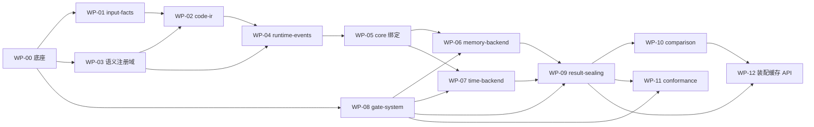

# 开发工作包任务书 · PyNative 多维并行成本评估器 v4.2 实施

> **文档角色**：总体架构师签发的软件开发活动任务书（Work Package Breakdown）。
> **设计基线**：`src/index.template.html` v4.2（commit `7470ae1`，2026-08-12）。
> **权威规则**：本任务书**不复制**任何 schema/等式/门定义；每个工作包的规范真值是正文对应
> 章节与模块契约锚点（`mc-*`）。任务书与正文冲突时，一律以正文为准，并向架构师报缺陷。
> **使用方式**：每个工作包（WP）交给一名开发者/一个小组。开发者接到 WP 后的第一件事是
> 依据本任务书 + 正文锚点，写出自己的详细实施计划（存放于
> `docs/superpowers/plans/`，TDD、小步提交），经架构师评审后开工。

---

## 0. 总体架构与工作包地图

软件分层沿用正文 §1.2（八层 + 一个横切 + 一个离线域）。实施拆为 **13 个工作包**：

| WP | 名称 | 对应层 | 规范锚点 | 关键交付 |
|---|---|---|---|---|
| WP-00 | 基础设施底座 | 全层公共 | §2.1–§2.5、§3.3 摘要、Ch11 | 规范序列化+摘要框架、类型化 ID/三态结果、blocker/诊断框架、checked 整数算术 |
| WP-01 | input-facts | L1 输入与事实 | `mc-input-facts`、§3.1–§3.5 | `build_request_snapshot`、快照体系、配置正则化、train-only CalibrationSet |
| WP-02 | code-ir | L2 结构 | `mc-code-ir`、Ch4 | PySub 逐 rank 求值、SourceObligation、`assemble_code_ir`、硬件无关摘要 |
| WP-03 | 语义注册域 | L2/L3 供给 | Ch6、§2.2 | 注册 DSL、逐面 OpSemantic、EffectSummary、未知算子闭环 |
| WP-04 | runtime-events | L3 运行时语义 | `mc-runtime-events`、Ch5、Ch7、§8.1–§8.4 | `expand_runtime_semantics`：事件/autograd/身份/生命周期/通信 intent/effect 定序 |
| WP-05 | core 绑定 | L4 共享绑定 | §8.5、§9.1 | `bind_core`、ExecutionDeployment 校验、KernelVariantBinding 唯一解析 |
| WP-06 | memory-backend | L5+L6 | `mc-memory-backend`、§9.2、§10.1–§10.2 | 投影纯函数、MemoryEventView、数值预检、逐 rank 重放、G-MEM 子句谓词 |
| WP-07 | time-backend | L5+L6 | `mc-time-backend`、§9.3、§10.3–§10.4 | cost/stream/route 绑定、endpoint quotient、无竞争 DES、聚合、G-TIME 子句谓词 |
| WP-08 | gate-system | 横切 L5–L7 | `mc-gate-system`、§12.2 | manifest 编译、逐 clause 执行、不可覆写账本、fixture 覆盖率门 |
| WP-09 | result-sealing | L7 封装 | `mc-result-sealing`、§10.4 后契约 | 三层 authority、EstimateCandidate、不可伪造 BackendSealArtifact |
| WP-10 | comparison | L7 比较 | `mc-comparison`、§10.5 | basis 派生与 mask 闭包、分支优先级函数、比较封装、G-REP2 谓词 |
| WP-11 | conformance | 离线验证 | `mc-conformance`、§12.3–§12.6 | 默认 local_integrity 全链；可选 hardened_attestation（独立里程碑） |
| WP-12 | 装配、缓存与 API | 端到端 | §13.2、§13.3、§10.6 | sweep 装配循环、六层缓存、最小 API 面、端到端集成测试 |

### 0.1 依赖关系

关键路径：WP-00 → WP-01/03 → WP-02 → WP-04 → WP-05 → WP-06/07 → WP-09 → WP-12。
WP-04 是体量最大、依赖最深的工作包，须最先配置最强人力。

### 0.2 里程碑（对齐正文 §13.4 八阶段）

| 里程碑 | 内容 | 完成判据 |
|---|---|---|
| M1 契约与门禁 | WP-00 全部 + WP-01 + WP-08 框架 | 摘要排除表 72 owner 全通过 conformance 测试；三态结果/blocker 框架可用；gate 框架能对空 manifest 走通编译→执行→账本 |
| M2 CodeIR | WP-03 + WP-02 | 代表性 mindformers 模型逐 rank 构图；G-IR1/G-IR2 全 clause 过正反例 |
| M3 事件展开 | WP-04 | 代表性配置（含 PP/CP/EP、重计算、分布式优化器）事件闭合；G-IR3 全 clause 过正反例 |
| M4 内存闭环 | WP-05 + WP-06 | memory-only 请求端到端 Ready→Ok；G-MEM1..6 全 clause 过正反例 |
| M5 时间闭环 | WP-07 | time 请求端到端；G-TIME1..6 全 clause 过正反例 |
| M6 封装与比较 | WP-09 + WP-10 | 双后端三态封装 + 一对配置严格同口径比较；G-REP1..3 全 clause 过正反例 |
| M7 验证链 | WP-11 | local_integrity conformance 对代表性配置出 verdict；真机留出误差报告 |
| M8 多配置 | WP-12 | K 配置 sweep + 缓存分层 + API 面；端到端确定性复跑通过 |

### 0.3 并发开发线（多 session 并行执行计划）

依赖 DAG 是**交付顺序**，不是**开发顺序**。v4.2 已把全部接口签名、schema 与摘要规则钉死在
权威正文里，因此各线可以**对着契约夹具开发**而不必等上游模块完工。并发化依靠三个手段：

1. **契约夹具（golden fixtures）**：每条线尽早发布自己输出类型的手写规范样例
   （JSON + 内容摘要清单，必须通过 WP-00 的 schema/摘要 conformance 测试）。下游线以夹具为
   测试输入先行开发，上游模块完工后在同步点替换为真实产物——替换时任何行为差异都是缺陷。
2. **纯函数先行**：重放器（WP-06 T5）、DES（WP-07 T5/T6）、分支函数（WP-10 T3）等纯函数
   只依赖输入 schema，可以在第一周就开工。
3. **门禁引擎先行**：WP-08 只依赖 WP-00 与规格，最早可用；各线的 clause 谓词随线内进度
   挂接。

#### 六条并发线

| 线 | 名称 | WP 序列 | 启动条件 | 对外发布的夹具 | 备注 |
|---|---|---|---|---|---|
| 线 1 | 底座与门禁（守门线） | WP-00 → WP-08 → CI/覆盖率门 → S4 起与线 6 合做 WP-12 | 即刻（S0 前独占仓库） | foundation kernel API、排除表 conformance suite、gate engine + 空 manifest 演示 | 兼任夹具注册中心与 merge train 守门人 |
| 线 2 | 输入与结构 | WP-01 → WP-02 | S0 后即刻；WP-02 对 WP-03 的依赖用 registry 夹具解耦（S1 前先做 PySub 求值环境与 obligation pass，不依赖语义细节） | RequestSnapshot 夹具、微型 RankCodeIR/CodeIR 夹具 | |
| 线 3 | 语义与事件（**关键路径，双人力**） | WP-03 → WP-04 | S0 后即刻做 WP-03；WP-04 于 S1 以手写 CodeIR 夹具启动，**不等 WP-02 完工** | registry 快照夹具 v1（S1）、**RuntimeEventPlan 夹具 v1（S2，全项目最重要夹具）** | 其余各线不得以任何方式阻塞本线 |
| 线 4 | 内存链 | WP-05 → WP-06 | S0 后以手写微型 RuntimeEventPlan 夹具起 WP-05 骨架与 WP-06 纯函数重放器；S2 切换线 3 真夹具 | SimulationPlanCore 夹具（给线 5）、Ready MemoryEventView/MemoryEstimate 夹具（给线 6） | |
| 线 5 | 时间链 | WP-07 | S0 后即刻：DES+聚合是纯函数，用手写 TimeEventView 夹具先行；测量键/公式绑定只需 WP-01 的 CalibrationSet schema 夹具；S2 接线 3/4 真夹具 | Ready TimeEventView/StepTimeEstimate 夹具（给线 6） | |
| 线 6 | 封装、比较与验证 | WP-09 → WP-10；穿插 WP-11 T1 真机 fixture 采集工具 | S0 后先做三态 candidate/authority 纯数据层与 WP-11 T1（真机侧完全独立）；S2 接线 1 gate engine 与线 4/5 view 夹具 | BackendSealArtifact/ComparisonResult 夹具、TraceFixture 采集件 | WP-11 主体在 M6 后；WP-12 由线 1+线 6 于 S4 合流 |

#### 同步点（S0–S5）

| 同步点 | 定义 | 解锁 | 对应里程碑 |
|---|---|---|---|
| S0 | WP-00 最小内核冻结（T1 类型/ID/三态 + T2 序列化 + T3 摘要）；此后 `foundation/` 对其他线只读 | 全部六线并行开工 | M1 启动 |
| S1 | 夹具交换 v1：线 3 发 registry 夹具、线 2 发 RequestSnapshot + 微型 CodeIR 夹具 | WP-04 启动；WP-02 接语义面 | M1 完成 |
| S2 | 线 3 发 RuntimeEventPlan 夹具 v1；线 1 gate engine 可执行真实 clause | 线 4/5 切真夹具；线 6 接门禁 | M2/M3 |
| S3 | 线 4/5 发 Ready 双视图夹具 | WP-09 实体化封装链 | M4/M5 |
| S4 | G-REP1/3 全绿，封装合流 | WP-12 装配启动（线 1+6） | M6 |
| S5 | 五条黄金链路 + 确定性复跑全绿 | M7 验证链、M8 sweep | M7/M8 |

#### 多 session 工程规约

1. **分支与工作区**：集成分支 `impl/main`；每线一个长期分支 `impl/line-<n>-<slug>`，
   建议各自 git worktree 隔离。每个 session 结束前 rebase 到最新 `impl/main`。
2. **合入走 merge train**：由线 1 守门；合入条件 = 本线测试全绿 + 夹具 conformance 不破坏
   任何下游线 + 五条黄金链路（S4 后）不红。
3. **目录所有权**：每线只写自己的子包与 `evaluator/fixtures/line<n>/`；`foundation/`
   在 S0 后、`gates/` 引擎在 S2 后对非属主只读。公共冻结面（接口签名/schema/门/blocker
   码表）变更一律走附 B 流程，任何线不得就地改。
4. **夹具协议**：`evaluator/fixtures/line<n>/<TypeName>/v<K>/*.json` + 摘要清单文件；
   消费方显式 pin 版本；升级只在同步点做，且由生产/消费两线 session 同时在场确认。
5. **session 交接**：每线维护自己的实施计划文件（`docs/superpowers/plans/impl-line<n>-*.md`，
   按 writing-plans 规范带勾选框）。session 开工三件事：读本线任务书节、读计划勾选态、
   `git log impl/main..HEAD`；session 收工三件事：更新勾选、写 3–5 行交接要点、rebase。
6. **冲突面清单**（单一属主，其余线只读）：`validation/gate-manifest.json`（线 1）、
   夹具注册清单（线 1）、顶层包装配与 API 门面（线 6，S4 前冻结为空壳）、集成测试目录
   （线 1+6）。
7. **关键路径保护**：线 3 的评审请求在各线中最高优先级；架构师对线 3 的承重等式抽查
   在每个同步点各做一次，不等 WP 完结。

### 0.4 全局工程规则（适用于全部 WP，验收前置条件）

1. **技术栈**（架构师决定，如需变更须书面申请）：Python ≥3.11；运行时仅标准库
   （`hashlib` sha256 为摘要函数）；`frozen dataclass`/tagged union 表达 schema；pytest 做测试。
2. **确定性**：任何生产路径禁止读取时钟、随机数、环境变量、浮点运算与依赖 hash 随机化的
   迭代序；所有 map/set 一律用显式规范序（OrderedMap/OrderedSet 语义）。同输入两次进程级
   复跑必须产生逐字节相同的序列化 artifact。
3. **数值纪律**：生产数值只有整数（bytes、ns）与显式 Decimal（通信公式内部）；加/减/乘/
   ceil-div 一律 checked；Ready 前任意精度预检（两侧各自的 NumericPolicy/RangeWitness）。
4. **错误模型**：用户输入问题 → 显式 `Blocked{BlockerRecord}` 三态结果；实现自相矛盾 →
   `InternalContractViolation` 终止请求。**生产 API 不允许裸异常逃逸**。
5. **摘要纪律**：新增任何可序列化类型必须同步登记摘要排除表（唯一自身派生 digest 字段）；
   禁止把自身置零后 hash、禁止实现自行删字段。
6. **非目标红线**（正文 §0.2 十条 + §14.5）：任何 WP 不得实现容量/OOM 判断、allocator
   碎片、图优化、在线 trace 读取、搜索器、多流完成时刻内存复用、layout 猜测、资源竞争
   降速、通信隐式 scratch。评审发现即打回。
7. **TDD 与提交**：先写失败测试再实现；每个 clause 谓词按 `ClauseCoverageRequirement`
   至少 1 正例 + 1 负边界例；小步提交，提交信息引用 WP 与任务号。
8. **代码布局**（建议，可经架构师同意调整）：`evaluator/` 包下按 WP 建子包：
   `foundation/ input_facts/ code_ir/ semantics/ runtime_events/ core_binding/
   memory_backend/ time_backend/ gates/ sealing/ comparison/ conformance/ api/`。
9. **交接物**：每个 WP 完成时提交 ① 代码+测试 ② 本模块 README（接口、不变量、与正文
   锚点的映射表）③ 注册进 content-addressed `validation/gate-manifest.json` 的本模块
   clause 谓词与 fixtures（HANDOFF §8 要求）。

### 0.5 通用验收门（每个 WP 的 DoD，逐条勾选）

- [ ] 正式入口签名与正文契约逐字一致（接口冻结，改动须走架构师变更流程）；
- [ ] 本 WP 所辖 gate clause 谓词全部实现，每 clause ≥1 正例 + ≥1 负边界例且入 FixtureSet；
- [ ] 确定性复跑测试通过（两次全量运行 artifact 逐字节相同）；
- [ ] 摘要闭包测试通过（本 WP 全部类型：serialize → hash → 排除表重算一致）；
- [ ] 违反正文"明确不得包含"的负面测试全部就位并通过（例如 memory 后端读 duration 必须
      编译期/构造期不可表达或运行期 ICV）；
- [ ] 复杂度符合 §13.1 预算（用 10×/100× 规模缩放实测斜率佐证，非严格证明）；
- [ ] 模块 README 与锚点映射表完成；代码评审（含架构师）通过。

---

## WP-00 · 基础设施底座

**层**：全层公共依赖。**规范锚点**：§2.1–§2.5（输出与证据类型）、§2.4/§3.3（摘要与排除表）、
Ch11（blocker/诊断）、§9.3+§10.1（NumericPolicy/RangeWitness 两侧）、附录级 `verify_gates.py`
中 `DERIVED_DIGEST_EXCLUSIONS` 的 72 个 owner 类型清单。

**目标**：提供全部上层模块共用的类型系统与不变量执行机制，使"确定性、摘要闭包、三态
结果、blocker 纪律"成为底座能力而不是各模块的自觉。

**任务分解**
- T1 类型化 ID 与 tagged union 框架：LogicalRank、EventId、TensorInstanceId、
  StorageInstanceId、RuntimeRuleInvocationRef 等（Ch5 §5.1–§5.4 全部身份类型）；
  三态结果泛型 `Ready|Blocked|NotRequested` 与 `BackendExecution/BackendSealBuildResult` 骨架。
- T2 规范序列化：全类型稳定字段序、OrderedMap/OrderedSet、跨平台字节一致；
  `canonical_payload_without_derived_digests` 按逐 schema 排除表实现。
- T3 摘要框架：sha256 内容摘要、排除表注册机制、嵌套输入 digest 保留语义。
- T4 Blocker 框架：BlockerRecord/BlockerCode/BlockerInstanceId、BlockerScopePolicy 求值器、
  Diagnostic 规范派生（Ch11 全部 BLK-* 码表）。
- T5 数值底座：checked add/sub/mul/ceil-div、`align_up(0,a)=0`、任意精度预检工具、
  NumericPolicySnapshot（time）与 MemoryNumericPolicySnapshot（memory）承载。
- T6 证据/覆盖类型：Estimate、SemanticValue、EvidenceTag、Coverage、Assumption、
  `quality_from_basis` 总函数（§2 全部 schema，纯数据+校验，无业务逻辑）。

**验收标准**
1. 排除表 conformance：对正文排除表全部 owner 类型逐一测试"只排除自身 digest 字段、
   嵌套输入 digest 保留"，与 `tools/verify_gates.py` 清单逐行对账零漂移。
2. 确定性：随机构造 1000 个嵌套 payload，进程内/跨进程两次序列化+摘要逐字节一致。
3. Coverage 守恒：`source_obligations_total == source_obligations_planned + source_residual
   + source_proven_not_executed` 等两条守恒式与 `source_obligations_planned ==
   source_nodes_planned` 一对一断言以属性测试覆盖（含违例必须拒绝）。
4. quality_from_basis 全值域测试：六 basis × unknown 分支全覆盖，映射与正文逐字一致。
5. checked 算术溢出必须抛 ICV 级错误且被预检提前拦截的路径有专项测试。
6. 负面：构造"自身 digest 置零后 hash""实现删字段"两类作弊路径在框架层不可表达。

---

## WP-01 · input-facts（L1 输入与事实层）

**规范锚点**：`mc-input-facts` 全部小节、§3.1 生产输入、§3.2 唯一归属、§3.3 配置正则化、
§3.4 CalibrationSet 与 raw trace、§3.5 冲突优先级。

**目标**：把源码、registry、模型/硬件事实、逐配置输入与逐后端输入冻结为可摘要、可重放的
`RequestSnapshot`，并派生 `EvaluationInstanceIdentity`；守住测量数据的 split 隔离边界。

**任务分解**
- T1 快照类型：SourceFileSnapshot/SourceSnapshot（含 import 解析摘要）、
  Structure/RuntimeRegistrySnapshot 装载、HardwareProfile（**不含 HBM 容量**）、
  CompileEnvFacts、各 policy snapshot。
- T2 配置正则化：`validate(P)`（`world_size = dp×tp×pp×cp`、EP 子组整除约束）、
  CanonicalConfigEvaluationInput、LogicalRankContextSet 校验。
- T3 tagged 后端输入：`RequestedBackendInput` 三分支、`domain == {memory,time}`、
  NotRequested 无 payload/digest；memory-only/time-only 不指纹化对侧输入。
- T4 `build_request_snapshot(...)`：含 gate specification/runner/blocker policy 三方一致
  等式（契约"接口定义"节全部 require）。
- T5 CalibrationSet：train-only `calibration_train_manifest_digest`、逐 record split 等式、
  `OfflineObservationRef` 分流 holdout/fixture；MeasurementProtocol 四方 digest 相等校验。
- T6 `derive_evaluation_identity`。

**验收标准**
1. 契约等式全绿：`mc-input-facts` "接口定义/不变量"小节列出的每条 require 各有正例与
   负边界例（含"E+P2 request specification embeds different blocker policy"这条正文点名负例）。
2. Split 隔离：向 CalibrationSet 注入 holdout/conformance record 必须构造期拒绝；
   holdout manifest digest 出现在任何生产摘要输入即测试失败。
3. 正则化：同一逻辑配置的两种等价写法产生逐字节相同 RequestSnapshot；EP 整除不满足、
   rank 集不完整等各返回具名 blocker。
4. 请求摘要指纹范围：memory-only 请求改动 time 侧输入不改变 request_digest（反向同理）。
5. 确定性 + 摘要闭包（通用 DoD）。

---

## WP-02 · code-ir（L2 结构层）

**规范锚点**：`mc-code-ir` 全部小节、Ch4（§4.1 PySub 边界、§4.2 逐 rank 构图、§4.3 核心
schema、§4.4 结构保持、§4.5 guard、§4.6 硬件独立性）。

**目标**：PySub 求值器按逐 logical rank 直接求值当前源码，产出不可变、硬件无关的
`CodeIR(P)`；SourceObligation 独立分母、三分支、双向闭合。

**任务分解**
- T1 PySub 求值环境：SourceSnapshot+CompileEnvFacts+冻结 registry 封闭世界；未快照
  hook/dispatch/monkey-patch 检测 → 阻断（不静默静态绑定）。
- T2 独立句法 obligation pass：先枚举分母，再求值；guard 只作 branch evidence。
- T3 逐 rank 求值 `evaluate_source`：TensorValue/LogicalStorage/TensorStorageRelation/
  Data/ControlEdge 构造，alias/view/in-place 按元数据 alias（§5.2 规则）。
- T4 `assemble_code_ir`：五字段构造（`logical_rank_order` 规范序、payload 等式、
  `model_digest`）、`rank_build_blocker_union`。
- T5 硬件独立性：构图输入禁读清单在类型层不可表达 + G-IR2 属性测试。

**验收标准**
1. G-IR1、G-IR2 全部 clause 谓词实现并过正反例（含"分母从已生成 IR 反推"必须被负例抓住）。
2. 硬件独立性属性测试：同一输入在 ≥3 个不同 HardwareProfile 下产生逐字节相同的
   RankCodeIR 与相同 model_digest。
3. Obligation 三分支守恒与双向授权：随机删/加一个 occurrence 的变异测试必须被守恒式拒绝。
4. 代表性素材：以 mindformers PyNative trainer 的一个真实 decoder 层为验收样例，
   TP=2/PP=2 两配置逐 rank 构图成功且 rank 间结构差异符合并行语义。
5. 复杂度：节点+边规模 10× 时构图耗时近线性（§13.1 `O(Σr(Nr+Er))`）。

---

## WP-03 · 语义注册域（L2/L3 供给）

**规范锚点**：Ch6（§6.1 注册域隔离、§6.2 OpSemantic、§6.3 EffectSummary、§6.5 未知算子
闭环）、§2.2 分面 epistemics。

**目标**：结构/运行时两个**分别冻结**的注册快照、逐面 OpSemantic DSL、EffectSummary 与
未知算子"发现→注册→校验→绑定→规划"闭环。

**任务分解**
- T1 注册 DSL 与装载：编译、引用解析、字段依赖检查、内容摘要冻结；选择器优先级冲突
  → 阻断（不依赖 import 顺序）。
- T2 OpSemantic 逐面 SemanticValue（shape/dtype/storage/autograd/placement/cost/workspace/
  effects），bytes 派生仅限显式 new+dense+无 padding。
- T3 EffectSummary/StateRef/EffectDomainRef：alias-root 归一化、RNG 具名 StateRef、
  GlobalHostStateRef。
- T4 未知算子状态机（§6.5 七态 + Stage-local 显式结果），未知 op 与弱证据 op 分流。
- T5 两快照 digest 进入不同摘要阶段的接线（与 WP-01/WP-02/WP-04 联调）。

**验收标准**
1. 快照隔离：只改 runtime 规则时 `model_input_digest` 不变、`runtime_input_digest` 变
   （专项回归，正文点名的缓存键污染风险）。
2. 状态机全路径测试：七个状态每条转移 + 每个失败出口各一例；未知 op 阻断、弱证据 op
   以 modeled/assumed 继续且 coverage/assumptions 如实披露。
3. 选择器：同优先级多匹配必须阻断；显式优先级解析确定性测试。
4. bytes 派生 fallback 负例：view/layout-dependent storage 走 shape×dtype 必须拒绝
   （BLK-UNSUPPORTED-LAYOUT 语义）。

---

## WP-04 · runtime-events（L3 运行时语义层）⚠ 关键路径最大件

**规范锚点**：`mc-runtime-events`、Ch5（身份与初态）、Ch7 全章、§6.4（effect 定序）、
§8.1–§8.4（放置与通信 intent、分布式优化器生命周期）。

**目标**：`expand_runtime_semantics` 把 CodeIR 按冻结训练语义展开为逐 microbatch 的
`RuntimeEventPlan`：事件、obligation、autograd、Tensor/Storage instance、生命周期、
通信 intent 与规范依赖边集。

**任务分解**
- T1 EventObligation 框架：三分支、coverage 守恒、每 Event 恰一反向授权。
- T2 forward/backward 展开：逐 rank×microbatch 实例化、AutogradLink（saved tensor、
  grad producer/consumer、accumulation、参数更新闭合；重复 origin 不按位置猜配对）。
- T3 recompute：新 EventId/TensorInstanceId/StorageInstanceId、原 RankCodeNodeRef 引用、
  RNG save/restore 与版本闭合。
- T4 optimizer 与分布式优化器生命周期（§8.4）：bucket/gather/reduce/prefetch 具名事件与
  storage lifetime、`dependency_safe` 释放规则、step_end 兜底 assumption。
- T5 身份与初态（Ch5）：instance 派生、`TensorStorageBinding` 唯一、LogicalInitialState、
  cold_start/steady_state 两初态语义。
- T6 通信 intent：P2PIntent（PP activation/gradient、CP ring、channel/sequence）、
  CollectiveIntent（kind 三分支）、EP dispatch/combine obligation 双向授权、
  matched/all-participant rendezvous 语义；buffer owner/lifetime 落到 StorageInstance。
- T7 effect 定序（§6.4）：conflict 判定、canonical base order 全序定向、
  ScheduleConstraintEdge lowering、`resolved_semantic_ref == event_id` 等式、成环阻断。

**验收标准**
1. G-IR3 全 clause 过正反例（本 WP 是其主要谓词提供方）。
2. 事件守恒：正文 §13.5——压缩表示展开前后 obligation/EventId/instance/effect edge/
   通信 identity/bytes 守恒，以变异测试验证。
3. 通信闭合：PP/CP/EP 三类通信各一套代表性配置；EP `ep=1`/dense 显式 NotApplicable；
   任一 endpoint 缺失/重复 → BLK-COLLECTIVE/BLK-P2P 负例。
4. autograd 闭合变异测试：随机移除一条 saved-tensor/grad 关系必须被拒绝
   （BLK-EVENT-SEMANTICS）。
5. effect 定序确定性：同输入两次展开边集逐字节相同；人为构造可串行化冲突集不得成环
   （正文"局部 pair 方向造环"回归例）。
6. RNG recompute 无 save/restore 必须阻断（BLK-EFFECT）。
7. 复杂度：`O((R+D) log R + C)` 斜率验证，含最坏 C=O(R²) 的防护性能例。

---

## WP-05 · core 绑定（L4 共享硬件绑定层）

**规范锚点**：§8.5（bind_core、各绑定 schema）、§9.1（CoreBuildResult、SimulationPlanCore、
ProjectionCandidate/Bundle 的 core 侧）。

**目标**：`bind_core` 校验全单射 rank_device_map、拷贝冻结 HardwareProjectionFacts、
在任何成本查找之前唯一解析 shared KernelVariantBinding。

**任务分解**
- T1 ExecutionDeployment 校验（total one-to-one）+ deployment_digest。
- T2 HardwareProjectionFacts 冻结拷贝（**无容量字段**——上游 WP-01 已保证）。
- T3 KernelVariantBinding：hardware-free selector + HardwareBindingPolicy 唯一解析，
  多候选/零候选各自阻断。
- T4 CoreBuildResult 三态与 `simulation_core_digest`；Runtime Blocked 时 core 只携相同
  blocker、Ready 时 `core == bind_core(plan,...)` 精确等式。

**验收标准**
1. 部署负例：非单射、缺 rank、幽灵 device 各一例 → 具名 blocker。
2. KernelVariantBinding 唯一性：selector 歧义 → 阻断；解析结果进入
   `simulation_core_digest` 且 memory/time 双侧共用同一 binding（回归例：两侧各自解析
   不同 variant 必须不可表达）。
3. bundle 等式：`plan.blocker_index` 在 bind_core Blocked 后仍完整可读（G-REP3 相关
   前置，联调 WP-09）。

---

## WP-06 · memory-backend（L5 投影 + L6 执行）

**规范锚点**：`mc-memory-backend` 全部小节、§9.2、§10.1–§10.2、§8.5 Storage/Workspace
绑定、Ch11 内存侧 blocker。

**目标**：`build_memory_projection_candidate` 纯函数生成逐 rank `MemoryEventView`
（含任意精度 byte 预检见证），`run_memory_backend` 按 logical kernel/anchor 顺序重放
Allocate/Bind/Use/Free 得到逐 rank 峰值、构成与 witness。

**任务分解**
- T1 StorageBinding/WorkspaceBinding：bytes 归一化、alignment 等式、workspace transient
  lifetime（`before/after(owner)`）。
- T2 `expected_memory_projection` 纯函数 + LogicalAnchor 全序 + MemoryEventId 规范 tuple。
- T3 LogicalLifetime 消费：唯一 release、`dependency_safe` 校验、None→step_end assumption。
- T4 MemoryNumericPolicy/RangeWitness 预检（G-MEM4 扩展语义）。
- T5 `run_memory_backend`：逐 rank 重放、逐 anchor 守恒断言、peak/tie、cluster max、
  timeline、MemoryExecutionWitness（`expected_memory_execution` 等式逐字实现）。
- T6 G-MEM1..6 全部 clause 谓词。

**验收标准**
1. G-MEM1..6 每 clause 正例+负边界例（幽灵 workspace、漏事件、release 不安全、
   分类不守恒、峰值 tie 错序、witness 篡改至少各一例）。
2. **禁读负面**：view 构造后，重放器可达的输入类型中不存在 duration/start/end/
   physical stream/TimeEstimate（类型级不可表达 + 运行期 ICV 双保险测试）。
3. 时间无关性回归：只改 CalibrationSet 任何内容，MemoryEventView 与 MemoryEstimate
   逐字节不变。
4. 预检：构造总 bytes 溢出用例 → Ready 前 memory-scoped BLK-NUMERIC-RANGE，重放器
   checked 算术永不首次发现溢出。
5. 初态峰值：`INITIAL_STATE` 成为 peak anchor 的用例；cold_start/steady_state 两初态
   各一条端到端例。
6. 复杂度 `O(M)`：M 10×/100× 线性验证。
7. 与真机对照冒烟（非发布门）：用仓内既有 cost_eval 校准场景做一次 predicted vs
   measured 偏差记录，仅报告不设阈值（阈值属于 WP-11 验证链）。

---

## WP-07 · time-backend（L5 投影 + L6 执行）

**规范锚点**：`mc-time-backend` 全部小节、§9.3、§10.3–§10.4、§3.1–§3.2（测量/公式）、
§8.2–§8.3（rendezvous）、Ch11 时间侧 blocker。

**目标**：`build_time_projection_candidate` 绑定精确 compute 测量与唯一通信公式/route、
做 endpoint quotient 与数值预检；`run_time_backend` 在 global progress DAG 上执行无竞争
DES，产出 step time、关键路径与全部聚合。

**任务分解**
- T1 MeasurementKey 补全链：template + hardware facts + shared KernelVariantBinding +
  TimeCostPolicy；exact-hit-only（0 候选 BLK-MISSING-TIME、多候选 BLK-AMBIGUOUS-COST）；
  协议四方 digest 相等。
- T2 通信 CostBinding：公式 AST/inputs/route/NumericPolicySnapshot 内嵌与复算。
- T3 StreamBinding 唯一分配 + endpoint quotient（`event_projection` 等式、
  communication_internal self-loop 规则、其余 quotient 自环阻断）。
- T4 联合 wait-for graph 无环与可结束检查（四类边并集）。
- T5 数值预检（NumericRangeWitness）+ `run_time_backend` DES（稳定拓扑序、checked 推进、
  step_end/critical path 规范 tie、空图零值）。
- T6 半开区间聚合（busy/overlap/bubble/service，§10.4 等式）+ TimeExecutionWitness。
- T7 G-TIME1..6 全部 clause 谓词。

**验收标准**
1. G-TIME1..6 每 clause 正例+负边界例（分组字段篡改、endpoint 幽灵、cohort 不占全
   endpoint stream、公式不可复算、witness 拓扑序伪造至少各一例）。
2. 无竞争语义回归：不同 stream 且无 progress edge 的节点完全重叠（专项例）；任何
   resource_ready/capacity 概念在类型层不可表达。
3. rendezvous：PP 1F1B、CP ring、EP all-to-all 三个代表性 pipeline 的 warmup/steady/
   cooldown 时序快照测试；跨 rank 死锁用例 → 联合图检查拒绝。
4. exact-hit-only：缺一条测量记录 → 只有 time Blocked、memory 不受影响（双侧独立性
   端到端回归）。
5. DES 确定性与并列 tie：构造多节点同 end 时刻用例，step_end/critical path 按
   ProgressNodeId 稳定。
6. 聚合守恒：service sums 允许大于 makespan 的专项例（正文明示语义）；map domain 覆盖
   全部 stream/device/stage，零事件 stage 出零值。
7. 复杂度 `O((V+D) log V)` 斜率验证。

---

## WP-08 · gate-system（横切 L5–L7）

**规范锚点**：`mc-gate-system` 全部小节、§12.2、§12.1（两类验证分界）。

**目标**：GateSpecificationSet→GateManifest 编译、`run_gate_domain` 逐 clause 执行、
`extend_gate_ledger_without_overwrite` 不可覆写账本、ExpectedInvocationDomain 推导，
以及 fixture 覆盖率（每 clause 正例+负边界例）的 CI 侧强制。

**任务分解**
- T1 specification/manifest/clause 数据结构 + 编译（三方 identity 等式、
  disposition 唯一权威）。
- T2 `build_gate_evaluation_authority`：六类 subject 的 coordinates 推导、request-owned
  校验（"never trusts manifest self-report"）。
- T3 `run_gate_domain` + `expected_invocation_domain`：stage sibling、依赖闭包只在
  immutable base 校验、NotApplicable 语义。
- T4 账本扩展：字节保留 prefix、stage context map、游离 record 拒绝。
- T5 InputBlocker 聚合与 InternalViolation 优先规则；`canonical_internal_violation_union`
  联调 WP-09。
- T6 CI harness：`validation/gate-manifest.json` 内容寻址产出 + clause 覆盖率统计与
  缺口报表（对齐 HANDOFF §8"发布 CI 不能只跑 verify_gates.py"）。

**验收标准**
1. 契约点名负例全部实现：policy digest mismatch、dangling scope rule、invocation
   subset/superset、wrong stage context、NotApplicable 依赖、wrong subject arm、
   ledger 重贴/覆写等（`mc-gate-system` 列出的每条 negative fixture 一一对应）。
2. 18 门全部 clause 在 manifest 中可编译且与正文 §12.2 表逐门对账（门数、
   invocation 维度、disposition 类型零漂移）。
3. 账本不可覆写：并发/重放两类攻击性测试（重复执行同 domain、篡改 prefix）→ ICV。
4. 覆盖率门：任一 clause 缺正例或负边界例时 CI 报表标红且发布脚本退出非零。

---

## WP-09 · result-sealing（L7 封装）

**规范锚点**：`mc-result-sealing`、§10.4 之后的 Backend execution 契约、§9.1
ProjectionBundleAuthority/联合闭包、Ch11 §11.4 部分成功。

**目标**：`evaluate_and_finalize_projection_bundle`（联合 scope 闭包）与
`run_backend_build_candidate_and_seal`（source→value→seal 三层 authority、三态
candidate、不可伪造 BackendSealArtifact）。

**任务分解**
- T1 ProjectionBundleAuthority：双 candidate 同 identity 绑定、Runtime/Core 权威结果
  保留、全局 InputBlocker 聚合后按 affected_backends 派生双侧 ProjectionResult。
- T2 EstimateCandidate（不可外泄）+ BackendValueGateAuthority 绑定。
- T3 三态 BackendResultCandidate + seal：G-REP1 谓词、capability 语义
  （`(request_digest, evaluation_instance_digest, backend)` 唯一构造器；反序列化
  不可构造——用语言手段：私有构造 + 模块边界 + 序列化白名单，方案写入模块 README）。
- T4 pre-seal/sealed ledger 接线（与 WP-08）；sealed ledger 不进入模型 evidence/cache。
- T5 G-REP3 谓词（bundle 联合验证）。

**验收标准**
1. G-REP1/G-REP3 每 clause 正反例（丢 runtime blocker、单侧 blocker 摧毁 shared
   artifact、先验 value 后换 candidate、用户 JSON 冒充 artifact 至少各一例）。
2. 双侧独立端到端：缺 time 测量 → memory Ok + time Blocked；shared blocker → 双侧
   Blocked；未请求侧恒 NotRequested（三条全链回归）。
3. Blocked 卫生：Blocked 分支携带 null/0 值、空 timeline、旧缓存值在类型层不可表达。
4. capability 不可伪造：构造同形 JSON/直接 new/跨请求挪用三类攻击测试全部失败。
5. ICV 语义：value/seal 门失败 → 单一 canonical union ICV、无结果无缓存无比较。

---

## WP-10 · comparison（L7 比较）

**规范锚点**：`mc-comparison`、§10.5、§0.2 成对比较边界、§1.4 输出不变量。

**目标**：ComparisonSchemaSnapshot 驱动的 basis 派生与 axes mask 闭包、固定分支优先级的
逐 metric 比较、arm/source/seal authority 链与 `build_and_seal_comparison`。

**任务分解**
- T1 CanonicalSchemaPath 语法 + 派生闭包计算 + masked_config_evaluation_input。
- T2 `derive_comparison_basis_pair`（逐 metric、Ok/Blocked 无关可派生）。
- T3 分支函数 `compare_per_metric_from_authority`：
  NotRequested→Incomparable→Unavailable→ComparableDelta 固定序；
  `NotRequested iff metric not in requested_metrics`；单臂请求分叉 → 构造期 ICV。
- T4 delta 语义：fractional_change、UndefinedZeroBaseline、MemoryDelta rank-set 等式、
  CoverageDelta。
- T5 authority 链 + G-REP2 谓词 + ComparisonSealArtifact。

**验收标准**
1. G-REP2 每 clause 正反例（A/B 对调、同臂混 bundle、旧 subject、
   `other_config_indexed_production_inputs.x` 注入闭包等正文点名负例全覆盖）。
2. 分支优先级表驱动测试：{basis 同/异}×{左右 Ok/Blocked}×{requested 与否} 全笛卡尔组合
   逐格断言，与正文分支函数逐字一致；mismatch+Blocked 并存 → Incomparable。
3. world-size 边界：world size 变化 → 必然 Incomparable 且 mismatch 定位
   `logical_rank_id_set`；同 world size 重切分且已声明 axes → ComparableDelta。
4. 时间协议：measurement_protocol_digest 不同 → Incomparable。
5. 零基线：left=0 → UndefinedZeroBaseline，绝无 Inf/NaN。

---

## WP-11 · conformance（离线验证域）

**规范锚点**：`mc-conformance`、§12.1、§12.3–§12.6、§14.3。
**里程碑拆分**：M7 只要求默认档 `local_integrity`；`hardened_attestation` 为独立后置
里程碑（M7+，须产品确认多方 CI/合规需求后启动）。

**目标**：默认档——以冻结 fixture 对 content-addressed ProductionSubject 做离线一致性
验证（摘要复算 + 完整 binding domain + 守恒 + verdict 唯一派生），产出
`LocalIntegrityReport/Decision`；全链不进任何生产摘要。

**任务分解**
- T1 TraceFixture 采集与冻结工具（真机 isolated run → fixture；采集侵入边界 §12.5）。
- T2 CodeIR conformance（§12.3 逐 rank 对比 + rank set 聚合）。
- T3 Runtime event/schedule conformance（§12.4：backward/recompute/optimizer、
  TensorInstance、P2P/collective、microbatch/pipeline、logical allocation timeline）。
- T4 `run_local_integrity_conformance` 全等式实现 + LocalIntegrity 六件套 schema。
- T5 数值误差 policy（peak/step 按版本化 ValidationPolicy）+ 留出误差报告（§14.3：
  无对照 → "未评估真机误差"，不改预测路径）。
- T6 生产隔离回归：删除全部 fixture/report 制品，任一生产摘要不变。
- T7（M7+，可选）hardened_attestation：双信任根/envelope/attestation/release 全链。

**验收标准（M7 · local_integrity）**
1. 契约负例：nested digest 篡改、binding subset/superset、重复/缺失 execution record、
   守恒破坏、caller forged verdict 五类全部在 report/decision 构造前变 ICV。
2. verdict 三态：结构性 fail / 数值 policy fail / insufficient（无 fixture 不得称 pass）
   各端到端一例；insufficient 的 allow/block 由显式 disposition 决定。
3. assurance 标签：所有输出恒 `local_integrity_non_adversarial`，不出现任何 hardened
   词汇；消费端展示按 tagged profile。
4. 生产隔离（T6）自动化回归入 CI。
5. 真机闭环：在 116/167 真机跑一组代表性配置（复用仓内标定工作流），产出
   IR/event/timeline conformance 报告 + 留出误差表。

---

## WP-12 · 装配、缓存与 API（端到端）

**规范锚点**：§13.2 装配伪代码（逐行为准）、§13.3 缓存分层、§10.6 首页最小字段、
§11.4 部分成功。

**目标**：K 配置 sweep 装配循环、六层缓存（键与禁含项逐表实现）、最小 API 面与
端到端集成测试基线。

**任务分解**
- T1 sweep 装配循环：与 §13.2 伪代码逐行对应（身份来自 config_ref slice、循环变量
  不是 provenance）。
- T2 六层缓存：Source parse / CodeIR / RuntimeEventPlan / Core / Memory result /
  Time result，命中重验派生 digest、命中不跳门、缓存 value 重走 seal。
- T3 API 面：单配置求值、K 配置 sweep、成对 comparison_request、§10.6 最小响应字段；
  完整 response 默认不缓存。
- T4 端到端集成测试基线：memory-only / time-only / 双后端 / Blocked 部分成功 /
  含比较 五条黄金链路 + 确定性复跑。

**验收标准**
1. 缓存键审计：逐表测试"禁含项进入键即失败"；跨配置 CodeIR 复用（`?? P` 换配置命中）
   必须 miss；NotRequested 永不入 estimate cache。
2. 缓存命中不降门：命中路径与冷路径产生相同 GateExecutionLedger domain 与相同
   BackendSealArtifact identity（digest 级断言）。
3. 黄金链路：五条端到端链路 + 两次复跑逐字节一致；`abort request` 语义（ICV）无部分
   写入缓存。
4. sweep 正确性：K=8 配置（TP/PP/DP/CP/EP/microbatch/重计算组合）逐配置结果与摘要表；
   sealed delta 仅 left/right 一对。
5. 性能基线：单配置端到端耗时与内存占用记录入基线报表（预算原则 §13.5：紧凑数组、
   按需物化明细）。

---

## 附 A · 验收流程（架构师执行）

1. WP 开发者提交：代码 + 测试 + README + fixtures + 本 WP DoD 勾选表。
2. 机器门：CI 跑该 WP 全部测试 + clause 覆盖率报表 + 确定性复跑 + 摘要闭包。
3. 人工门：架构师按"正文锚点 ↔ 实现"抽查 3–5 个承重等式；抽查任一不符 → 打回。
4. 集成门：进入 M4 之后每个 WP 合入都必须保持五条黄金链路（WP-12 T4）全绿。
5. 里程碑门：里程碑列出的门（G-*）全部 clause 双例齐备才可宣布达成。

## 附 B · 变更控制

- 正式入口签名、schema 字段、gate/clause、blocker 码表 = **冻结面**：修改必须先改
  权威正文（走 verify_gates + 构建 + 测试），再同步实现；顺序不可颠倒。
- 实现中发现正文欠定/矛盾：提交"设计缺陷单"给架构师，禁止就地自定语义。
- 新增 Assumption：任何改变预测语义的近似必须成为具名 Assumption 并进入 evidence 链
  （§13.5），由架构师批准。
