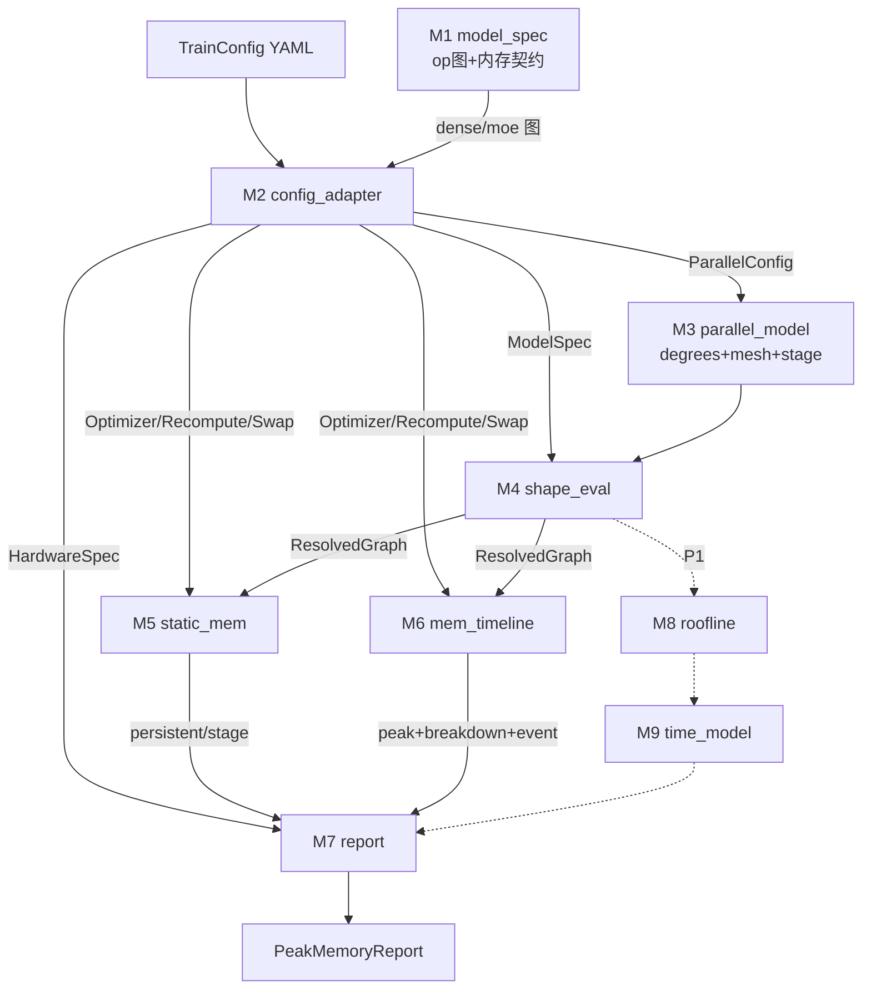
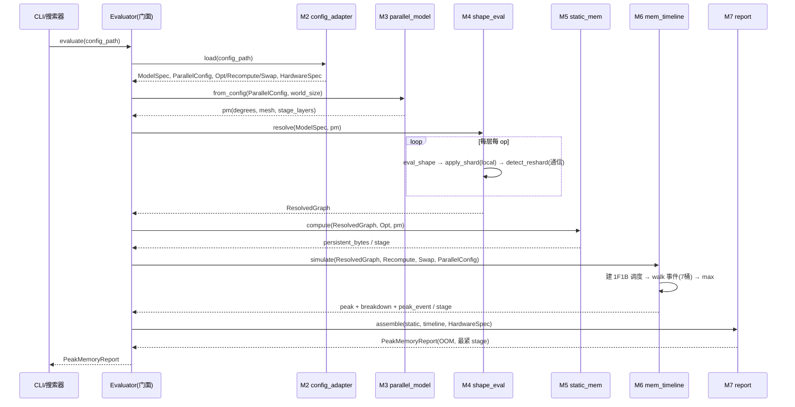

# 评估器实现架构设计（模块 / 时序 / 接口）

> 日期: 2026-06-29 · 状态: Draft（待评审）
> 父设计: [[2026-06-23-pynative-cost-evaluator-design]] · P0 内存细化: [[2026-06-29-p0-modelspec-and-memory-design]]
> 范围：评估器的**实现级**架构。P0 模块（显存）为实线落地，P1 模块（时间）标为扩展点。
> 核心模块 M4/M5/M6 内部逻辑（算法+伪代码）: [[2026-06-29-core-modules-m4-m5-m6-internals]]

## 1. 设计原则

- **单一职责 + 可独立测试**：每个模块一个清晰目的、定义良好的接口、可单独 mock 上下游单测。
- **纯函数式数据流**：模块间传**不可变数据结构**（ResolvedGraph 等），无隐藏状态；便于缓存与搜索器（P2）复用。
- **解耦输入**：只依赖 ModelSpec（数据）+ TrainConfig（复用）+ HardwareSpec，不 import 真实模型/不上 NPU。

## 2. 逻辑模块总览

| # | 模块 | 功能目标 | 理论依据 | 阶段 |
|---|---|---|---|---|
| M1 | `model_spec` | 声明式 op 图数据结构 + 内存契约 + 已写好的 dense/moe 图 + 注册表 | 声明式 sharded-graph IR（DTensor/GSPMD placement）；`saves`=autodiff `save_for_backward` | P0 |
| M2 | `config_adapter` | 加载 TrainConfig → 切出并行/重算/swap/优化器配置；构建 ModelSpec、HardwareSpec | 复用 trainer 配置=单一真相源、零漂移 | P0 |
| M3 | `parallel_model` | 并行度数 + mesh 关系 + PP 的 stage→层分配 | TorchTitan `ParallelDims`（efsdp·ep=dp_shard·cp·tp） | P0 |
| M4 | `shape_eval` | 符号 shape 求值 + sharding 代入(local shape) + reshard 检测(派生通信) → ResolvedGraph | 符号代数；DTensor placement∘mesh-degree；reshard=placement mismatch（GSPMD 传播） | P0 |
| M5 | `static_mem` | 持久 param+grad+opt（切分后、按优化器倍数） | ZeRO 混合精度显存账（16–18B/param）+ Megatron 切分 | P0 |
| M6 | `mem_timeline` | 事件驱动峰值仿真（buckets + 1F1B 调度 + recompute/FSDP预取/swap） | 离散事件仿真；"peak=max over time"(liveness)；rematerialization；ZeRO-3 all-gather 双缓冲 | P0 |
| M7 | `report` | 组装输出：峰值+OOM+拆解+最紧 stage；挂验证 | `max_device_memory` 预算约束 | P0 |
| M8 | `roofline`（扩展点） | 每 op FLOPs/bytes/受限分类 + η（time） | Roofline 模型；α-β 通信 | P1 |
| M9 | `time_model`（扩展点） | 单步时间：overlap + 1F1B bubble + DP 同步 | 1F1B 气泡公式 | P1 |

## 3. 模块依赖 & 数据流



## 4. 时序图（一次 `evaluate(config)`）



## 5. 核心数据结构

```python
# ---- 输入 ----
@dataclass(frozen=True)
class HardwareSpec:
    peak_flops: dict[str, float]      # dtype -> FLOPS
    hbm_bw: float; intra_bw: float; inter_bw: float; pcie_bw: float
    max_device_memory: int            # 来自 ContextConfig.max_device_memory
    framework_reserve: int            # O_framework 标定常数

@dataclass(frozen=True)
class ParallelConfig:                 # 从 ParallelismConfig 抽取
    dp_replicate:int; dp_shard:int; cp:int; tp:int; pp:int; ep:int
    sequence_parallel:bool; reshard_after_forward:str; cpu_offload:bool
    pp_schedule:str; microbatch:int; interleave:int; layers_per_stage:list
    moe_token_dispatcher:str

@dataclass(frozen=True)
class OptimizerSpec:
    type:str
    state_bytes_per_param:int         # AdamW=16/18; Muon 另算（param+grad+master+m(+v)）

# ---- 中间（M4 产出，不可变）----
@dataclass(frozen=True)
class ResolvedTensor:
    tid:str; local_numel:int; dtype_bytes:int; is_weight:bool

@dataclass(frozen=True)
class ResolvedOp:
    name:str; type:str
    inputs:list[ResolvedTensor]; output:ResolvedTensor
    params:list[ResolvedTensor]; saves:list[ResolvedTensor]   # 内存契约(已代入 local)
    workspace_bytes:int
    collectives:list["CommSpec"]      # reshard 派生 / 显式

@dataclass(frozen=True)
class ResolvedLayer:
    layer_id:int; layer_type:str; ops:list[ResolvedOp]

@dataclass(frozen=True)
class ResolvedGraph:
    stages:dict[int, list[ResolvedLayer]]   # stage -> 该 stage 的层

# ---- 输出 ----
@dataclass(frozen=True)
class MemBreakdown:
    persistent:int; act_live:int; gather_buf:int; grad_buf:int
    recomp_scratch:int; swap_buf:int; workspace:int; framework:int

@dataclass(frozen=True)
class StagePeak:
    stage:int; peak_bytes:int; breakdown:MemBreakdown
    peak_event:str; oom:bool          # peak_event: "fwd_end" | "bwd_recompute@layer_i" | ...

@dataclass(frozen=True)
class PeakMemoryReport:
    per_stage:list[StagePeak]; tightest_stage:int; oom:bool
```

## 6. 各模块接口设计

### M1 `model_spec`
- **目标**：提供数据结构（§P0 §2）+ 已写好的 op 图 + 注册表；纯数据，无逻辑。
- **接口**：
```python
register_layer(layer_type:str, builder:Callable[[DimTable], LayerSpec])
get_layer_spec(layer_type:str, dims:DimTable) -> LayerSpec
DENSE_DECODER, MOE_DECODER  # 内置 builder（对照源码核实，标 file:line）
```

### M2 `config_adapter`
- **目标**：把一份 TrainConfig 变成评估器的全部输入；ModelSpec 由 `TransformerConfig` adapter 半自动 + 手填层图组装。
- **接口**：
```python
class ConfigAdapter:
    def load(config_path:str) -> tuple[ModelSpec, ParallelConfig, OptimizerSpec,
                                       RecomputeSpec, SwapSpec, HardwareSpec]
    def model_spec_from_transformer_config(tc) -> ModelSpec   # adapter（不 import 真实模块）
```

### M3 `parallel_model`
- **目标**：封装并行度数与 mesh 关系（镜像 `parallel_dims.py`），供切分与 stage 分配查询。
- **接口**：
```python
class ParallelModel:
    @classmethod
    def from_config(pc:ParallelConfig, world_size:int) -> "ParallelModel"
    def degree(axis:str) -> int            # axis ∈ {tp,cp,ep,dp_shard,dp_replicate,pp}
    def fsdp_degree() -> int               # dp_shard*cp
    def efsdp_degree() -> int              # dp_shard*cp*tp//ep
    def stage_of(layer_id:int) -> int
    def stage_layers(stage:int) -> list[int]
```

### M4 `shape_eval`（核心）
- **目标**：ModelSpec + ParallelModel → ResolvedGraph（local shape + 派生通信 + 已代入的内存契约）。
- **理论依据**：local = 符号 shape 各切分维 ÷ 轴度数；reshard = 相邻 placement 不一致 → 集合通信。
- **接口**：
```python
class ShapeEval:
    def resolve(spec:ModelSpec, pm:ParallelModel) -> ResolvedGraph
    # 内部纯函数(可单测):
    def eval_shape(symbolic:list[str], dims:DimTable) -> list[int]
    def apply_shard(shape, shard:dict[int,str], pm) -> int      # -> local_numel
    def detect_reshard(prev:TensorRef, nxt:TensorRef, pm) -> CommSpec | None
```

### M5 `static_mem`
- **目标**：每 stage 持久 param+grad+opt 字节（§P0 §6）。
- **理论依据**：attn/dense 权重 /(tp·dp_shard·cp)；专家 /(dp_shard·cp·tp)；复制 /(dp_shard·cp)；× `state_bytes_per_param`。
- **接口**：
```python
class StaticMem:
    def compute(g:ResolvedGraph, opt:OptimizerSpec, pm:ParallelModel) -> dict[int, int]  # stage -> persistent bytes
```

### M6 `mem_timeline`（核心）
- **目标**：事件驱动峰值仿真（§P0 §8）：7 桶 + 1F1B 调度 + recompute 反向尖峰 + FSDP 预取双缓冲 + swap 预取。
- **理论依据**：peak=max over liveness 事件；rematerialization；ZeRO-3 all-gather 窗口双缓冲。
- **接口**：
```python
class MemTimeline:
    def simulate(g:ResolvedGraph, recompute:RecomputeSpec, swap:SwapSpec,
                 pc:ParallelConfig, hw:HardwareSpec) -> dict[int, StagePeak]
    # 内部:
    def build_schedule(stage:int, pc) -> list[Event]      # warmup/steady/cooldown
    def walk(events:list[Event]) -> tuple[int, MemBreakdown, str]   # peak,breakdown,event
```

### M7 `report`
- **目标**：组装最终报告 + OOM 判定 + 验证钩子。
- **接口**：
```python
class Report:
    def assemble(static:dict[int,int], timeline:dict[int,StagePeak],
                 hw:HardwareSpec) -> PeakMemoryReport

class Evaluator:   # 门面
    def evaluate(config_path:str) -> PeakMemoryReport
```

## 7. 模块边界与可测试性

| 模块 | 单测方式（mock 边界） |
|---|---|
| M3 | 给 ParallelConfig，断言 degree/mesh/stage 分配（对 `parallel_dims.py` 不变量） |
| M4 | 给小 ModelSpec + degrees，断言 local shape 与派生通信（含退化 tp=1） |
| M5 | 给 ResolvedGraph，断言 Σ切分态=全局（守恒）、对 ZeRO 16/18B 律 |
| M6 | 给构造的事件序列，断言峰值落点（注入"无重算"vs"full 重算"看尖峰转移） |
| M7 | 给 static+timeline，断言 OOM 判定与最紧 stage |
| 端到端 | 1 dense + 1 MoE worked config，对 Megatron 2205.05198 公式互证 |

## 8. P1 扩展点（不改 P0 结构）

- `M8 roofline`：消费 M4 的 ResolvedOp（已有 local shape）→ 加 FLOPs/bytes/η → 每 op time。
- `M9 time_model`：消费 M6 的调度 + M8 的 op time → bubble/overlap → 单步时间。
- 接入点：M7 report 增加 time 字段；M4/M6 的产物不变（这就是把 time 解耦在评估器内核之外的价值）。
